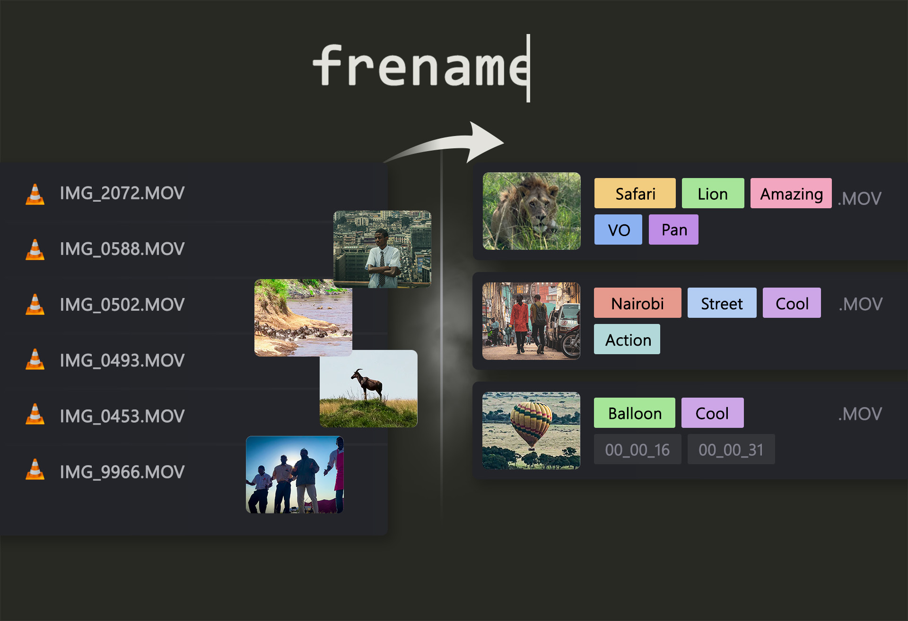
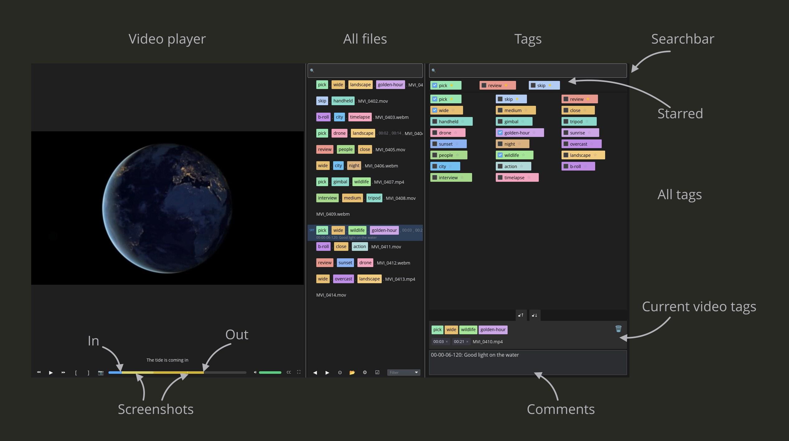

# frename



**Tag your footage before you edit it.**

I returned from a trip to Africa with 2,000 raw video files. No names, no structure — just `MVI_0001.MP4` through `MVI_2000.MP4`. Before I could start editing I needed to know what was in each clip. frename let me watch each clip, tag it in seconds, and move on. By the time I opened Premiere the project was already organized.

This tool is for the hour *before* the edit begins.

---

## What it does

Open a folder of videos. Watch each clip. Tag what you see. When you move to the next clip, the one you leave is renamed with its tags.

**File name format:** `tag1.tag2.name.in_HH_MM_SS.out_HH_MM_SS.mp4`

Tags become part of the file name, so your file manager, editing app and sync tools all see them.
The in/out part is there only when you mark a segment and keep in/out points in the file name (the default).

---

## The window



- left: the file list of the current folder
- center: the video player with its progress bar
- right: tag search, starred tags, the tag grid and the comment box
- bottom: the new file name — drag the tag chips to reorder them

---

## The workflow

1. Open a file with the 📂 button, or drag a file onto the window. Its whole folder opens.
2. The video starts playing.
3. Tag what you see: click a tag, or move with the arrow keys and press `Shift+Space`.
4. Press `[` and `]` to mark the usable segment of the clip (in and out points).
5. Press `F12` to save a screenshot of an interesting moment.
6. Type a note in the comment box if needed.
7. Press `PageDown` to go to the next clip. The clip you leave is renamed.
8. Most clips share most tags with their neighbors: press `Ctrl+C` on one clip and `Ctrl+V` on the next, then adjust.

Next time you start frename, it reopens the last folder and clip.

---

## Keyboard shortcuts

### Files
| Key | Action |
|---|---|
| `PageDown` | Next file (renames the file you leave) |
| `PageUp` | Previous file (renames the file you leave) |
| Double-click a file | Rename it by hand: `Enter` renames, `Esc` cancels |

### Tags
| Key | Action |
|---|---|
| `↑` `↓` `←` `→` | Move the selection in the tag grid |
| `Shift+Space` | Tag or untag the file with the selected tag |
| Any letter | Type into the tag search |
| `Enter` | Add the typed tag to the folder's tags |
| `Delete` | Delete the selected tag from the folder's tags |
| `Escape` | Clear the search |
| `Ctrl+C` | Copy the file's tags |
| `Ctrl+V` | Replace the file's tags with the copied ones |
| `Ctrl+Z` | Undo |
| `Ctrl+Y` or `Ctrl+Shift+Z` | Redo |
| Middle-click a chip in the file name | Untag the file |

### Video
| Key | Action |
|---|---|
| `Space` | Play / pause (or click the picture) |
| `F1` | Back 10 seconds |
| `F3` | Forward 10 seconds |
| `[` | Set the in point |
| `]` | Set the out point |
| `F12` | Take a screenshot |
| `F5` | Fullscreen on / off (or double-click the picture) |
| `Escape` | Leave fullscreen |

---

## Tags

Each folder has its own tags, kept in a `.frename` file inside the folder. The file travels with the
footage, and you can edit it by hand: one tag per line, in the order the tag panel shows them.
A folder without one starts with a set for travel and documentary work: `pick`, `skip`, `review`,
`wide`, `close`, `drone`, `golden-hour`, `people`, `wildlife`, and more.

- **Star a tag** (☆) to keep it in the starred row above the grid.
- **Search:** type anything to filter the tags.
- **Add a tag:** type a new name and press `Enter`.
- **Unsaved tags:** a tag that is already in a file's name but not in the folder's tags shows as
  unsaved (○). Press `Enter` or click ○ to add it.
- **Order:** the order of tags in the tag panel is the order they get in file names. Drag chips in
  the file name to change it, or drop a chip on 🗑 to untag it. The lock buttons between the grid
  and the file name keep the two orders in step.

Undo (`Ctrl+Z`) covers tagging, adding, deleting, starring and reordering tags, pasting, in/out
points and renames.

---

## Screenshots, comments and in/out points

The progress bar shows what you have noted about a clip:

- **Screenshots:** `F12` or 📷 saves the frame as a JPEG next to the video
  (`clip.mp4.snap.00-01-05-250.jpg`) and puts a mark on the progress bar. It also adds a line with
  the time to the comment.
- **In and out points:** `[` and `]` mark the usable segment, highlighted on the progress bar.
  They are saved in the file name (`in_00_01_05`, `out_00_02_10`, whole seconds) or, if you choose
  in Settings, inside the video as a marker that Premiere Pro turns into a subclip.
- **Comments:** free text per clip. By default it is saved inside the video, where Premiere Pro
  shows it in the Description column and finds it by search. Settings can keep it in a
  `.comment.txt` next to the video instead. The file list shows the first line of each comment.
  While comments are inside the video, a clip with a comment gets a "Commented" tag.

Screenshots, `.comment.txt` files and subtitles are renamed together with their video.

---

## Finding files

- **Search** the file list by name. Tags already in a name are searchable too.
- **Filter** the list to files that are untagged, have subtitles, or have a comment.
- The list shows only videos (mp4, mov, mkv, avi, webm, and other common formats), oldest first.

## Subtitles

A `.srt` with the same name as the video (`clip.srt` for `clip.mp4`) is shown under the picture.
The CC button opens a list of every line; click a line to jump to it. In fullscreen the subtitles
are shown over the picture with the list beside them.

## Batch mode

Click ☑ to check files in the list (All / Invert) and run one action on all of them, with progress
and Cancel. Each file then shows a green or red check box. Actions:

- move comments between the video and `.comment.txt` files;
- move in/out points between the file name and the video;
- tag commented videos with "Commented" (or untag the rest);
- put the tags in every name in tag panel order;
- reset the cache and read every file again.

## Settings

The ⚙ button opens Settings:

- play videos automatically when opened;
- draw all tags in one neutral color;
- where comments are kept (inside the video or `.comment.txt`), and the name of the "Commented"
  tag, or none;
- where in/out points are kept (file name or inside the video).

After you change where comments or in/out points are kept, Settings offer the batch action that
moves the existing ones.

---

## Requirements

**Windows 10/11 (64-bit):** download the Windows zip from the latest release. It needs the
GStreamer runtime for video playback — see [GSTREAMER_SETUP.md](GSTREAMER_SETUP.md).

**Linux (64-bit; Ubuntu 24.04, Linux Mint 22, Fedora 40, Debian 13 or newer):** download the
`.AppImage` from the latest release, make it executable (`chmod +x frename-*.AppImage`) and run
it. Video playback is built in; nothing else to install. If it says FUSE is missing, run it with
`--appimage-extract-and-run`. Your settings and the last opened folder are kept in
`~/.local/share/frename`.

---

## Building from source

```sh
cargo build
cargo run
```

Requires Rust stable and GStreamer development libraries. See [GSTREAMER_SETUP.md](GSTREAMER_SETUP.md) for the GStreamer setup on Windows.
