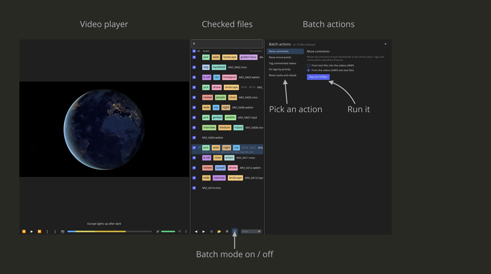
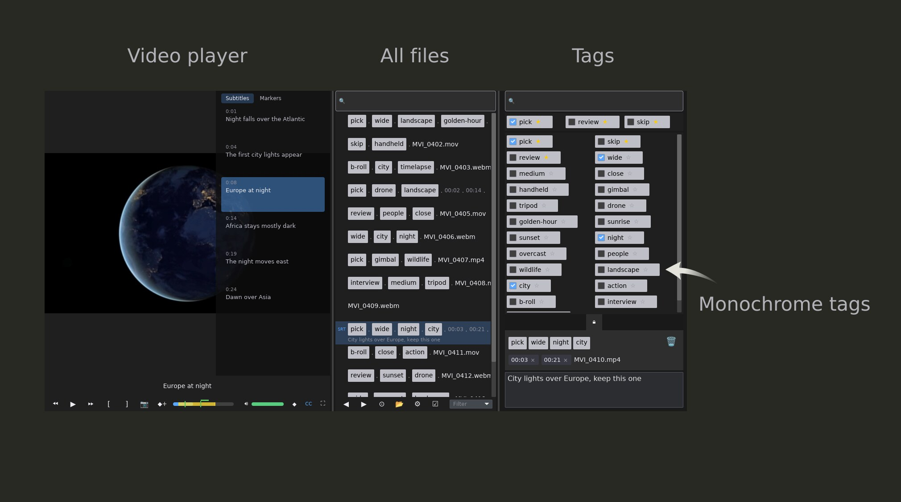

# frename


**Tag your footage before you edit it.**

I returned from a trip to Africa with 2,000 raw video files. No names, no structure — just `MVI_0001.MP4` through `MVI_2000.MP4`. Before I could start editing I needed to know what was in each clip. frename let me watch each clip, tag it in seconds, and move on. By the time I opened Premiere the project was already organized.

This tool is for the hour *before* the edit begins.

---

## What it does

Open a folder of videos. Watch each clip. Tag what you see. When you move to the next clip, the one you leave is renamed with its tags.

**File name format:** `tag1.tag2.name.in_HH_MM_SS.out_HH_MM_SS.mp4`

Tags become part of the file name, so your file manager, editing app and sync tools all see them.
Nothing is locked inside frename.
The in/out part is there only when you mark a segment.

---

## The window


- left: the video player with its progress bar
- middle: the file list of the current folder
- right: tag search, starred tags and the tag grid; under them the new file name (drag the tag
  chips to reorder them) and the comment box

---

## The workflow

1. Open a file with the 📂 button, or drag a file onto the window. Its whole folder opens.
2. The video starts playing.
3. Tag what you see: click a tag, or move with the arrow keys and press `Shift+Space`.
4. Press `[` and `]` to mark the usable segment of the clip (in and out points).
5. Press `F2` at an interesting moment to mark it. Press `F2` again right away to name the marker,
   then `Enter`. Markers show up on the clip in Premiere Pro.
6. Type a note for the whole clip in the comment box, press `Esc` to leave it, then `PageDown` to
   go to the next clip. The clip you leave is renamed and its markers are saved.
7. Most clips share most tags with their neighbors: press `Ctrl+C` on one clip and `Ctrl+V` on the next, then adjust.

Next time you start frename, it reopens the last folder and clip.

---

## Keyboard shortcuts

### Files
| Key | Action |
|---|---|
| `PageDown` | Next file (renames the file you leave) |
| `PageUp` | Previous file (renames the file you leave) |
| Double-click a file | Rename it by hand: `Enter` renames, `Esc` cancels |

### Tags
| Key | Action |
|---|---|
| `↑` `↓` `←` `→` | Move the selection in the tag grid |
| `Shift+Space` | Tag or untag the file with the selected tag |
| Any letter, `Backspace` | Type into the tag search |
| `Enter` | Add the typed tag, or the selected unsaved (○) tag, to the folder's tags |
| `Delete` | Delete the selected tag from the folder's tags |
| `Escape` | Clear the tag and file searches |
| `Ctrl+C` | Copy the file's tags (and its new name to the clipboard) |
| `Ctrl+V` | Replace the file's tags with the copied ones |
| `Ctrl+Z` | Undo |
| `Ctrl+Y` or `Ctrl+Shift+Z` | Redo |
| Middle-click a chip in the file name | Untag the file |

### Video
| Key | Action |
|---|---|
| `Space` | Play / pause (or click the picture) |
| `F1` | Back 10 seconds |
| `F3` | Forward 10 seconds |
| `[` | Set the in point |
| `]` | Set the out point |
| `F2` | Add a marker; `F2` again within a second and a half, or on a marker, names it |
| `Shift+F2` | Delete the marker under the playhead |
| `Shift+F1` / `Shift+F3` | Jump to the previous / next marker |
| `Shift` + drag the progress bar | Snap to the nearest marker |
| `F12` | Save the current frame as a JPEG next to the video |
| `F5` | Fullscreen on / off (or double-click the picture) |
| `Escape` | Leave fullscreen |

While a text box (tag search, file search, comment) has the cursor, it takes the keys it needs:
arrows, `Delete`, `Space`, `Enter`, `Ctrl+C`, and in the comment box also `PageUp` / `PageDown`.
Press `Esc` first to give the keys back to the app. `[` and `]` set in and out points, except while
you type in a marker's name. The F-keys always work.

Undo (`Ctrl+Z`) covers tagging, adding, deleting, starring and reordering tags, pasting, in/out
points, adding, deleting and coloring markers, and the rename when you leave a clip.
It does not cover comment text or marker names, a rename by hand
(double-click), untagging with 🗑, the 🔓↑ / 🔓↓ buttons, or batch actions; opening a folder or running a batch
action clears the undo history.

---

## Tags

Each folder has its own tags, kept in a `.frename` file inside the folder. The file travels with the
footage.
A folder without one starts with a set for travel and documentary work: `pick`, `skip`, `review`,
`wide`, `close`, `drone`, `golden-hour`, `people`, `wildlife`, and more.

- **Star a tag** (☆) to keep it in the starred row above the grid.
- **Search:** type anything to filter the tags.
- **Add a tag:** type a new name and press `Enter`.
- **Unsaved tags:** a tag that is already in a file's name but not in the folder's tags shows as
  unsaved (○). Select it and press `Enter`, or click ○, to add it.
- **Order:** the order of tags in the tag panel is the order they get in file names. Drag chips in
  the file name to change it, or drop a chip on 🗑 to untag it. When the file's order differs from
  the panel's, 🔓↑ copies the file's order to the tag panel and 🔓↓ puts the file's tags in panel
  order. When they match, 🔒 keeps them in step: reordering one reorders the other. Click 🔒 to unlock (it
  shows 🔓) and again to lock.

---

## Markers, comments and in/out points

The progress bar shows what you have noted about a clip:

- **Markers:** `F2` or 📍 marks the moment under the playhead with a pin in the marker's color. ◆ opens the
  marker list over the picture (in fullscreen too; it shares the place with the subtitle list, with a
  tab for each; an empty list has an Add button). Click a marker's row to name it, its dot to
  pick one of Premiere's colors, ✕ to delete it, and its time to jump there. Markers are saved inside the video when you leave the
  clip, and Premiere Pro shows them on the clip with their name, length and color after
  you import it (re-import a clip it already has: Premiere reads the markers once). Markers
  Premiere wrote are shown too and kept (one with a length is drawn as a band). If a clip is open in Premiere, its markers may not save:
  the file gets a red ✕ in the list, and frename tries again when you next leave it.
  While the playhead is on a marker, its name becomes the pin's head; click it to rename the
  marker.
- **Frames:** `F12` or 📷 saves the current frame as a JPEG next to the video
  (`clip.mp4.snap.00-01-05-250.jpg`) and shows `Frame saved`.
- **In and out points:** `[` and `]` mark the usable segment, highlighted on the progress bar.
  They are saved in the file name (`in_00_01_05`, `out_00_02_10`, whole seconds) or, if you choose
  in Settings, inside the video as a marker that Premiere Pro turns into a subclip.
- **Comments:** free text per clip. By default it is saved inside the video, where Premiere Pro
  shows it in the Description column and finds it by search. Settings can keep it in a
  `.comment.txt` next to the video instead. The file list shows the first line of each comment.
  While comments are inside the video, frename tags a commented clip "Commented" (Settings can
  rename or turn off this tag).

Some formats, such as mkv, cannot hold comments, in/out points or markers inside them; for those,
frename keeps comments and in/out points in `.comment.txt` and the file name whatever Settings say,
and 📍 is off. mp4 and mov hold everything.

`.comment.txt` files and subtitles are renamed together with their video.

---

## Finding files

- **Search** the file list by name. Tags already in a name are searchable too.
- **Filter** the list to files that are untagged, have subtitles, a comment or markers: the
  Filter dropdown sits at the right end of the search bar. A file with markers shows 📍 and
  their number in the list.
- The list shows only videos (mp4, mov, mkv, avi, webm, and other common formats), oldest first.

## Subtitles

A `.srt` with the same name as the video (`clip.srt` for `clip.mp4`) is shown under the picture.
The CC button opens a list of every line; click a line to jump to it. In fullscreen the subtitles
are shown over the picture, and CC opens the list beside them there too.

## Batch mode



Click ☑ to check files in the list (All / Invert) and run one action on all of them, with progress
and Cancel. Each file then shows a green or red check box. Actions:

- move comments between the video and `.comment.txt` files;
- move in/out points between the file name and the video;
- turn comment lines that start with a time (`03:24 — Take 3 — nice light`, `0:41-0:47 — Lion`)
  into markers, or copy the markers into the comment as such lines. What follows the name after
  a second ` — ` or ` -- ` (not a plain ` - `) goes into the marker's comment, which Premiere
  shows and frename keeps but does not show;
- tag commented videos with "Commented" and untag the rest;
- put the tags in every name in tag panel order;
- add or remove the space after each tag, as set in Settings;
- read every file again (use this if the list looks out of date).

## Settings

The ⚙ button opens Settings:

- play videos automatically when opened;
- draw all tags in one neutral color;
- put a space after each tag in file names (`Food. Goat. clip.mp4`);
- where comments are kept (inside the video or `.comment.txt`), and the name of the "Commented"
  tag, or none;
- where in/out points are kept (file name or inside the video).

After you change where comments or in/out points are kept, or the tag spacing, Settings offer the
batch action that updates the existing files.



---

## Requirements

**Windows 10/11 (64-bit):** download the Windows zip from the [latest release](https://github.com/Zelenov/frename/releases/latest). It needs the
GStreamer runtime for video playback — see [GSTREAMER_SETUP.md](GSTREAMER_SETUP.md).

**Linux (64-bit; Ubuntu 24.04, Linux Mint 22, Fedora 40, Debian 13 or newer):** download the
`.AppImage` from the [latest release](https://github.com/Zelenov/frename/releases/latest), make it executable (`chmod +x frename-*.AppImage`) and run
it. Video playback is built in; nothing else to install. If it says FUSE is missing, run it with
`--appimage-extract-and-run`. Your settings and the last opened folder are kept in
`~/.local/share/frename`.

---

## Building from source

```sh
cargo build
cargo run
```

Requires Rust stable and GStreamer development libraries. See [GSTREAMER_SETUP.md](GSTREAMER_SETUP.md) for the GStreamer setup on Windows.
