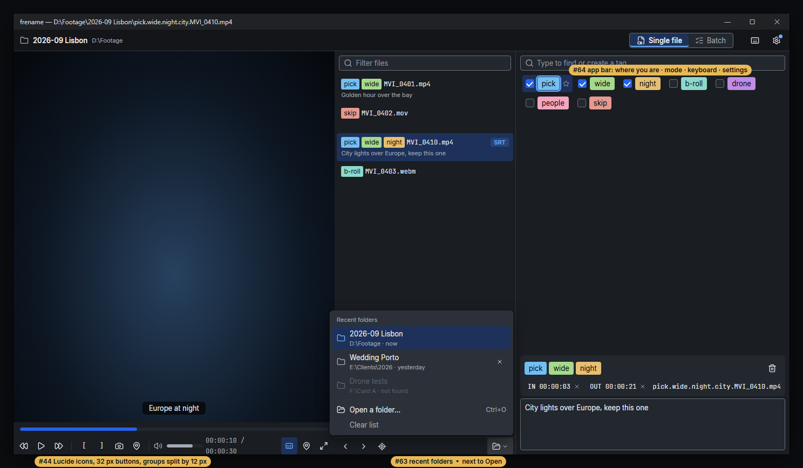
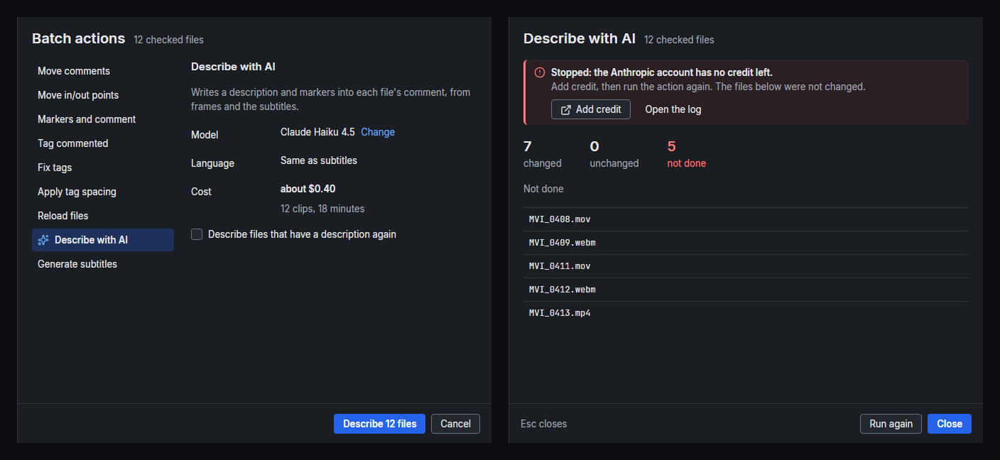

# Design system

Design for issue #57: one visual and interaction system for all of frename, and the Settings
window rebuilt as its first user. The batch windows (#58), SVG icons (#44), the rest of the app
(#59), recently opened folders (#63), keyboard shortcuts (#62) and the app bar with the mode
switch (#64) are built on it later; this document already fixes the rules they follow, so each
of those issues only has to apply them.

Every rule here is the rule for UI work in frename. A view that needs something this document
does not cover adds it here first, in the same PR.

Images are in [`design-system/`](design-system/). They are mockups drawn in HTML with the real
tokens, fonts and icons (rendered with headless Edge), except the `before-*` images, which are
screenshots of the app (`frename --demo … --settings`).

Contents:
1. [Principles](#1-principles)
2. [Approaches considered](#2-approaches-considered)
3. [Color](#3-color)
4. [Typography](#4-typography)
5. [Spacing, sizes and layout](#5-spacing-sizes-and-layout)
6. [Shape and depth](#6-shape-and-depth)
7. [Icons](#7-icons)
8. [Components](#8-components)
9. [Windows, dialogs and surfaces](#9-windows-dialogs-and-surfaces)
10. [Patterns](#10-patterns)
11. [Keyboard](#11-keyboard)
12. [Text in the interface](#12-text-in-the-interface)
13. [Every screen](#13-every-screen)
14. [The Settings window](#14-the-settings-window)
15. [Implementation](#15-implementation)
16. [Out of scope](#16-out-of-scope)
17. [Test plan](#17-test-plan)
18. [Open questions (with recommended answers)](#18-open-questions-with-recommended-answers)
19. [Sources](#19-sources)

Book references are short: **AF** About Face (Cooper et al., 2014), **DI** Designing Interfaces
(Tidwell et al., 2020), **MiM** Designing with the Mind in Mind (Johnson, 2020), **PUI** Practical
UI (Dannaway, 2024), **RUI** Refactoring UI (Wathan & Schoger), **BIR** Birman, «Пользовательский
интерфейс». Full list in [Sources](#19-sources).

## 1. Principles

frename is a *sovereign* tool (AF ch. 9): an editor works in it for hours, mostly from the
keyboard, next to Premiere Pro. The rules below come from that.

1. **The content is colorful, the chrome is quiet.** Video, tag chips and marker colors are the
   only large areas of color. Everything else is neutral gray in a few lightness steps, with one
   accent for "selected / focused / the main action" (AF ch. 17 "Keep it simple"; DI ch. 5: "one or
   two saturated colors"). Spend boldness in one place: the tags.
2. **One look per kind of thing, one kind of thing per look.** Controls that look alike behave
   alike (PUI "Layout"; DI "Visual Framework"). Two checkbox styles, three "selected" tints and
   default-styled buttons next to custom ones are exactly what #57 removes.
3. **Nothing moves.** Controls keep their place between states and screens; a disabled control
   stays where it is, dimmed (AF ch. 18; BIR «Привычка»). Lists never reorder under the user.
4. **Do, don't ask; undo instead of confirm.** A confirmation only guards what cannot be undone
   (AF ch. 21 "How to eliminate confirmations"; BIR «Привычка»; MiM ch. 15).
5. **Status in place, not in popups.** Results, errors and progress show where the user looks, in
   the window they belong to (AF ch. 11 "Don't use dialogs to report normalcy"; BIR «Обратная связь»).
6. **Keyboard first, and every shortcut is visible** in a tooltip, a menu or the cheat sheet
   (AF ch. 16 "memorization vectors"; MiM ch. 9 "recognition over recall").
7. **Words for commands, icons for recognition.** A command in a window's button bar is a text
   button; icons are for frequent, well-known toolbar actions and always have a tooltip
   (BIR «Пиктограммы»; DI p. 396).
8. **Built for 1080p at 150 %** (1280×720 logical, about 680 px of it under the taskbar): every
   window and default layout fits there.

## 2. Approaches considered

Three ways to rebuild Settings and to frame the rest of the system were drawn with the same
tokens. All three share the tokens, type and components of sections 3–8; they differ in where
Settings lives and how its content is grouped.

| A. Separate window, category list | B. Separate window, one page of cards | C. A page inside the main window |
|---|---|---|
|  |  |  |

**A. Separate window with a category list on the left (two-panel selector).** One page per
category, one row per option (label left, control right), a button bar with Close.
- For: current values readable at a glance, pages whose names predict their content, arrow keys
  move between categories (DI "Settings Editor", "Two-Panel Selector" p. 90–91, 343). The main
  window stays visible and usable, so switching monochrome tags or the language shows its effect
  at once. Room for a *Keyboard* page (#62) without redesign.
- Against: one more window to manage (it already exists today).

**B. Separate window, one scrolling page of titled cards with a jump bar.** Closest to today's
window, with the sections made visible as cards.
- For: everything on one page, easy search by scrolling.
- Against: the page gets long (Describe with AI and Subtitles are at the end and were opened
  "scrolled to the end" before); a long card stack is the "SaaS card kit" look; the jump bar is a
  tab strip in disguise and wraps in Russian.

**C. Settings as a page inside the main window** (VS Code / Lightroom style), under the app bar
of #64.
- For: no second window, no keyboard leaks between windows.
- Against: covers the work while it is open, so the effect of a setting cannot be seen next to it;
  it needs #64's app bar first; it makes Settings modal in practice ("a dialog is another room",
  AF ch. 18, but here the room replaces the house).

**Decision: A.** It follows the settings patterns of DI and AF most closely, keeps the main window
working (AF ch. 21: property settings are modeless and apply immediately), splits the long page
into short ones, and is the smallest change for #64 (⚙ just moves to the app bar) and #62 (one
more page).

Settings today, for comparison (560×640, one scrolling page):

| top | middle | end |
|---|---|---|
|  |  |  |

## 3. Color


### 3.1 Tokens

All colors in the app come from these tokens. Contrast is WCAG 2 against the surface it is used on
(`panel` unless noted), computed from the hex values.

| Token | Hex | Use | Contrast |
|---|---|---|---|
| `bg.window` | `#131519` | behind panels; navigation column; button bars; app bar | – |
| `bg.panel` | `#1A1D22` | panels and pages: file list, tag grid, video controls, Settings page | – |
| `bg.raised` | `#23272E` | fields, secondary buttons, cards, notices, file name panel | – |
| `bg.overlay` | `#2C3139` | menus, dropdown lists, tooltips, dialogs | – |
| `state.hover` | white 6 % | hover over a transparent control or row | – |
| `state.pressed` | white 12 % | pressed | – |
| `state.selected` | `#1D315A` | the selected row, category, cell, segment | text 10.4 : 1 |
| `scrim` | black 55 % | behind a modal dialog | – |
| `border.subtle` | `#30353D` | dividers, window/panel edges, menu outline (decorative) | – |
| `border.control` | `#6A7280` | the edge of a field, checkbox, radio, secondary button | 3.5 (panel), 3.1 (raised) |
| `text.primary` | `#E6E8EB` | all normal text and icons | 13.8 (panel), 10.7 (overlay) |
| `text.secondary` | `#A3AAB5` | help, descriptions, meta, idle tab labels | 7.2 (panel), 5.6 (overlay) |
| `text.placeholder` | `#8F97A3` | placeholder in a field | 5.1 (raised) |
| `text.disabled` | `#5C636E` | disabled text and icons (no minimum, WCAG 1.4.3 exception) | – |
| `accent` | `#2563EB` | fill of the primary button, checked box, selected radio, progress | white on it 5.2 |
| `accent.hover` / `.pressed` | `#2F6DF0` / `#1D56D6` | primary button hover / pressed | 4.6 / 6.3 |
| `accent.text` | `#6CB0FF` | accent as text or line: links, focus ring, selection bar, latched icon | 7.5 |
| `success` | `#5CCB8F` | done, saved, changed | 8.4 |
| `warning` | `#E9B955` | needs attention, nothing lost | 9.3 |
| `error` | `#FF7A7A` | failed, invalid (text, icon, field edge) | 6.7 |
| `danger` / `danger.hover` | `#C93434` / `#D23B3B` | fill of the button that confirms a destructive action | white on it 5.2 / 4.7 |

Why these values:
- **Four surfaces, one step apart**, so depth reads without shadows (PUI "Adding depth in dark
  interfaces": base / raised / overlay). The grays lean slightly cool (hue ≈ 220), like Premiere
  Pro and DaVinci Resolve, so frename sits quietly next to them. No pure black (PUI, RUI).
- **Text contrast ≥ 4.5 : 1 on every surface it is used on** (MiM ch. 6; the issue's rule), and
  more on dark surfaces than the minimum (PUI: dark interfaces need contrast "well above" WCAG).
- **Control edges ≥ 3 : 1** (PUI "Ensure form field borders are high contrast"; WCAG 1.4.11).
  Decorative dividers have no minimum and stay subtle (RUI "Use fewer borders").
- **One accent.** `accent` is dark enough to carry white text (5.2 : 1); `accent.text` is its
  light twin for lines and text on dark (7.5 : 1). The iced default violet `#5865F2` disappears.
- **The error red is light and desaturated**, since dark reds vanish on dark backgrounds
  (MiM ch. 4: "Don't use dark reds, blues, or violets against any dark colors").

### 3.2 Rules

- **Never color alone.** Every state that has a color also has a shape, an icon or a word: the
  selected category has a bar and bold text, an error has an icon and a sentence, a failed file
  has ✕ and a reason (AF ch. 16; MiM ch. 4; PUI).
- **Red means error or destruction and nothing else** (MiM ch. 5: "Reserve red for errors"). The
  delete ✕ on a tag chip is not red; it is the chip's text color.
- **Accent means "selected, focused, or the main action".** It is not decoration: no accent
  headings, no accent icons that are not latched on.
- **States are overlays**, not new colors: hover adds `state.hover`, pressed `state.pressed`, on any
  surface (PUI "Use transparent layers for interaction states"). Disabled is `text.disabled` (or
  40 % opacity for a filled button); a disabled control keeps its size and place.
- **One "selected" look everywhere:** `state.selected` fill, plus `accent.text` 2 px bar or ring
  where the item is not obviously the only selected one. Today's three tints (accent 25 %, 45 %,
  and a 2 px border) become this one.

### 3.3 Content colors (kept as they are)

- **Tag palette** (`src/tag_colors.rs`): 16 light colors with black text, 8–14 : 1. Unchanged;
  it moves into `ui` with #53 or #59. **Monochrome** (#53) will use `tag.mono.known` `#9EA5AF` (black
  text 7.9 : 1) for tags in the list and an outlined chip (`border.control` edge, `text.secondary`
  text) for tags not in the list; #53 implements it.
- **Marker colors** (`theme::marker_color`): the nine Premiere Pro marker colors stay as they are:
  they must match Premiere, not the theme.
- **Video overlays** (subtitle caption, side list over the picture): black 62 % and a near-black
  72 % panel, so text reads over any picture. They are tokens (`overlay.caption`,
  `overlay.list`), used only over video.
- **Star** gold `#FFCC00` is a token (`tag.star`); **volume** and batch "changed" green become
  `success`; the in/out **segment** yellow stays a token (`video.segment`).

## 4. Typography

### 4.1 Fonts

| Role | Font | File | Why |
|---|---|---|---|
| UI | **Inter** 4.1, Regular and SemiBold | `Inter-Regular.ttf`, `Inter-SemiBold.ttf` (≈ 830 KB) | Drawn for screens at 11–16 px; full Latin and Cyrillic; neutral, like the Segoe UI users know. |
| File names, timecodes, keys in values | **JetBrains Mono NL** 2.304 Regular | `JetBrainsMonoNL-Regular.ttf` (≈ 210 KB) | 0/O and 1/l/I differ (DI p. 273); fixed width keeps timecodes still; the NL build has no ligatures, so `->` or `==` in a file name is shown as typed. |

Both are SIL OFL 1.1 and are bundled into the binary (`include_bytes!`), so Windows, Linux and
the CI screenshots draw the same letters. The licence files go next to the fonts
(`assets/fonts/`). Static files, not the variable font: the family name is then just "Inter", and
two weights are all the system uses (PUI: "regular and bold font weights only").

### 4.2 Text styles

Only these styles exist. Sizes are logical pixels.

| Style | Font | Size / line | Use |
|---|---|---|---|
| `heading` | Inter SemiBold | 20 / 28 | Settings page title; batch panel title; empty-state title |
| `title` | Inter SemiBold | 15 / 20 | section title; dialog title; batch action title |
| `body` | Inter Regular | 13 / 20 | everything else: labels, controls, lists, tooltips' first line |
| `body.strong` | Inter SemiBold | 13 / 20 | the value that matters in a line: a count, the selected item, a key-saved state |
| `secondary` | Inter Regular, `text.secondary` | 13 / 20 | help, descriptions under options, meta |
| `caption` | Inter Regular | 11 / 16 | badges, counters, key caps, second line of a dense row |
| `tooltip` | Inter Regular | 12 / 16 | tooltip text only (a tooltip is small and dense by nature) |
| `error` | Inter Regular, `error` | 13 / 20 | what went wrong, next to where it did (§10.3) |
| `mono` | JetBrains Mono NL | 12 / 20 | file names, paths, timecodes, examples of names |
| `video.caption` | Inter Regular | 28 / 36 | subtitle caption over fullscreen video only |

Rules:
- **Hierarchy by weight and color first, size second** (RUI "Size isn't everything"). Help text is
  `body` size in `text.secondary`, not smaller text.
- Sizes differ by at least 2 px where they sit together (DI p. 489: one point "looks like a
  mistake"). 13 and 11 never sit on one line except a key cap inside body text.
- Nothing below 11 px (AF ch. 17: "less than 10 pixels are difficult to read").
- No ALL CAPS, no italics, no letter-spaced labels (AF ch. 17; MiM ch. 6).
- Left-aligned text; numbers in tables right-aligned (RUI).
- Line length ≤ 80 characters: help text wraps inside its control column.
- Mono is 12 px because JetBrains Mono's x-height is larger than Inter's: 12 px mono matches 13 px
  Inter in visual size.
- The default text size of iced becomes 13 (today it is 16 wherever a view forgot `.size()`).

## 5. Spacing, sizes and layout

### 5.1 Spacing scale

A 4-px base, each step at least 25 % bigger than the one before (RUI; AF ch. 17 "atomic grid
unit"; PUI "4 point increments" for detailed interfaces):

| Token | px | Use |
|---|---|---|
| `xxs` | 2 | between rows of a list; between a label and its description |
| `xs` | 4 | between buttons of a toolbar group; between chips; icon to text in a badge |
| `s` | 8 | inside a group: between controls of one row, options of one question, buttons of a bar |
| `m` | 12 | between the options of a radio group that have descriptions; toolbar group gap |
| `l` | 16 | padding of button bars; between the label column and the control column |
| `xl` | 24 | between rows of a Settings page; page side padding |
| `xxl` | 32 | between sections of a long page |

Rules:
- **Space inside a group < space between groups** (RUI "Avoid ambiguous spacing"; DI "Proximity";
  BIR «Близость»): a label sits closer to its control than to the next row.
- **Two vertical rhythms per surface** where possible (BIR «Сетка»): Settings uses 8 inside a
  row and 24 between rows.
- Space above a title is at least twice the space below it (BIR «Заголовки»).
- Near-equal gaps become equal (AF ch. 17 "snap near-equal spacings").

### 5.2 Sizes

| Token | px | What |
|---|---|---|
| `control.height` | 28 | buttons, fields, dropdowns, segmented control |
| `bar.height` | 32 | toolbars (folder controls, video controls); icon buttons in them are 32×32 |
| `appbar.height` | 40 | the app bar of #64 |
| `buttonbar.height` | 56 | window button bar (28 button + 2 × 14) |
| `row.height` | 32 | list row, navigation item, menu item 28 |
| `row.tall` | 44 | two-line row (recent folders, file list keeps its 52) |
| `icon.button.small` | 24 | icon buttons inside rows and chips |
| `check.size` | 16 | checkbox and radio |
| `nav.width` | 188 | Settings navigation column |
| `label.width` | 160 | Settings label column |

**Hit targets:** a desktop tool with a mouse does not need 44–48 px targets (PUI and the mobile
guidelines assume touch). frename's minimum *hit* area is 24×24 (WCAG 2.2 target size), 32 in
toolbars; the whole row is clickable, and a checkbox or radio label is part of its target
(MiM ch. 13; BIR «Прицеливание»). At least 4 px between separate targets, 8 px around anything
destructive (BIR: "separate dangerous buttons with extra distance").

### 5.3 Layout

- **Padding:** window content 20 top/bottom, 24 left/right; panels 8; notices 8×12; menus 4;
  tooltips 6×8; dialogs 20.
- **Alignment:** everything on a surface aligns to one left edge; labels are left-aligned, never
  right-aligned (BIR «Формы»; AF ch. 17). The control column starts at the same x on every row
  of a page.
- **Center stage:** the video and the tag grid are the work areas; side panels have fixed widths
  that the user can drag (RUI "Grids are overrated": fixed sidebars, flexible main area).
- **Label left, control right** in Settings and in batch options (BIR: table layout on wide
  windows); **label above** only in narrow places (a dialog under 400 px).

## 6. Shape and depth

- **Radius:** 4 (`radius.s`: controls, chips, rows, badges), 6 (`radius.m`: menus, tooltips,
  notices, cards), 8 (`radius.l`: dialogs). Round (`radius.full`) only for dots and the knob-like
  marker pins. Today's nine radii become these four.
- **Borders:** 1 px. `border.control` only on things you can type into or tick, and on secondary
  buttons; `border.subtle` for dividers and outlines of popups. No boxes around sections: a title
  and space group them (DI "Titled Sections"; AF ch. 17 "visual noise").
- **Depth:** lighter is closer. Popups (menus, tooltips, dialogs) are `bg.overlay` with one shadow
  `0 8 24 black 50 %`; dragged chips keep their lift shadow. Nothing else has a shadow.
- **Focus:** a focused field draws a 2 px `accent.text` border (iced draws a field's border inside its
  bounds; only fields can take focus in iced 0.14, see §11).

## 7. Icons

- **Set:** [Lucide](https://lucide.dev) (ISC licence), outline icons on a 24 grid with 2 px strokes
  and round joins. One family, one stroke weight (PUI; AF ch. 17 "If some of your icons use bold
  black lines … the visual style won't hold together").
- **Sizes:** 16 in buttons, menus and rows; 12 inside chips and badges; 20 only for the trash drop
  zone; 48 for empty states. Icons are drawn at those sizes, never scaled from another (RUI
  "Everything has an intended size").
- **Color:** an icon takes its control's text color (`svg::Style { color }`), so it follows hover,
  disabled and selected states. A latched toggle (subtitle list shown) draws its icon in
  `accent.text` on `state.selected`. Filled icons mean "on" (★ starred) and are the only filled
  ones (PUI: "filled icons often indicate that an element is selected").
- **Every icon-only button has a tooltip** with its name and key (§8.13).
- **Words stay words:** `[`, `]`, `CC`, `SRT`, `F1`… are text, as #44 says.
- **Delivery:** #57 enables iced's `svg` feature and adds `assets/icons/` (with Lucide's ISC licence)
  and the `ui::icons` module with the icons Settings needs (navigation, ⓘ, notices). #44 adds the rest
  and replaces every glyph button. Until then the main window's glyphs stay as they are. The
  recommended mapping for #44:

| Today | Lucide | | Today | Lucide |
|---|---|---|---|---|
| ◀ ▶ (file) | `chevron-left` `chevron-right` | | ⏪ ⏩ | `rewind` `fast-forward` |
| ⊙ | `locate-fixed` | | ▶ ⏸ | `play` `pause` |
| 📂 | `folder-open` | | 📷 | `camera` |
| ⚙ | `settings` | | 📍 | `map-pin` |
| ☑ (batch) | `list-checks` (segmented control in #64) | | 🔊 | `volume-2` |
| ⛶ ⊡ | `maximize-2` `minimize-2` | | ◆ (marker list) | `diamond` |
| ✎ | `pencil` | | ✕ × (close, delete) | `x` |
| ✓ | `check` | | ○ (save tag) | `plus` |
| ★ ☆ | `star` (filled / outline) | | 🔍 | `search` |
| 🗑 | `trash-2` | | 🔒 🔓 ↑ ↓ | `lock` `lock-open` `arrow-up` `arrow-down` |
| ⏳ ◐◓◑◒ | `loader-circle` (turning) | | 🎬 📄 📭 | `clapperboard` `file` `folder-x` |
| ✕ (load failed, 80 px) | `circle-x` 48 | | ⌨ (#62) | `keyboard` |

## 8. Components


Each component lists its sizes and its states: normal, hover, pressed, focused, disabled (and
selected where it has one). iced 0.14 gives buttons, checkboxes and radios no keyboard focus
(§11), so "focused" applies to fields today.

### 8.1 Buttons

```
 ┌──────────────────┐  ┌──────────┐  ┌────────┐     Remove        ┌─────────────┐
 │ Describe 12 files│  │ Replace… │  │  Close │   (danger-ghost)  │ Remove key  │ (danger)
 └──────────────────┘  └──────────┘  └────────┘                   └─────────────┘
   primary              secondary     secondary
```

| Kind | Look | Use |
|---|---|---|
| **primary** | `accent` fill, white SemiBold text | The one commit action of a window or panel: *Describe 12 files*, *Save key*. At most one per window (PUI; MiM ch. 7). |
| **secondary** | `bg.raised` fill, `border.control` edge, `text.primary` | Every other command: *Close*, *Cancel*, *Replace…*, *Check for updates*, *Move comments…*. |
| **ghost** | no fill, `text.primary`; hover shows `state.hover` | Minor actions inside a row: *Show*, *Open the log*, *Change*. |
| **danger-ghost** | no fill, `error` text and a 1 px `error` edge | The first step of a destructive action: *Remove…*. Clearly a button, but quieter than a filled one until confirmed (PUI "friction"; RUI "Semantics are secondary"). |
| **danger** | `danger` fill, white SemiBold | Only inside the confirmation of a destructive action: *Remove key*. |
| **icon** | 32×32 (toolbar) or 24×24 (row), transparent | Frequent toolbar actions with a known picture. Always a tooltip. |
| **icon, latched** | `state.selected` fill, icon `accent.text` | A toggle that shows its state: subtitle list, marker list, fullscreen, batch mode today. |

- Height 28, padding 0×12, radius 4, text `body` (primary/danger SemiBold). Icon + text: 16 px
  icon, 6 px gap.
- States: hover = `accent.hover` / `state.hover` overlay; pressed = `accent.pressed` /
  `state.pressed`; disabled = 40 % opacity, same size and place. A disabled button always has a
  visible reason nearby or in its tooltip (PUI "Avoid disabled buttons"; BIR: caption it).
- **Close and Cancel** are secondary buttons, except on a *result* screen where nothing is left to
  commit (a finished batch job, #58): there Close is the primary button, and it is still the last
  one on the right (§9.2).
- Labels are verb + object in sentence case: *Save key*, *Describe 12 files*, never *OK*, *Yes*,
  *Submit* (DI "Prominent Done Button"; PUI; BIR «Кнопка»). The count goes into the label when
  it helps ("Run on 12 files").
- **Ellipsis** only when the button asks for more before acting (*Replace…* shows a field,
  *Import settings from an old frename folder…* opens a picker); never on a button that acts at once
  (BIR «Многоточие»).
- **Never a state-flipping label** (*Play/Pause* as one label that changes): use a latched icon
  button or two states that are both visible (AF ch. 21 "State-switching buttons: an idiom to
  avoid"). The play button is the accepted media exception: its icon shows the action.

### 8.2 Checkbox

- 16×16 box, radius 3, `border.control` edge on `bg.raised`; checked: `accent` fill with a white
  tick. Label `body` on the right, 8 px gap; the label is clickable.
- States: hover edge `text.secondary`; checked hover `accent.hover`; disabled: `border.subtle`
  edge, `text.disabled` label.
- Positive wording that describes a lasting behaviour: *Check for updates when frename starts*,
  not *Don't check…*, not *Yes* (BIR «Чекбокс»; PUI "Use positive phrasing").
- One style in the whole app. The three copies of `dark_checkbox_style` and the default iced
  style become one component (#59 moves the tag grid and batch rows).

### 8.3 Radio group

```
 ◉ Inside the video file
   XMP, shown on the clip in Premiere Pro
 ○ In the comment, one line each
   0:41–0:47 — Lion
```

- 16×16 circle, `border.control` edge; selected: `accent` fill with a 6 px white dot.
- Always stacked vertically (BIR: «классические радиокнопки должны стоять друг под другом»),
  always two or more, one always selected (AF ch. 21).
- **Option with a description:** the option's name on the first line (`body`), one line of
  `secondary` under it; an example of a name or a timecode in `mono`. 12 px between options with
  descriptions, 8 without. This replaces today's long labels in parentheses that wrap onto two
  lines.
- The group's question is the row label on the left; the options do not repeat its words
  (BIR: "take it out of the brackets").

### 8.4 Segmented control

`[ Single file | Batch ]` (#64). 28 high, `bg.raised` with a `border.control` edge; the current
segment is `state.selected` with SemiBold text and a 2 px `accent.text` underline, so the mode is
visible without color (DI "Module Tabs": "Color alone isn't usually enough"). 2–4 segments, each
with a word (and an icon if the words are short). It shows a *mode*, never a one-off command.

### 8.5 Toggle switch

**Not used.** Every on/off choice is a checkbox. A switch would be a second look for the same thing
(principle 2), and AF ch. 21 finds switches "somewhat more awkward to use, in desktop" apps. Changes
in Settings apply at once either way; the button bar says so.

### 8.6 Text field

- 28 high, padding 0×8, radius 4, `bg.raised`, `border.control` edge, text `body`, placeholder
  `text.placeholder`. Width shows the expected input (DI p. 473): a tag name 160, a key 280, a
  search the whole column.
- States: hover edge `text.secondary`; **focused**: 2 px `accent.text` border; **error**:
  `error` edge and a message under it (§10.3); disabled: `bg.panel`, `border.subtle`,
  `text.disabled`.
- A placeholder is an example (`sk-ant-…`), never the label (DI p. 473; PUI; BIR «Взгляд
  новичка»).
- **Secret field** (API key): hidden by default; a ghost *Show* / *Hide* button next to it.
- **Search field** (#59): a `search` icon inside on the left; `x` to clear on the right when not
  empty (tooltip *Clear — Esc*).

### 8.7 Dropdown (pick list)

- Looks like a field with a `chevron-down` on the right; the list is a menu (§8.14) under it,
  `bg.overlay`, the current item marked with `check` and `state.selected`.
- For choices of 5 or more, where the options are long (models with prices), or where the list
  grows over time (UI languages). A fixed set of fewer than 5 short options is a radio group (PUI:
  radios up to about 10; BIR).
- Drop-downs choose values, never run commands (DI p. 378).

### 8.8 Slider

The seek bar and the volume bar are frename's own `ProgressBar` widget. Track `bg.raised` 6 px
(seek 8 px), fill `accent` (volume: `text.secondary`), hit height 24. Hover brightens the fill;
dragging shows the value. #59 moves their colors to tokens; no stock slider is used.

### 8.9 List row

- 32 high (one line) or 44 (two lines: name + `caption` meta), padding 0×8, radius 4. The file
  list keeps its 52-px rows (tags + comment line).
- States: hover `state.hover`; **selected** `state.selected` (plus SemiBold or an `accent.text`
  icon where several things could look selected); **unavailable** (a recent folder that is not
  found): dimmed, not disabled: text in `text.disabled` with a "not found" note, still clickable, and
  a click offers the fix inline ("Remove from the list? [Remove] [Keep]", #63).
- The whole row is the target (BIR: «Одна строка — это один объект»). Row actions (✕ remove)
  appear on hover and on the selected row, in a 24-px icon button at the right end (DI "Hover
  Tools": they must not shift the layout).

### 8.10 Section header

`title` style text, no box, no rule, no caps. 24 px above (or the page padding), 12 below. Names say
what is inside ("Comments", "Markers and ranges"); never "General", "Advanced", "Other"
(BIR «Слова»; DI: a "Miscellaneous" section means the grouping is wrong).

### 8.11 Help text and ⓘ

- **Short help (one line) sits under its control** in `secondary`. It says what the choice does,
  not how to click it.
- **Longer help goes behind ⓘ:** a 12-px `info` icon after the row label or the control; hovering it
  shows a tooltip (max 280 px wide). ⓘ holds only what is never needed to choose: anything that
  changes the choice goes into the option's description (PUI: don't hide critical hints in
  tooltips). iced cannot focus ⓘ, so keyboard users never see it; that is why the rule is strict.
- Never a paragraph of gray text under an option: the owner's first complaint about Settings.

### 8.12 Status message (notice)

```
 ▌ⓘ Existing files keep their comments where they are.
 ▌  [Move comments into text files…]
```

- A block in the flow of the page: `bg.raised`, radius 6, padding 8×12, a 3 px bar on the left in
  the status color, a 16-px icon in the same color, text `body`. Error notices use a red-tinted
  surface `#2A1F22`.
- Four kinds, each with its own icon: **info** (`info`, `accent.text`), **success**
  (`circle-check`, `success`), **warning** (`triangle-alert`, `warning`), **error**
  (`circle-alert`, `error`).
- First line = what happened (SemiBold if there is a second line); second line = what to do; then
  at most two buttons (secondary / ghost). §10.3 for the wording.
- It stays until the situation changes. No toasts that vanish (AF ch. 21 "Bulletin dialogs").
- **Inline status** (one line, no box): an icon + text, e.g. "✓ Saved in Windows Credential
  Manager" in the API key row. Transient notes in the video controls bar ("Frame saved") are
  inline status in `text.secondary`, cleared by the next action (#59).

### 8.13 Tooltip

- `bg.overlay`, `border.subtle` edge, radius 6, padding 6×8, text style `tooltip` (12/16), max width
  280, one shadow.
- **Delay 500 ms** (`tooltip.delay`); drag-and-drop previews show at once. AF ch. 18 asks for "a
  second or so", DI for 1–2 s; frename's users hover icon toolbars many times a day and read the
  key in the tooltip, so half a second.
- **Placement:** away from the edge the control sits on: *below* for the app bar and top rows,
  *above* for the bottom bars (folder controls, video controls), *left* for controls at the right
  edge of a panel. 6 px gap. Never over the thing it explains, and never under the pointer's path
  to its neighbours (BIR «Движение и клик — один жест»).
- **Content:** the command's name in sentence case, then its keys as key caps: `Open a folder`
  `Ctrl` `O`. Only the keys that work in that place. The key shown comes from the shortcut
  registry of #62 once it exists.
- Required on every icon-only control; optional on text buttons (only to say why one is
  disabled).
- Never used for errors (BIR: errors go next to the field).

### 8.14 Menu and context menu

- `bg.overlay`, `border.subtle`, radius 6, padding 4, shadow; items 28 high, padding 0×8, 16-px icon
  (or 16 px of space) + label + key on the right in `text.secondary`; separators `border.subtle`
  with 4 px around. Hover and keyboard highlight: `state.selected`.
- Opens under the pointer (context menu, #48) or under its anchor (dropdown, recent folders); the
  most frequent item first (BIR). Short (DI: "Keep them short").
- Closes on Esc, a click outside, or choosing an item. Up/Down move, Enter chooses (§11).

### 8.15 Progress

- **Bar:** 6 px, radius 3, track `bg.raised`, fill `accent`. Above it: `body.strong` "7 of 12
  files" (work left, not done, MiM ch. 14), the current file in `mono`, and on the right the time
  left in human terms ("about 1 min left"). Cancel is next to it.
- **Spinner** (`loader-circle`, turning) for waits that cannot be measured, and only after
  0.5 s; under 0.5 s nothing (BIR: a progress bar is "too loud" for a short wait; MiM ch. 14).
- Timing (AF ch. 17; MiM ch. 14): feedback within 0.1 s; a busy sign within 1 s; progress with a
  time estimate and Cancel above ~2 s; over 10 s the work runs while the rest of the app stays
  usable.

### 8.16 Badge, chip, key cap, timecode

- **Badge:** `caption` SemiBold, padding 0×6, radius 4, `bg.raised` + `text.secondary`, or tinted
  (`accent.text` 16 % + `accent.text` text; `error` 16 % + `error`). For facts: `SRT`, "3 markers",
  "Not saved".
- **Tag chip:** 24 high (today 28; #59), padding 0×8, radius 4, tag color, black `body` text.
  Selected: 2 px `accent.text` ring 1 px outside. Chip actions (✕, ★) are 16-px icons inside the
  chip in black at 70 %.
- **Key cap:** `caption` in `text.secondary`, `border.control` edge, radius 3, padding 0×4, on
  `bg.raised`. One cap per key, no "+" between them.
- **Timecode:** `mono` on `bg.raised`, radius 4, padding 0×6, optional 12-px `x` to clear. IN/OUT
  badges of the file name panel use it.

### 8.17 Modal dialog

`bg.overlay`, radius 8, shadow, width 420 (max 560); title `title` (the question), one or two
lines of `secondary`, button bar on `bg.raised`. Over a `scrim` that covers the window it belongs
to. When to use one: §9.3.

### 8.18 Panel

A region of the main window: `bg.panel`, no border, separated from its neighbours by the splitter
(1 px `border.subtle` line in a 12-px hit area; hover and drag show `border.control`). A panel
with a title (batch panel) has a title row (`heading` + `secondary` context), content, and its own
button bar at the bottom.

### 8.19 Scrollbar

Rail 6 px, `bg.raised`, scroller
`border.control`, hovered or dragged `accent.text`; radius 3. Scroll content keeps 8 px from the
rail.

### 8.20 Empty state

In the middle of the empty area, left-aligned block max 420 wide: a 48-px icon in
`text.secondary`, a `heading` that names the next step ("Open a folder of clips"), one line of
`secondary` with the other ways, and the action as a button (primary if it is *the* thing to do)
(RUI "Don't overlook empty states"; DI "Instant Gratification"; BIR «Взгляд новичка»). Smaller
empty areas (an empty filter result, no markers yet) get one line of `secondary` and, if there is
one, a ghost button ("Add a marker `F2`").

### 8.21 Link

A ghost button whose text is `accent.text`: *Change*, *Open Settings*, *Add credit* in a notice. It
navigates (opens a page of frename, or a web page with a 12-px `external-link` icon after the words)
and never runs a command (BIR: «Ссылки не предназначены для отдачи команды»). A web address that is
only information ("console.soniox.com") is plain text, not a link.

## 9. Windows, dialogs and surfaces


### 9.1 Four kinds of surface

| Surface | What it is | Blocks | Opens | Closes |
|---|---|---|---|---|
| **Window** | An OS window of its own: the main window; Settings. | Nothing. Both windows work at the same time. | A button or a shortcut; a second open focuses the open one. | Close in its button bar, Esc, the OS ✕. All three the same. |
| **Panel** | Part of the main window that changes: batch mode, the subtitle / marker list over the video, the expanded comment. | Only the area it replaces. | Its button or key. | Its ✕ or toggle, Esc (when focus is not in a field). |
| **Modal dialog** | A question drawn over the window with a scrim. | Its window, until answered. | Only by an action that needs an answer (§9.3). | One of its buttons, or Esc (= the safe answer). Not a click outside. |
| **Popover** | Menus, dropdown lists, recent folders (#63), tooltips. | Nothing; it closes when you do something else. | Its anchor, a right-click, a key. | Esc, a click outside, choosing an item. |

The cheat sheet of #62 is a modal dialog without a question: it blocks the window while shown,
has only *Close*, and also closes on its own key (`Ctrl`+`/`) and Esc.

### 9.2 Window anatomy

```
┌ OS title bar: "Settings" (what it is, AF: object name) ───────────── ─  ✕ ┐
│ navigation (188, bg.window) │ page (bg.panel, padding 20/24)               │
│  ▌Selected                  │  Heading                                      │
│   Other                     │  Label ········ control                       │
│                             │                 secondary help                │
├─────────────────────────────┴──────────────────────────────────────────────┤
│ status or hint (secondary)                          [ Secondary ] [ Close ] │  button bar 56
└─────────────────────────────────────────────────────────────────────────────┘
```

- **Title:** the OS title bar says what the window is: "Settings"; the main window the open file.
  #64 decides whether the main window draws its own bar; secondary windows keep the OS one (AF
  ch. 9: they "must be movable").
- **Button bar:** at the bottom of every window and every titled panel, `bg.window` (or the
  panel's color), 1 px `border.subtle` on top, padding 0×16, buttons right-aligned with 8 px
  gaps. On the left, a status or hint in `secondary` ("Changes apply right away.", "Esc closes").
- **Button order:** the right-aligned group ends with **Close/Cancel, always the last button on
  the right**; the primary action stands immediately to its left; other actions further left.
  `[ Run again ] [ Describe 12 files ] [ Cancel ]`. This is the Windows order (confirm left of
  Cancel), which BIR insists on keeping ("like swapping gas and brake"), and it keeps Close/Cancel
  in one place in every window, as #57 asks. A window with nothing to commit has Close only.
- **Enter** runs the primary button only in a dialog or a panel whose primary is safe and can be
  undone or cancelled (*Describe 12 files* can be cancelled; its cost is shown first), and only when
  focus is not in a field. Never for *Update and restart* or a destructive button. Settings has no
  window-level Enter: Enter only submits the focused field (a key field → *Save key*). **Esc** runs
  Close/Cancel. A destructive confirmation makes the safe button the default (§10.2).
- *"Primary action on the right, Cancel/Close always in the same place"* (#57) is read as: the
  buttons sit on the right; Close/Cancel is the fixed last one; the primary is next to it.
- **Size:** fits 1280×680 logical; opens centered on the main window's monitor; remembers
  nothing it does not need to (Settings opens at its size every time). Resizable if its content
  can use the space, with a minimum size.

### 9.3 When a modal dialog is allowed

Only when the app cannot go on without an answer and the action cannot be undone (DI "Modal Panel";
MiM ch. 5; AF ch. 21). frename has one such case today, and it is better inline: *Remove a saved API key* asks in its row
(§14.3), because a key is shown only once, when it is made.

No dialog reports success, no dialog asks "Save changes?" (frename saves), no dialog opens another
dialog (AF ch. 21 "Cascading dialogs"). OS dialogs (folder picker, file picker) are fine: they are
the platform's.

### 9.4 Windows and the keyboard

- A key pressed in a window acts in that window only. Main-window shortcuts do not act while
  Settings has focus (today F1/F3/F12 leak: #62 fixes it with the shortcut registry; Settings'
  own keys come with #57).
- Esc closes the frontmost thing of the focused window: first an open popover, then a text field's
  focus (iced unfocuses the field itself), then an inline confirmation (= *Keep*), then the dialog or
  panel, then (Settings only) the window.
- iced 0.14 limit: an open `pick_list` does not take Esc, so Esc with a dropdown open acts on the
  next thing in that order (in Settings: closes the window). Accepted until iced handles it or
  frename draws its own dropdown.

## 10. Patterns

### 10.1 Settings and forms

- **One option per row:** label left (160), control right, help under the control. A row reads as
  a sentence: *Comments — In a text file next to the video* (BIR «Формы»: label and value read as a
  phrase).
- **Settings apply at once and are saved at once**; there is no Save, Apply or Cancel (AF ch. 14
  "Save documents and settings automatically"; AF ch. 21 property dialogs are modeless). The
  button bar says "Changes apply right away."
- **A setting only decides what happens from now on.** Changing where things are saved never moves
  existing data by itself; it shows an info notice under the choice with a button that opens the
  matching batch action (as today: settings choose where, batch actions change files).
- **Choose, don't type:** a bounded control (radio, dropdown, checkbox) wherever the values are
  known (AF ch. 21 "Use bounded controls for bounded input").
- Labels are nouns (*Comments*, *Model*), never "Enter …" (BIR; PUI). No asterisks, no optional
  fields.
- Tab order follows the visual order (BIR «Формы»).

### 10.2 Destructive actions

In order of preference (AF "Do, don't ask"; BIR «Привычка»; PUI "friction by severity"):
1. **Undo** (tags, renames, comments: Ctrl+Z). No confirmation.
2. **Delayed or recoverable** (files to the trash, never deleted).
3. **Inline confirmation** for what cannot be undone: the *danger-ghost* button turns into an
   error notice in place with the question as its first line, the consequence as its second, and
   `[ Remove key ] [ Keep ]` — the danger button left, the safe one last. **Enter and Esc both mean
   Keep** (MiM ch. 15: "Cancel is the default choice"). The question names the thing: "Remove the
   saved Anthropic key?", not "Are you sure?".
4. A modal dialog, only if the action starts from a place that has no room for an inline notice.

### 10.3 Errors

- **Prevent first:** bounded controls, filtering invalid characters, fixing the format silently
  (BIR: "make it impossible or fix it silently"; AF "Make errors impossible").
- **Where:** next to the cause, in space reserved for it (a field's message line; a notice under
  the row; the failed row in a list). Never a tooltip, never a dialog for a single field
  (DI p. 525; BIR «Формы»).
- **When:** on leaving the field or on commit, never while the user is still typing a valid
  value (DI p. 526; BIR).
- **Wording:** what happened · why (if known) · what to do, in the user's words, no blame, no
  "please", no "error:" prefix, no codes in the first line (PUI "Write clear error messages";
  AF ch. 21). "The Anthropic account has no credit left. Add credit, then run again." Technical
  details go to the log, with an *Open the log* button.
- **Once:** a message appears in one place. The batch result's title and its failed row do not
  both say "no credit left" (#58's complaint).
- **Action button** when there is a fix: *Add credit* (opens the billing page), *Open Settings*
  (for a missing key, opening the right page).

### 10.4 Empty states

Every list, grid and window has a designed empty state (§8.20). It says what is missing in human
words ("No markers yet", not "No items to display", BIR «Язык роботов») and offers the next step.

### 10.5 Long lists

- Rows of fixed height; the selected row scrolls into view on keyboard moves; the list keeps its
  scroll position across updates (DI; BIR: lists don't reorder under the user).
- Filtering narrows in place and says how many are hidden ("Filter (3)").
- Tables (batch failures): a header row in `caption` `text.secondary`, cells padded 6×8, a
  `border.subtle` rule between rows, the file name in `mono`, the reason in `body`. Each row can be
  copied (#58).

### 10.6 Loading and progress

- Under 0.5 s: nothing. Up to ~2 s: spinner where the result will appear. Longer: progress bar,
  "n of total", time left, Cancel (§8.15).
- Skeleton of the result rather than a blank area where the layout is known (BIR: skeletons over
  splash screens).
- Background work never blocks other windows; a batch job keeps the file list locked (as today) and
  says so.
- Never report success before it happened (BIR «Мгновенно, но без обмана»).

### 10.7 Feedback

Every click or key shows a change within 0.1 s (MiM ch. 14): a pressed state, a selection, a
spinner. Results that the user asked for are shown where they happen, not announced.

## 11. Keyboard

The full shortcut list and its registry are #62's. The design system fixes the rules the
registry and every surface follow:

- **Typing letters always goes to the tag search** when no field has focus; plain letters are
  never shortcuts (#62's proposed rule 1, kept here as a design rule).
- **Esc** closes or cancels the frontmost thing (§9.4). **Enter** commits: the primary button of a
  window or dialog, the selected item of a list or menu.
- **Arrows** move in lists, grids and menus; **Tab / Shift+Tab** move between fields in visual
  order where iced allows it (§11 focus). Settings changes pages with `Ctrl`+`Tab` instead of
  arrows, which fields do not take (§14.1).
- **Standard keys keep their standard meaning** (Ctrl+C/V/Z/Y, Ctrl+O) (AF ch. 18; DI p. 18).
- **Every shortcut is shown** in its control's tooltip and in the cheat sheet; a menu item shows
  its key on the right.
- **Dangerous commands get no single-key shortcut** (AF ch. 11 "Hide the ejector seat levers").
- **Reserved for #62's registry:** `Ctrl`+`,` opens Settings (the platform-standard key);
  `Ctrl`+`/` opens the cheat sheet. Settings uses `Ctrl`+`Tab` / `Ctrl`+`Shift`+`Tab` for its pages
  (the Windows convention for pages of a dialog) from #57 on.
- **Focus** is visible: a 2 px `accent.text` border. iced 0.14 can focus only text fields and
  editors; buttons, checkboxes and radios cannot take keyboard focus, and its focus operations run
  over every open window at once, so Tab cannot be wired per window safely. In the main window every
  daily command has a shortcut (#62). **Settings is the recorded exception:** its pages switch from
  the keyboard and its fields take typing, but its checkboxes, radios and buttons need the mouse. It
  is opened a few times a year; a row-focus model owned by Settings' own state (Tab moves a ring,
  Space toggles) is filed as an idea rather than built into #57.

## 12. Text in the interface

- Sentence case everywhere: titles, buttons, menu items (PUI).
- Commands are verbs (*Remove key*); navigation is nouns (*Subtitles*); settings describe a
  lasting behaviour (*Check for updates when frename starts*) (BIR «Кнопка», «Синтаксис»).
- No filler: "please", "successfully", "here", "click", "information", "data" (BIR stop-words;
  PUI). "12 files changed", not "Operation completed successfully".
- Numbers as digits; proper plurals via Fluent (`{ $count ->`), never "file(s)".
- The same thing has the same name everywhere: a button *Describe 12 files* leads to a result
  titled *Describe with AI* and a Settings page *Describe with AI*.
- No trailing full stop on labels, buttons, titles; full stops on sentences in help and notices.
- Every string goes through `fl!` with an English and a Russian text (`docs/design/localization.md`).
  Russian is about 20 % longer: every row wraps rather than clips, and fixed widths (160 label,
  188 navigation) are checked with the Russian UI.

## 13. Every screen

What each window and screen is made of, which issue brings it onto the system, and what stays
special. "Now" means this PR.

| Screen | Made of | Issue |
|---|---|---|
| **Settings window** | window anatomy, navigation list, row pattern, all form components, notices, button bar | **now** (§14) |
| Main window frame | `bg.window`; panels with splitters; OS title bar; app bar (#64) | #59, #64 |
| App bar (#64) | 40 px `bg.window`: folder name (`body.strong`) + parent path (`caption`, secondary) on the left; segmented *Single file / Batch*; icon buttons ⌨ (cheat sheet) and ⚙ with its update dot (7 px `accent.text` with a 2 px `bg.window` ring) on the right | #64 |
| Empty "open a folder" screen | empty state (§8.20) with *Open a folder…* (primary) and *Open a file…*, and the recent folders list (44-px rows, missing ones dimmed with "not found", §8.9) | #59, #63 |
| Folder controls bar | 32-px bar: ◀ ▶ ⊙ group, then a 12-px gap, then 📂 with a ▾ (recent folders popover, #63) | #59, #44, #63 |
| File list | search field with the Filter dropdown; 52-px rows (tags as 20-px mini chips, name in `mono`, comment line `caption`); badges `SRT` and marker count; inline rename field with its error line; batch check column | #59 |
| Tag search | search field (§8.6) with create `plus` and clear `x` | #59 |
| Tag grid and starred tags | 32-px cells: checkbox + chip + ★; selected cell `state.selected`; one checkbox style | #59, #53 |
| File name panel | `bg.raised` card, radius 6: chips (drag), trash drop zone (20-px icon), IN/OUT timecodes, the file name in `mono` | #59 |
| Sync panel | three 36-px blocks become icon buttons in a 32-px bar with tooltips | #59 |
| Comment editor | text editor styled as a field (§8.6), expand/collapse icon button with tooltip | #59 |
| Video pane | video on black; 24-px progress row; 32-px controls bar in groups: transport · in/out · frame and marker · volume · (right) time in `mono`, CC, marker list, fullscreen as latched icon buttons | #59, #44 |
| Progress bar with markers | custom widget; colors from tokens (`accent`, `video.segment`, marker colors); marker label as a chip-like button | #59 |
| Subtitle strip, caption, side list | video overlay tokens; side list rows as list rows on the overlay surface | #59 |
| Fullscreen | the video pane alone; controls fade in on mouse move | #59 |
| Batch panel: choose | titled panel; action list (32-px rows) left; options on the right in the row pattern; cost as `body.strong`; button bar `[ Describe 12 files ] [ Cancel ]` | #58 |
| Batch panel: progress | progress (§8.15) with Cancel; the file list shows each file's status | #58 |
| Batch panel: result | one notice (done / stopped / cancelled) with the reason once and a fix button; counts as figures (`heading` digits over `secondary` words; "not done" in `error` only when > 0); files not done as a table (a *Why* column only when the reasons differ); `[ Run again ] [ Close ]` with Close as the primary (§8.1) | #58 |
| Cheat sheet (#62) | modal without a question: `title`, a find field, groups in three columns of `body` + key caps, *Close*; `Ctrl`+`/` and Esc close it | #62 |
| Context menu (#48) | menu (§8.14) with keys on the right | #48 |
| Recent folders popover (#63) | menu with 44-px two-line items, ✕ on hover, *Open a folder…* and *Clear list* at the bottom; *Clear list* confirms inline (it cannot be undone) | #63 |
| Keyboard page in Settings (#62) | a sixth category, *Keyboard*, if #62 adds rebinding | #62 |
| OS dialogs | folder/file pickers, the old-settings question: the platform's own | – |

### 13.1 Tasks

How the core tasks run on the system: keys, where the result shows, and what happens when it
fails. The keys are today's (#62 owns the list).

| Task | Keys / mouse | Where it happens | Feedback | Error or empty state |
|---|---|---|---|---|
| Open a folder | 📂, drop a folder, recent folders (#63), a path on the command line | OS picker; the file list | the list fills; the app bar shows the folder (#64) | empty folder: empty state in the list; missing recent folder: dimmed row with a remove offer |
| Walk the clips | PageUp / PageDown, click | file list, video pane | row selected and scrolled into view; video loads | load failed: `circle-x` 48 and the reason in the video pane |
| Tag a clip | type part of a name, arrows, Shift+Space | tag search, tag grid | checkbox ticks; the chip appears in the file name panel and the list row | no match: the search offers to create the tag (Enter) |
| Rename | double-click a row, Enter / Esc | inline field in the row | the row shows the new name | error line under the field (why + what to do); the field keeps the text |
| Comment | click the comment box, type | comment editor | saved on leave; comment line in the list row | save failed: error status in the file name panel |
| Mark in / out | `[` `]` | video controls, file name panel | IN/OUT timecodes appear; segment on the bar | – |
| Markers | F2 (hold for a range), Shift+F1/F3 | progress bar, marker list | pin appears, its label opens for a name | not saved: "Not saved" badge in the row and a notice |
| Run a batch action | batch mode, pick an action, primary button | batch panel | progress with n of total, time left, Cancel | stopped or failed: one notice with the reason and a fix button; files not done listed once |
| Change a setting | ⚙, Ctrl+Tab between pages | Settings window | applies at once | key save failed: error line under the key row |
| Update | the dot on ⚙ | Settings → Updates | status line; *Update and restart* | check failed: error line with the reason |
| Undo | Ctrl+Z / Ctrl+Y | where the change was | the change reverts in place | nothing to undo: nothing happens |

### 13.2 Mockups

Mockups of how these fit together:

| Main window with #64's app bar, #44's icons and #63's recent folders | Empty screen with recent folders (#63) |
|---|---|
|  |  |

| Cheat sheet (#62) | Batch choose and result (#58) |
|---|---|
|  |  |

These are directions, not specs: each issue writes its own details and may change them within
these rules.

## 14. The Settings window

### 14.1 Window

- **Size** 800×600 logical (fits 1280×680), centered, **resizable** with a minimum of 720×520 so a
  long Russian label or a large system font never clips; the page scrolls when it does not fit.
- **One instance**; opening it again focuses it and switches to the requested page.
- **Closes** with *Close*, Esc, or the OS ✕. Esc first leaves a focused field (iced does that
  itself) and first cancels an open remove confirmation (= *Keep*), per §9.4.
- **Keys:** `Ctrl`+`Tab` / `Ctrl`+`Shift`+`Tab` move to the next / previous page (plain arrows would
  switch pages while typing: iced fields do not take Up/Down). No window-level Enter (§9.2).
  Main-window keys do not act here except the video F-keys, whose leak #62 fixes.
- **Opened on a page:** ⚙ opens the last page shown in this session (*Interface* the first time), or
  *Updates* when an update is ready (the dot on ⚙ leads to it, and the *Updates* item shows the
  same dot). *Describe with AI* and *Generate subtitles* in batch mode open their pages (they used to
  open "scrolled to the end"); the *Settings…* links of *Tag commented* and *Apply tag spacing* open
  *Saving*.

### 14.2 Pages

| Category (icon) | Rows |
|---|---|
| **Interface** (`languages`) | Language · Tag colors (*Monochrome*) · Video (*Play videos automatically when opened*) |
| **Saving** (`folder`) | File names (*Space after each tag*) · Comments · Markers and ranges · In/out points |
| **Describe with AI** (`sparkles`) | Anthropic API key · Model · Description language |
| **Subtitles** (`captions`) | Soniox API key · Languages · Cue length |
| **Updates** (`refresh-cw`) | Version (version, status, *Check for updates*, *Update and restart*, *Check for updates when frename starts*) · Settings from an older frename (installed only) |

Why these groups: *Saving* holds the four settings that decide what frename writes into files
and names, which is what an editor thinks about together; *Interface* holds what changes only how
frename looks and behaves; the two paid services each get the page their batch action links to.
No "General" (BIR). The version is on *Updates* ("About" would hold only it).

| Interface | Saving | Describe with AI |
|---|---|---|
|  |  |  |

| Removing the key | Subtitles (no key yet) | Updates (an update is ready) |
|---|---|---|
|  |  |  |

### 14.3 Rows in detail

- **Language:** dropdown, 240 wide: *System (English)*, then each language in its own name (a
  dropdown although the list is short: it grows, §8.7).
- **Tag colors:** checkbox *Monochrome*, help "Every tag chip in one gray."
- **Video:** checkbox *Play videos automatically when opened*.
- **File names:** checkbox *Space after each tag*, example in `mono` `Food. Goat. clip.mp4`. After a
  change: info notice "Files keep their names until renamed or saved." with *Add the space to
  existing file names…* / *Remove the space from existing file names…* (secondary).
- **Comments:** radios *Inside the video file* — "XMP, the Description column in Premiere Pro";
  *In a text file next to the video* — `clip.comment.txt`. While comments go inside the video (as
  today, the part is hidden otherwise), under the first option, indented 24: checkbox *Tag videos with
  a comment*, and under it, indented again, the label *Tag* with a 160-px field and an ⓘ that holds
  today's explanation with the example name. After a change of storage: info notice + *Move comments
  into the videos… / into text files…*.
- **Markers and ranges:** radios *Inside the video file* — "XMP, shown on the clip in Premiere
  Pro"; *In the comment, one line each* — `0:41–0:47 — Lion`; one help line under them: "Points and
  ranges alike, the moments AI finds too." Move notice after a change.
- **In/out points:** radios *Inside the video file* — "A subclip marker in Premiere Pro"; *In the
  file name* — `in_00_01_05.out_00_01_20.clip.mp4`. Move notice after a change.
- **API key rows** (Anthropic, Soniox), one component:
  - *Saved:* inline status `circle-check` "Saved in Windows Credential Manager on this computer"
    (the store's name per OS); buttons *Replace…* (secondary) and *Remove…* (danger-ghost).
  - *Missing, or replacing:* secret field (fills the column) + *Show* / *Hide* (ghost); under it
    *Save key* (primary, disabled while the field is empty) and, when replacing, *Cancel*
    (secondary); one help line: where to get a key; the rest (where Save key keeps it, what is sent)
    behind the row's ⓘ, which says only what the service is used for once a key is saved.
  - *Confirm remove:* in place of the buttons, an error notice "Remove the saved Anthropic key?" /
    "You will need to paste it again." with *Remove key* (danger) and *Keep* (secondary, the last
    button). Esc = Keep. The other rows stay where they are.
  - *Keyring unavailable:* warning notice with today's text and hint.
  - A failed save or removal: error line under the row.
- **Model** (AI): dropdown 300 wide with the prices; help "Haiku is the cheapest; Sonnet and Opus
  notice more." **Description language:** dropdown 300. The page's ⓘ (on the key row): "Used by
  Describe with AI in batch mode."
- **Languages** (Subtitles): checkboxes of a fixed width that wrap into as many columns as fit (three
  at the default size, two at the minimum); a status line under them while loading, locked or
  failed; help "The languages spoken in the footage, as hints." **Cue length:** radios *Short* —
  "One line, up to 8 s"; *One sentence*. ⓘ on the key row: "Used by Generate subtitles in batch
  mode. The cue length applies to new subtitles."
- **Version** (Updates): `body.strong` "frename <version>"; one status line (up to date, checking,
  downloading n %, version n is available; failed: in `error`). In a build that cannot update
  itself (a zip or development build) the status says "Updates work in the installed version" and
  *Check for updates* is disabled: the reason is that line. *Check for updates* (secondary);
  *Update and restart* (primary, only when an update is ready; disabled while a batch runs, with the
  tooltip "Wait for the batch to finish"); checkbox *Check for updates when frename starts*.
- **Settings from an older frename** (installed only): *Import from an old frename folder…*
  (secondary), help "Bring the settings of a frename you ran from a zip folder.", and the import's
  status line.
- **Button bar:** "Changes apply right away. Ctrl+Tab moves between pages." on the left, so the
  page key is visible (§11: every shortcut is shown); *Close* (secondary) on the right.

### As built

Screenshots of the app (`frename --demo docs/screenshots/main.toml --settings <page>`; a demo shows
the Anthropic key as saved and the Soniox key as missing):

| Interface | Saving | Describe with AI |
|---|---|---|
|  |  |  |

| Subtitles | Updates (a development build) | Russian: Saving, Describe with AI |
|---|---|---|
|  |  |   |

| Comments inside the video, after a change | Removing the key | Keyring unavailable |
|---|---|---|
|  |  |  |

The last row was taken with a local, uncommitted patch that puts the demo into those states; an
update that is ready cannot be shown by a development build (it never finds one), see the mockup.

Differences from the mockups: *Remove…* gained a 1 px `error` edge after review, so it reads as a
button (§8.1); the dropdown keeps iced's own arrow instead of a `chevron-down`
(iced 0.14 draws the pick list's handle itself); a navigation item whose label wraps (Russian)
grows taller instead of clipping.

### 14.4 Behaviour that does not change

Every setting keeps its meaning, its default and its storage; the key rows keep their credential
store logic; the move offers open the same batch actions; *Update and restart* waits for a batch
job as today. What changes: the layout, the grouping into pages, shorter labels with descriptions,
and what the new window needs: the Close button, Esc, `Ctrl`+`Tab`, opening on a page.

## 15. Implementation

### 15.1 Module

`src/ui/` is the design system in code:

```
src/ui/
  mod.rs        the theme for windows on the system; re-exports
  tokens.rs     colors, spacing, sizes, radii, text sizes, fonts, durations — consts only
  icons.rs      the bundled Lucide icons and `icon(name, size, color)`
  text.rs       text styles: heading(), body(), strong(), secondary(), error(), mono(), tooltip();
                title() and caption() come with their first user (#58)
  button.rs     primary(), secondary(), ghost(), danger(), danger_ghost()
  form.rs       checkbox(), checkbox_with_hint(), radio_option(), text_field(), dropdown()
  layout.rs     window(), sidebar(), page(), setting_row(), aligned(), buttons(), nav_item(),
                button_bar(), notice(), inline_status(), info(), with_tooltip(), scroll()
  style.rs      the style functions behind them
  legacy.rs     today's src/theme.rs, moved: the styles of views not yet on the system
```

- **`ui` vs `widgets`:** `ui` holds tokens, styles and stateless constructors of standard controls;
  `src/widgets/` keeps frename's own stateful or custom-drawn widgets (splitter, chips, progress
  bar), which take their colors and sizes from `ui::tokens`.
- **Tokens are consts** (`Color::from_rgb8` is const; `Padding` fields are public). Radii are
  `f32`; `Border` values are built inside style functions.
- **Theme per window.** The daemon's theme hook takes the window id: Settings gets `ui::theme()`
  (a `Theme::custom_with_fn` palette from the tokens, so unstyled parts such as the dropdown list
  follow it); the main window keeps `Theme::Dark` until #59, so #57 changes nothing there.
- **Fonts** (`assets/fonts/`, with their licences) are loaded once on the daemon with `.font(bytes)`.
  They are not the default font: `ui` components set `FONT` / `FONT_STRONG` / `FONT_MONO` and their
  sizes explicitly, so the main window keeps its system font and 16-px default until #59 moves it.
- `src/theme.rs` moves to `src/ui/legacy.rs` with its values unchanged and stays reachable as
  `crate::theme`, so the views not yet on the system build as before; #58 and #59 empty it and #59
  deletes it. The tag palette (`src/tag_colors.rs`) moves into `ui` with #53 or #59.

### 15.2 The check that keeps the system followed

A unit test (`src/ui/lint.rs`) reads every `.rs` file under `src/` outside `src/ui/`, ignoring
`#[cfg(test)]` code, and fails on:
- a color literal: `Color::from_rgb`, `Color::from_rgba`, `Color::from_rgb8`, `Color::from_rgba8`,
  `color!(`, `Color::WHITE`, `Color::BLACK`;
- a number passed as a size: any method whose name ends in `size`, `spacing`, `padding`, `width`,
  `height`, `gap` or `line_height` (so `.vertical_spacing(`, `.max_height(`, `.text_line_height(`
  too), `.center_x(` / `.center_y(`, `rounded(`, `Length::Fixed(`, `Padding::new(`, `Vector::new(`,
  `padding::…(`; a number inside `Padding {`, `Border {` or `Shadow {`, or after `radius:`;
- a size moved into a constant of the file (`const GAP: f32 = 6.0`): a size of its own is still
  not a token.

`0` alone is allowed (it means "none"). Colors also include `Color::new(` and `Color {`.

Files not yet on the system are in an **allow-list inside the test**, each with the issue that moves
it (#58 batch, #59 the rest). The test also fails when an allow-listed file has nothing left to
allow, so the list only shrinks. After #59 it is empty.

### 15.3 Demo mode

`--settings [page]` makes the demo capture the Settings window (opened on `page`: `interface`,
`saving`, `ai`, `subtitles`, `updates`) instead of the main window. In a demo the API keys read as
"Anthropic saved, Soniox missing", never from the renderer's keyring, so a screenshot shows both
states and asks no server. `docs/screenshots/render.sh` and the README images do not change: the
main window does not change in #57 and the README has no Settings screenshot.

### 15.4 Delivery

- **#57 (this):** this document; `src/ui/` with tokens, fonts, icons, the Settings theme and the
  components Settings needs; `theme.rs` moved into `ui::legacy`; `src/features/settings/` and
  `src/features/updates/view.rs` rebuilt with them; the lint test with its allow-list; Close, Esc,
  `Ctrl`+`Tab` and opening on a page; demo `--settings [page]`; new and changed strings in English
  and Russian; the Settings section of the README; `version.md`; the `ui-dev` skill and the styling
  section of the Elm skill pointed at this document and `src/ui`.
- **#58:** the batch views onto the system (removes `batch/**` from the allow-list).
- **#44:** the other icons. **#53:** monochrome tags and the tag palette into `ui`. **#59:**
  everything else, the main window theme and fonts; the allow-list becomes empty and `ui::legacy`
  goes.

## 16. Out of scope

- Icons (#44), batch windows (#58), the rest of the app (#59), the app bar (#64), recent folders
  (#63), shortcuts and the cheat sheet (#62), monochrome tags (#53). This document only fixes the
  rules they follow.
- A light theme. The tokens are named by role, so one could be added, but nothing asks for it.
- User-adjustable font size or density.
- Keyboard focus for buttons and checkboxes (iced 0.14 limit, §11).
- Animation beyond iced's own hover changes.

## 17. Test plan

- **Unit:** the lint test (§15.2) with its allow-list; demo arguments parse `--settings [page]`;
  the Settings page parses from its name and pages step with wrap-around; the token contrast pairs of
  §3.1 are recomputed by a test from the constants (text ≥ 4.5, control edges ≥ 3.0), so a later
  color change cannot break them silently.
- **Screenshots:** `frename --demo docs/screenshots/main.toml --settings <page> --out …` for
  every page, English and Russian, at 800×600; before/after in the PR.
- **By hand:** Esc closes; Esc in a focused field only leaves the field; Esc during a remove
  confirmation keeps the key; Ctrl+Tab / Ctrl+Shift+Tab change pages; ⚙ with an update ready opens
  *Updates*;
  opening Settings from Describe with AI / Generate subtitles lands on their pages; every setting
  still changes what it did; key Save / Replace / Remove / Keep; move offers open the batch action;
  resize down to 720×520 in Russian: nothing clips.

## 18. Open questions (with recommended answers)

1. **Inter or the system font?** Recommended: Inter, bundled. The issue asks for one font on every
   OS; Segoe UI cannot be shipped on Linux.
2. **Should Settings stay a separate window once #64 adds an app bar?** Recommended: yes (§2).
3. **Toggle switches for settings that apply at once (Windows 11 style)?** Recommended: no, one
   checkbox look (§8.5).
4. **Remember the last Settings page across restarts?** Recommended: no, only within a session;
   it is a small convenience and one more stored value.
5. **Tooltip delay 500 ms** instead of the books' ~1 s? Recommended: yes for this app (§8.13); easy
   to change as one token.
6. **Chip height 28 → 24 (#59)?** Recommended: yes, it aligns chips with 32-px rows and the 4-px
   grid; #59 checks it in the tag grid with real names.
7. **Keyboard focus for Settings' checkboxes and buttons?** Recommended: not in #57 (§11); filed as
   an idea: a focus ring owned by Settings' state.

## 19. Sources

- Alan Cooper, Robert Reimann, David Cronin, Christopher Noessel. *About Face: The Essentials of
  Interaction Design*, 4th ed., Wiley, 2014 — ch. 9 (posture), 11, 14–18, 21.
- Jenifer Tidwell, Charles Brewer, Aynne Valencia. *Designing Interfaces*, 3rd ed., O'Reilly, 2020 —
  ch. 4–5, Settings Editor, Two-Panel Selector, Titled Sections, Button Groups, Prominent "Done"
  Button, Input Hints, Error Messages, Cancelability, Multilevel Undo.
- Jeff Johnson. *Designing with the Mind in Mind*, 3rd ed., Morgan Kaufmann, 2020 — ch. 2, 4–7, 9,
  13–15.
- Adham Dannaway. *Practical UI*, 2024 — Colour (contrast, dark palettes, states), Typography,
  Layout, Buttons, Forms, Copywriting.
- Adam Wathan, Steve Schoger. *Refactoring UI*, 2022 — hierarchy, spacing system, color, depth,
  empty states.
- Илья Бирман. *Пользовательский интерфейс*. Бюро Горбунова, 2017 — «Привычка», «Модальность»,
  «Взгляд новичка», «Обратная связь», «Прицеливание», «Близость», «Формы», «Сетка», «Язык».
- WCAG 2.2: contrast (1.4.3, 1.4.11), target size (2.5.8).
- Inter 4.1 (rsms/inter, OFL 1.1); JetBrains Mono 2.304 (JetBrains/JetBrainsMono, OFL 1.1);
  Lucide (lucide-icons/lucide, ISC).
- Mockup method: the `frontend-design` skill (anthropics/skills) for the design pass and its
  self-critique, and the `ui-ux-pro-max` skill (nextlevelbuilder/ui-ux-pro-max-skill) checklists
  for token naming, state parity and contrast.
- iced 0.14 sources (iced_core, iced_widget, iced_winit) for what the toolkit can draw.
