# Design system

Design for issue #57: one visual and interaction system for all of frename, and the Settings
window rebuilt as its first user. The batch windows (#58), SVG icons (#44), the rest of the app
(#59), recently opened folders (#63), keyboard shortcuts (#62) and the app bar with the mode
switch (#64) are built on it later; this document already fixes the rules they follow, so each
of those issues only has to apply them.

Every rule here is the rule for UI work in frename. A view that needs something this document
does not cover adds it here first, in the same PR.

Images are in [`design-system/`](design-system/). They are mockups drawn in HTML with the real
tokens, fonts and icons (rendered with headless Edge), except the `before-*` images, which are
screenshots of the app (`frename --demo … --settings`).

Contents:
1. [Principles](#1-principles)
2. [Approaches considered](#2-approaches-considered)
3. [Color](#3-color)
4. [Typography](#4-typography)
5. [Spacing, sizes and layout](#5-spacing-sizes-and-layout)
6. [Shape and depth](#6-shape-and-depth)
7. [Icons](#7-icons)
8. [Components](#8-components)
9. [Windows, dialogs and surfaces](#9-windows-dialogs-and-surfaces)
10. [Patterns](#10-patterns)
11. [Keyboard](#11-keyboard)
12. [Text in the interface](#12-text-in-the-interface)
13. [The main window](#13-the-main-window)
14. [The Settings window](#14-the-settings-window)
15. [Implementation](#15-implementation)
16. [Out of scope](#16-out-of-scope)
17. [Test plan](#17-test-plan)
18. [Decisions](#18-decisions-answered-by-the-owner-2026-09-28)
19. [Sources](#19-sources)

Book references are short: **AF** About Face (Cooper et al., 2014), **DI** Designing Interfaces
(Tidwell et al., 2020), **MiM** Designing with the Mind in Mind (Johnson, 2020), **PUI** Practical
UI (Dannaway, 2024), **RUI** Refactoring UI (Wathan & Schoger), **BIR** Birman, «Пользовательский
интерфейс». Full list in [Sources](#19-sources).

## 1. Principles

frename is a *sovereign* tool (AF ch. 9): an editor works in it for hours, mostly from the
keyboard, next to Premiere Pro. The rules below come from that.

1. **The content is colorful, the chrome is quiet.** Video, tag chips and marker colors are the
   only large areas of color. Everything else is neutral gray in a few lightness steps, with one
   accent for "selected / focused / the main action" (AF ch. 17 "Keep it simple"; DI ch. 5: "one or
   two saturated colors"). Spend boldness in one place: the tags.
2. **One look per kind of thing, one kind of thing per look.** Controls that look alike behave
   alike (PUI "Layout"; DI "Visual Framework"). Two checkbox styles, three "selected" tints and
   default-styled buttons next to custom ones are exactly what #57 removes.
3. **Nothing moves.** Controls keep their place between states and screens; a disabled control
   stays where it is, dimmed (AF ch. 18; BIR «Привычка»). Lists never reorder under the user.
4. **Do, don't ask; undo instead of confirm.** A confirmation only guards what cannot be undone
   (AF ch. 21 "How to eliminate confirmations"; BIR «Привычка»; MiM ch. 15).
5. **Status in place, not in popups.** Results, errors and progress show where the user looks, in
   the window they belong to (AF ch. 11 "Don't use dialogs to report normalcy"; BIR «Обратная связь»).
6. **Keyboard first, and every shortcut is visible** in a tooltip, a menu or the cheat sheet
   (AF ch. 16 "memorization vectors"; MiM ch. 9 "recognition over recall").
7. **Words for commands, icons for recognition.** A command in a window's button bar is a text
   button; icons are for frequent, well-known toolbar actions and always have a tooltip
   (BIR «Пиктограммы»; DI p. 396).
8. **Built for 1080p at 150 %** (1280×720 logical, a 1280×680 work area under the taskbar): every
   window and default layout fits there.
9. **Offer the action, not directions.** Wherever frename could tell the user to go somewhere and
   do something ("Generate them in batch mode", "Set a key in Settings"), it shows the button that
   does it instead, and the button takes them there with everything prepared: the right window,
   page, action, files and field. What stays text is only what no click can do for them (a fact,
   or typing into a field that is already in front of them).

## 2. Approaches considered

Three ways to rebuild Settings and to frame the rest of the system were drawn with the same
tokens. All three share the tokens, type and components of sections 3–8; they differ in where
Settings lives and how its content is grouped.

| A. Separate window, category list | B. Separate window, one page of cards | C. A page inside the main window |
|---|---|---|
| 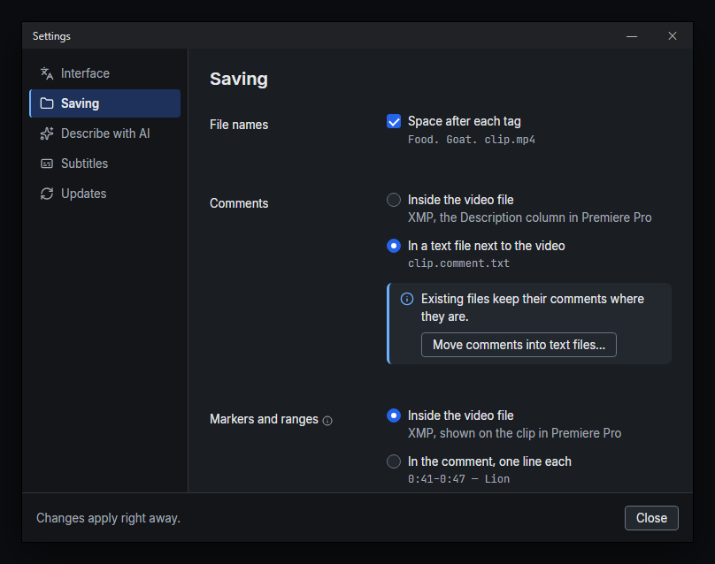 | 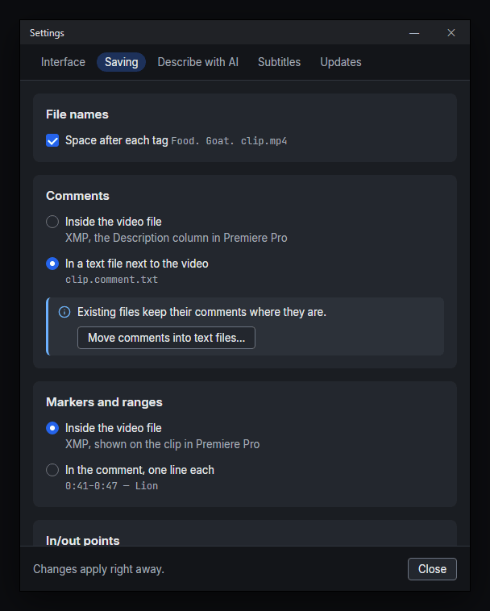 | 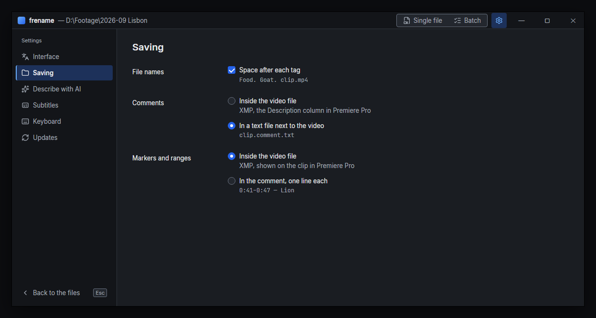 |

**A. Separate window with a category list on the left (two-panel selector).** One page per
category, one row per option (label left, control right), a button bar with Close.
- For: current values readable at a glance, pages whose names predict their content, arrow keys
  move between categories (DI "Settings Editor", "Two-Panel Selector" p. 90–91, 343). The main
  window stays visible and usable, so switching monochrome tags or the language shows its effect
  at once. Room for a *Keyboard* page (#62) without redesign.
- Against: one more window to manage (it already exists today).

**B. Separate window, one scrolling page of titled cards with a jump bar.** Closest to today's
window, with the sections made visible as cards.
- For: everything on one page, easy search by scrolling.
- Against: the page gets long (Describe with AI and Subtitles are at the end and were opened
  "scrolled to the end" before); a long card stack is the "SaaS card kit" look; the jump bar is a
  tab strip in disguise and wraps in Russian.

**C. Settings as a page inside the main window** (VS Code / Lightroom style), under the app bar
of #64.
- For: no second window, no keyboard leaks between windows.
- Against: covers the work while it is open, so the effect of a setting cannot be seen next to it;
  it needs #64's app bar first; it makes Settings modal in practice ("a dialog is another room",
  AF ch. 18, but here the room replaces the house).

**Decision: A.** It follows the settings patterns of DI and AF most closely, keeps the main window
working (AF ch. 21: property settings are modeless and apply immediately), splits the long page
into short ones, and is the smallest change for #64 (⚙ just moves to the app bar) and #62 (one
more page).

Settings today, for comparison (560×640, one scrolling page):

| top | middle | end |
|---|---|---|
| 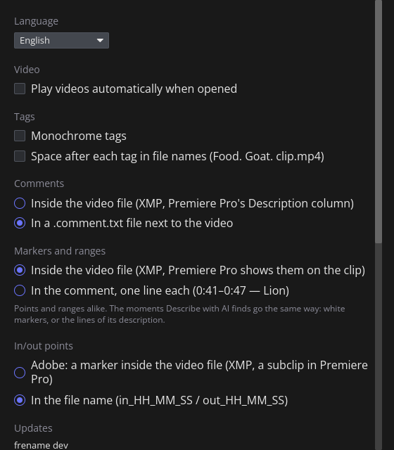 | 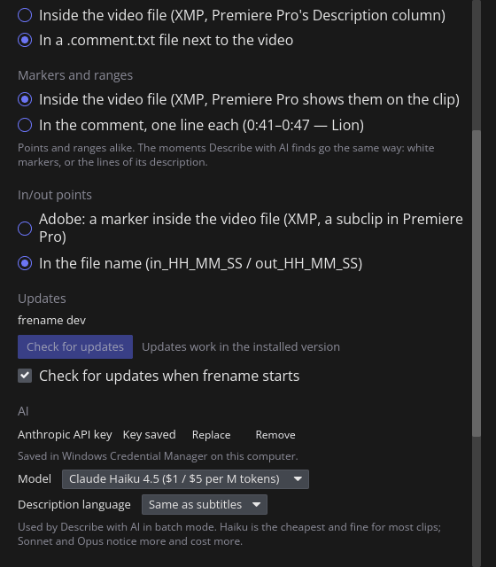 | 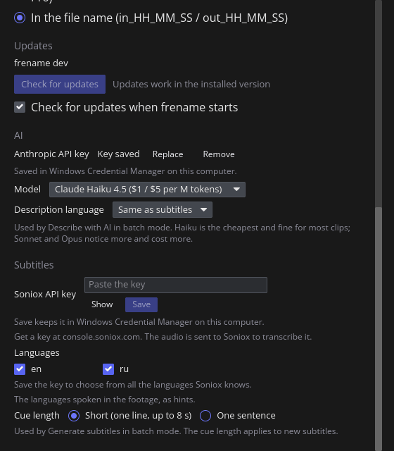 |

## 3. Color

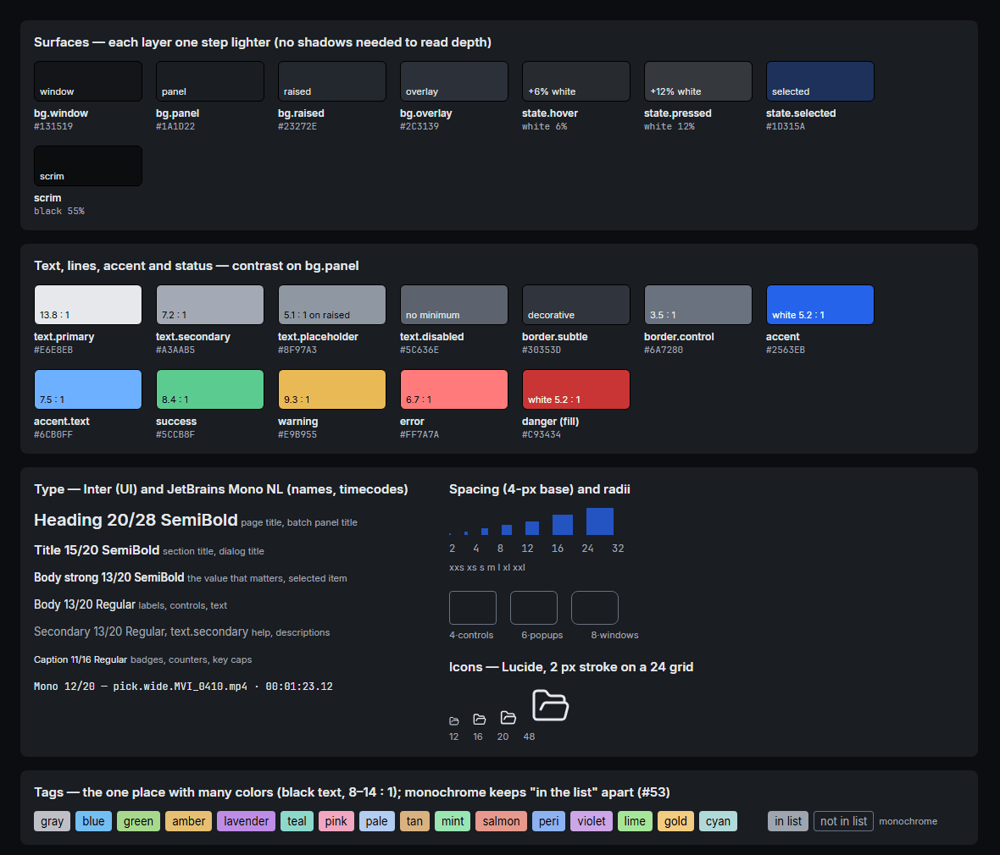

### 3.1 Tokens

All colors in the app come from these tokens. Contrast is WCAG 2 against the surface it is used on
(`panel` unless noted), computed from the hex values.

| Token | Hex | Use | Contrast |
|---|---|---|---|
| `bg.window` | `#131519` | behind panels; navigation column; button bars; app bar | – |
| `bg.panel` | `#1A1D22` | panels and pages: file list, tag grid, video controls, Settings page | – |
| `bg.raised` | `#23272E` | fields, secondary buttons, cards, notices, file name panel | – |
| `bg.overlay` | `#2C3139` | menus, dropdown lists, tooltips, dialogs | – |
| `state.hover` | white 6 % | hover over a transparent control or row | – |
| `state.pressed` | white 12 % | pressed | – |
| `state.selected` | `#1D315A` | the selected row, category, cell, segment | text 10.4 : 1 |
| `scrim` | black 55 % | behind a modal dialog | – |
| `border.subtle` | `#30353D` | dividers, window/panel edges, menu outline (decorative) | – |
| `border.control` | `#6A7280` | the edge of a field, checkbox, radio, secondary button | 3.5 (panel), 3.1 (raised) |
| `text.primary` | `#E6E8EB` | all normal text and icons | 13.8 (panel), 10.7 (overlay) |
| `text.secondary` | `#A3AAB5` | help, descriptions, meta, idle tab labels | 7.2 (panel), 5.6 (overlay) |
| `text.placeholder` | `#8F97A3` | placeholder in a field | 5.1 (raised) |
| `text.disabled` | `#5C636E` | disabled text and icons (no minimum, WCAG 1.4.3 exception) | – |
| `accent` | `#2563EB` | fill of the primary button, checked box, selected radio, progress | white on it 5.2 |
| `accent.hover` / `.pressed` | `#2F6DF0` / `#1D56D6` | primary button hover / pressed | 4.6 / 6.3 |
| `accent.text` | `#6CB0FF` | accent as text or line: links, focus ring, selection bar, latched icon | 7.5 |
| `success` | `#5CCB8F` | done, saved, changed | 8.4 |
| `warning` | `#E9B955` | needs attention, nothing lost | 9.3 |
| `error` | `#FF7A7A` | failed, invalid (text, icon, field edge) | 6.7 |
| `danger` / `danger.hover` | `#C93434` / `#D23B3B` | fill of the button that confirms a destructive action | white on it 5.2 / 4.7 |

Why these values:
- **Four surfaces, one step apart**, so depth reads without shadows (PUI "Adding depth in dark
  interfaces": base / raised / overlay). The grays lean slightly cool (hue ≈ 220), like Premiere
  Pro and DaVinci Resolve, so frename sits quietly next to them. No pure black (PUI, RUI).
- **Text contrast ≥ 4.5 : 1 on every surface it is used on** (MiM ch. 6; the issue's rule), and
  more on dark surfaces than the minimum (PUI: dark interfaces need contrast "well above" WCAG).
- **Control edges ≥ 3 : 1** (PUI "Ensure form field borders are high contrast"; WCAG 1.4.11).
  Decorative dividers have no minimum and stay subtle (RUI "Use fewer borders").
- **One accent.** `accent` is dark enough to carry white text (5.2 : 1); `accent.text` is its
  light twin for lines and text on dark (7.5 : 1). The iced default violet `#5865F2` disappears.
- **The error red is light and desaturated**, since dark reds vanish on dark backgrounds
  (MiM ch. 4: "Don't use dark reds, blues, or violets against any dark colors").

### 3.2 Rules

- **Never color alone.** Every state that has a color also has a shape, an icon or a word: the
  selected category has a bar and bold text, an error has an icon and a sentence, a failed file
  has ✕ and a reason (AF ch. 16; MiM ch. 4; PUI).
- **Red means error or destruction and nothing else** (MiM ch. 5: "Reserve red for errors"). The
  delete ✕ on a tag chip is not red; it is the chip's text color.
- **Accent means "selected, focused, or the main action".** It is not decoration: no accent
  headings, no accent icons that are not latched on.
- **States are overlays**, not new colors: hover adds `state.hover`, pressed `state.pressed`, on any
  surface (PUI "Use transparent layers for interaction states"). Disabled is `text.disabled` (or
  40 % opacity for a filled button); a disabled control keeps its size and place.
- **One "selected" look everywhere:** `state.selected` fill, plus `accent.text` 2 px bar or ring
  where the item is not obviously the only selected one. Today's three tints (accent 25 %, 45 %,
  and a 2 px border) become this one.

### 3.3 Content colors (kept as they are)

- **Tag palette** (`src/tag_colors.rs`): 16 light colors with black text, 8–14 : 1. Unchanged;
  it moves into `ui` with #53 or #59. **Monochrome** (#53) will use `tag.mono.known` `#9EA5AF` (black
  text 7.9 : 1) for tags in the list and an outlined chip (`border.control` edge, `text.secondary`
  text) for tags not in the list; #53 implements it.
- **Marker colors** (`theme::marker_color`): the nine Premiere Pro marker colors stay as they are:
  they must match Premiere, not the theme.
  `marker.label.tint` 25 %: how much of its marker's color tints the marker label's fill over
  `bg.raised` (§13.3.4; `MARKER_LABEL_TINT`).
- **Video overlays** (subtitle caption, side list over the picture): black 62 % and a near-black
  72 % panel, so text reads over any picture. They are tokens (`overlay.caption`,
  `overlay.list`), used only over video.
- **Star** is black 70 % on the chip (`tag.star`, §13.8; today gold, which vanishes on yellow chips); **volume** and batch "changed" green become
  `success`; the in/out **segment** yellow stays a token (`video.segment`).

## 4. Typography

### 4.1 Fonts

| Role | Font | File | Why |
|---|---|---|---|
| UI | **Inter** 4.1, Regular and SemiBold | `Inter-Regular.ttf`, `Inter-SemiBold.ttf` (≈ 830 KB) | Drawn for screens at 11–16 px; full Latin and Cyrillic; neutral, like the Segoe UI users know. |
| File names, timecodes, keys in values | **JetBrains Mono NL** 2.304 Regular | `JetBrainsMonoNL-Regular.ttf` (≈ 210 KB) | 0/O and 1/l/I differ (DI p. 273); fixed width keeps timecodes still; the NL build has no ligatures, so `->` or `==` in a file name is shown as typed. |

Both are SIL OFL 1.1 and are bundled into the binary (`include_bytes!`), so Windows, Linux and
the CI screenshots draw the same letters. The licence files go next to the fonts
(`assets/fonts/`). Static files, not the variable font: the family name is then just "Inter", and
two weights are all the system uses (PUI: "regular and bold font weights only").

### 4.2 Text styles

Only these styles exist. Sizes are logical pixels.

| Style | Font | Size / line | Use |
|---|---|---|---|
| `heading` | Inter SemiBold | 20 / 28 | Settings page title; batch panel title; empty-state title |
| `title` | Inter SemiBold | 15 / 20 | section title; dialog title; batch action title |
| `body` | Inter Regular | 13 / 20 | everything else: labels, controls, lists, tooltips' first line |
| `body.strong` | Inter SemiBold | 13 / 20 | the value that matters in a line: a count, the selected item, a key-saved state |
| `secondary` | Inter Regular, `text.secondary` | 13 / 20 | help, descriptions under options, meta |
| `caption` | Inter Regular | 11 / 16 | badges, counters, key caps, second line of a dense row |
| `tooltip` | Inter Regular | 12 / 16 | tooltip text only (a tooltip is small and dense by nature) |
| `error` | Inter Regular, `error` | 13 / 20 | what went wrong, next to where it did (§10.3) |
| `mono` | JetBrains Mono NL | 12 / 20 | file names, paths, timecodes, examples of names |
| `video.caption` | Inter Regular | 28 / 36 | subtitle caption over fullscreen video only |

Rules:
- **Hierarchy by weight and color first, size second** (RUI "Size isn't everything"). Help text is
  `body` size in `text.secondary`, not smaller text.
- Sizes differ by at least 2 px where they sit together (DI p. 489: one point "looks like a
  mistake"). 13 and 11 never sit on one line except a key cap inside body text.
- Nothing below 11 px (AF ch. 17: "less than 10 pixels are difficult to read").
- No ALL CAPS, no italics, no letter-spaced labels (AF ch. 17; MiM ch. 6).
- Left-aligned text; numbers in tables right-aligned (RUI).
- Line length ≤ 80 characters: help text wraps inside its control column.
- Mono is 12 px because JetBrains Mono's x-height is larger than Inter's: 12 px mono matches 13 px
  Inter in visual size.
- The default text size of iced becomes 13 (today it is 16 wherever a view forgot `.size()`).

## 5. Spacing, sizes and layout

### 5.1 Spacing scale

A 4-px base, each step at least 25 % bigger than the one before (RUI; AF ch. 17 "atomic grid
unit"; PUI "4 point increments" for detailed interfaces):

| Token | px | Use |
|---|---|---|
| `xxs` | 2 | between rows of a list; between a label and its description |
| `xs` | 4 | between buttons of a toolbar group; between chips; icon to text in a badge |
| `tight` | 6 | between an icon and its words in a button; inside tooltips and the search bar |
| `s` | 8 | inside a group: between controls of one row, options of one question, buttons of a bar |
| `m` | 12 | between the options of a radio group that have descriptions; toolbar group gap |
| `l` | 16 | padding of button bars; between the label column and the control column |
| `xl` | 24 | between rows of a Settings page; page side padding |
| `xxl` | 32 | between sections of a long page |

Rules:
- **Space inside a group < space between groups** (RUI "Avoid ambiguous spacing"; DI "Proximity";
  BIR «Близость»): a label sits closer to its control than to the next row.
- **Two vertical rhythms per surface** where possible (BIR «Сетка»): Settings uses 8 inside a
  row and 24 between rows.
- Space above a title is at least twice the space below it (BIR «Заголовки»).
- Near-equal gaps become equal (AF ch. 17 "snap near-equal spacings").

### 5.2 Sizes

| Token | px | What |
|---|---|---|
| `control.height` | 28 | buttons, fields, dropdowns, segmented control |
| `bar.height` | 32 | toolbars (folder controls, video controls); icon buttons in them are 32×32 |
| `appbar.height` | 40 | #64 version A: frename's own title bar (§13.12) |
| `appbar.height.under_title` | 36 | #64 version B: the app bar under the OS title bar (§13.12) |
| `buttonbar.height` | 56 | window button bar (28 button + 2 × 14) |
| `row.height` | 32 | list row, navigation item, menu item 28 |
| `row.tall` | 44 | two-line row (recent folders, file list keeps its 52) |
| `icon.button.small` | 24 | icon buttons inside rows and chips |
| `check.size` | 16 | checkbox and radio |
| `focus.ring.gap` | 2 | between a button, checkbox or radio and the 2 px focus ring around it (`FOCUS_RING_GAP`, §6 Focus) |
| `nav.width` | 188 | Settings navigation column |
| `label.width` | 160 | Settings label column |

**Hit targets:** a desktop tool with a mouse does not need 44–48 px targets (PUI and the mobile
guidelines assume touch). frename's minimum *hit* area is 24×24 (WCAG 2.2 target size), 32 in
toolbars; the whole row is clickable, and a checkbox or radio label is part of its target
(MiM ch. 13; BIR «Прицеливание»). At least 4 px between separate targets, 8 px around anything
destructive (BIR: "separate dangerous buttons with extra distance").

### 5.3 Layout

- **Padding:** window content 20 top/bottom, 24 left/right; panels 8; notices 8×12; menus 4;
  tooltips 6×8; dialogs 20.
- **Alignment:** everything on a surface aligns to one left edge; labels are left-aligned, never
  right-aligned (BIR «Формы»; AF ch. 17). The control column starts at the same x on every row
  of a page.
- **Center stage:** the video and the tag grid are the work areas; side panels have fixed widths
  that the user can drag (RUI "Grids are overrated": fixed sidebars, flexible main area).
- **Label left, control right** in Settings and in batch options (BIR: table layout on wide
  windows); **label above** only in narrow places (a dialog under 400 px).

## 6. Shape and depth

- **Radius:** 4 (`radius.s`: controls, chips, rows, badges), 6 (`radius.m`: menus, tooltips,
  notices, cards), 8 (`radius.l`: dialogs). Round (`radius.full`) only for dots and the knob-like
  marker pins. Today's nine radii become these four.
- **Borders:** 1 px. `border.control` only on things you can type into or tick, and on secondary
  buttons; `border.subtle` for dividers and outlines of popups. No boxes around sections: a title
  and space group them (DI "Titled Sections"; AF ch. 17 "visual noise").
- **Depth:** lighter is closer. Popups (menus, tooltips, dialogs) are `bg.overlay` with one shadow
  `0 8 24 black 50 %`; dragged chips keep their lift shadow. Nothing else has a shadow.
- **Focus:** a focused field or dropdown draws a 2 px `accent.text` border as its edge (iced draws a
  field's border inside its bounds). A focused button, checkbox or radio gets the same 2 px ring
  outside it, 2 px away (`FOCUS_RING_GAP`), so focusing never moves anything. iced 0.14 focuses only
  fields; Settings keeps the focus of its other controls itself (§11).

## 7. Icons

- **Set:** [Lucide](https://lucide.dev) (ISC licence), outline icons on a 24 grid with 2 px strokes
  and round joins. One family, one stroke weight (PUI; AF ch. 17 "If some of your icons use bold
  black lines … the visual style won't hold together").
- **Sizes:** 16 in buttons, menus and rows; 14 for small marks inside chips and rows (star, chip
  action, status column); 12 inside badges and row meta; 20 only for the trash drop zone; 24 for
  spinners and the empty states of small panels; 48 for the empty states of panes and windows. Icons are drawn at those sizes, never scaled from another (RUI
  "Everything has an intended size").
- **Color:** an icon takes its control's text color (`svg::Style { color }`), so it follows hover,
  disabled and selected states. A latched toggle (subtitle list shown) draws its icon in
  `accent.text` on `state.selected`. Filled icons mean "on" (★ starred) and are the only filled
  ones (PUI: "filled icons often indicate that an element is selected").
- **Every icon-only button has a tooltip** with its name and key (§8.13).
- **Words stay words:** `[`, `]`, `CC`, `SRT`, `F1`… are text, as #44 says.
- **Delivery:** #57 enables iced's `svg` feature and adds `assets/icons/` (with Lucide's ISC licence)
  and the `ui::icons` module with the icons Settings needs (navigation, ⓘ, notices). #44 adds the rest
  and replaces every glyph button. Until then the main window's glyphs stay as they are. The
  recommended mapping for #44:

| Today | Lucide | | Today | Lucide |
|---|---|---|---|---|
| ◀ ▶ (file) | `chevron-left` `chevron-right` | | ⏪ ⏩ | `rewind` `fast-forward` |
| ⏮ ⏭ (frame steps, #162) | `step-back` `step-forward` | | | |
| ⊙ | `locate-fixed` | | ▶ ⏸ | `play` `pause` |
| 📂 | `folder-open` | | 📷 | `camera` |
| ⚙ | `settings` | | 📍 | `map-pin` |
| ☑ (batch) | `list-checks` (segmented control in #64) | | 🔊 | `volume-2` |
| ⛶ ⊡ | `maximize-2` `minimize-2` | | ◆ (marker list) | `map-pin` (one symbol for markers everywhere) |
| ✎ | `pencil` | | ✕ × (close, delete) | `x` |
| ✓ | `check` | | ○ (save tag) | `plus` |
| ★ ☆ | `star` (filled / outline) | | 🔍 | `search` |
| 🗑 | `trash` (Lucide merged `trash-2` into it) | | 🔒 🔓 ↑ ↓ | `lock` `lock-open` `arrow-up` `arrow-down` |
| ⏳ ◐◓◑◒ | `loader-circle` (turning) | | 🎬 📄 📭 | `clapperboard` `file` `folder-x` |
| ✕ (load failed, 80 px) | `circle-x` 48 | | ⌨ (#62) | `keyboard` |

## 8. Components

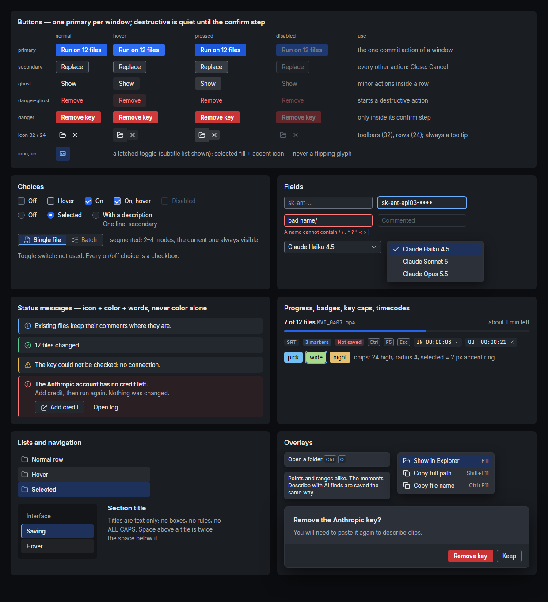

Each component lists its sizes and its states: normal, hover, pressed, focused, disabled (and
selected where it has one). iced 0.14 gives buttons, checkboxes and radios no keyboard focus
(§11), so "focused" applies to fields, and in Settings to every control (§6 Focus).

### 8.1 Buttons

```
 ┌──────────────────┐  ┌──────────┐  ┌────────┐     Remove        ┌─────────────┐
 │ Describe 12 files│  │ Replace… │  │  Close │   (danger-ghost)  │ Remove key  │ (danger)
 └──────────────────┘  └──────────┘  └────────┘                   └─────────────┘
   primary              secondary     secondary
```

| Kind | Look | Use |
|---|---|---|
| **primary** | `accent` fill, white SemiBold text | The one commit action of a window or panel: *Describe 12 files*, *Save key*. At most one per window (PUI; MiM ch. 7). |
| **secondary** | `bg.raised` fill, `border.control` edge, `text.primary` | Every other command: *Close*, *Cancel*, *Replace…*, *Check for updates*, *Move comments…*. |
| **ghost** | no fill, `text.primary`; hover shows `state.hover` | Minor commands that act right here, inside a row or a list's header: *Invert*, *Copy the list*, *Undo*. Not for going somewhere: that is a link (§8.21). |
| **danger-ghost** | no fill, `error` text and a 1 px `error` edge | The first step of a destructive action: *Remove…*. Clearly a button, but quieter than a filled one until confirmed (PUI "friction"; RUI "Semantics are secondary"). |
| **danger** | `danger` fill, white SemiBold | Only inside the confirmation of a destructive action: *Remove key*. |
| **icon** | 32×32 (toolbar) or 24×24 (row), transparent | Frequent toolbar actions with a known picture. Always a tooltip. |
| **icon, latched** | `state.selected` fill, icon `accent.text` | A toggle that shows its state: subtitle list, marker list, fullscreen, batch mode today. |

- Height 28, padding 0×12, radius 4, text `body` (primary/danger SemiBold). Icon + text: 16 px
  icon, 6 px gap.
- States: hover = `accent.hover` / `state.hover` overlay; pressed = `accent.pressed` /
  `state.pressed`; disabled = 40 % opacity, same size and place. A disabled button always has a
  visible reason nearby or in its tooltip (PUI "Avoid disabled buttons"; BIR: caption it).
- **Focused** (Settings, §11): a 2 px `accent.text` ring with radius 6 (radius 4 + the gap) drawn
  2 px outside the button, around its whole box, for every kind (danger and danger-ghost too: the
  ring is the one focus color, the button keeps its own). Focused + hover shows both: the hover fill
  inside, the ring outside. Tab never lands on a disabled button; one disabled while focused keeps
  the ring (§11), around its 40 % look:

```
  ╭──────────────────────╮
  │┌────────────────────┐│   ring at full strength, button at 40 %
  ││ Update and restart ││   (disabled while a batch runs; Space and Enter do nothing)
  │└────────────────────┘│
  ╰──────────────────────╯
```

```
  ╭────────────╮
  │┌──────────┐│   2 px accent.text ring, 2 px gap
  ││ Replace… ││   (the button's own edge and fill unchanged)
  │└──────────┘│
  ╰────────────╯
```
- **Close and Cancel** are secondary buttons, except on a *result* screen where nothing is left to
  commit (a finished batch job, #58): there Close is the primary button, and it is still the last
  one on the right (§9.2).
- Labels are verb + object in sentence case and name what the click achieves, not the place it
  opens: *Set the key…*, not *Open Settings*; *Generate subtitles…*, not *Go to batch mode*;
  *Save key*, *Describe 12 files*, never *OK*, *Yes*, *Submit* (DI "Prominent Done Button"; PUI; BIR «Кнопка»). The count goes into the label when
  it helps ("Run on 12 files").
- **Ellipsis** only when the button asks for more before acting (*Replace…* shows a field,
  *Import settings from an old frename folder…* opens a picker); never on a button that acts at once
  (BIR «Многоточие»).
- **Never a state-flipping label** (*Play/Pause* as one label that changes): use a latched icon
  button or two states that are both visible (AF ch. 21 "State-switching buttons: an idiom to
  avoid"). The play button is the accepted media exception: its icon shows the action.

### 8.2 Checkbox

- 16×16 box, radius 3, `border.control` edge on `bg.raised`; checked: `accent` fill with a white
  tick. Label `body` on the right, 8 px gap; the label is clickable.
- States: hover edge `text.secondary`; checked hover `accent.hover`; disabled: `border.subtle`
  edge, `text.disabled` label.
- **Focused** (Settings, §11): the button ring (§8.1) around the box *and* its label, the whole
  click target. A checkbox with a hint line under it rings only the checkbox line; the
  hint stays outside. A checkbox of a fixed width (a Subtitles language, 120 wide) is ringed across
  its whole cell, empty space included, since the whole cell takes the click. Focused + hover: the
  hover edge on the box, the ring around it.

```
  ╭──────────────╮
  │ ☐ Monochrome │          ← ring around box and label only
  ╰──────────────╯
    Tags you added show in a darker gray, …      ← the hint stays outside

  ╭────────────╮
  │ ☑ en       │ ☑ ru       ← a language cell: the ring spans the 120-wide cell
  ╰────────────╯
```
- Positive wording that describes a lasting behaviour: *Check for updates when frename starts*,
  not *Don't check…*, not *Yes* (BIR «Чекбокс»; PUI "Use positive phrasing").
- One style in the whole app. The three copies of `dark_checkbox_style` and the default iced
  style become one component (#59 moves the tag grid and batch rows).

### 8.3 Radio group

```
 ◉ Inside the video file
   XMP, shown on the clip in Premiere Pro
 ○ In the comment, one line each
   0:41–0:47 — Lion
```

- 16×16 circle, `border.control` edge; selected: `accent` fill with a 6 px white dot.
- Always stacked vertically (BIR: «классические радиокнопки должны стоять друг под другом»),
  always two or more, one always selected (AF ch. 21).
- **Option with a description:** the option's name on the first line (`body`), one line of
  `secondary` under it; an example of a name or a timecode in `mono`. 12 px between options with
  descriptions, 8 without. This replaces today's long labels in parentheses that wrap onto two
  lines.
- The group's question is the row label on the left; the options do not repeat its words
  (BIR: "take it out of the brackets").
- **Focused** (Settings, §11): each option is a Tab stop of its own, and Space picks it. The ring
  (§8.1) goes around the whole option, its description included, since a click on the description
  picks it too:

```
  ╭──────────────────────────────────────────╮
  │ ○ Inside the video file                  │   ← focused, not selected
  │   XMP, the Description column in Premiere│
  ╰──────────────────────────────────────────╯
   ◉ In a text file next to the video
     clip.comment.txt
```

### 8.4 Segmented control

`[ Single file | Batch ]` (#64). 28 high, `bg.raised` with a `border.control` edge; the current
segment is `state.selected` with SemiBold text and a 2 px `accent.text` underline, so the mode is
visible without color (DI "Module Tabs": "Color alone isn't usually enough"). 2–4 segments, each
with a word (and an icon if the words are short). It shows a *mode*, never a one-off command.

### 8.5 Toggle switch

**Not used.** Every on/off choice is a checkbox. A switch would be a second look for the same thing
(principle 2), and AF ch. 21 finds switches "somewhat more awkward to use, in desktop" apps. Changes
in Settings apply at once either way; the button bar says so.

### 8.6 Text field

- 28 high, padding 0×8, radius 4, `bg.raised`, `border.control` edge, text `body`, placeholder
  `text.placeholder`. Width shows the expected input (DI p. 473): a tag name 160, a key 280, a
  search the whole column.
- States: hover edge `text.secondary`; **focused**: 2 px `accent.text` border; **error**:
  `error` edge and a message under it (§10.3); disabled: `bg.panel`, `border.subtle`,
  `text.disabled`.
- A placeholder is an example (`sk-ant-…`), never the label (DI p. 473; PUI; BIR «Взгляд
  новичка»).
- **Secret field** (API key): hidden by default; a ghost *Show* / *Hide* button next to it.
- **Search field** (#59): a `search` icon inside on the left; `x` to clear on the right when not
  empty (tooltip *Clear — Esc*).

### 8.7 Dropdown (pick list)

- Looks like a field with a `chevron-down` on the right; the list is a menu (§8.14) under it,
  `bg.overlay`, the current item marked with `check` and `state.selected`.
- For choices of 5 or more, where the options are long (models with prices), or where the list
  grows over time (UI languages). A fixed set of fewer than 5 short options is a radio group (PUI:
  radios up to about 10; BIR).
- Drop-downs choose values, never run commands (DI p. 378).
- States: hover edge `text.secondary`; **open**: 1 px `accent.text` edge while its list shows;
  **focused** (Settings, §11): a 2 px `accent.text` edge, as a focused field (§8.6), drawn as its
  own edge, not a ring outside it. Focused wins over hover and open: the edge stays 2 px.

```
  ┏━━━━━━━━━━━━━━━━━━━━━━━━━━┓
  ┃ English               ⌄  ┃   2 px accent.text edge, chevron unchanged, no outer ring
  ┗━━━━━━━━━━━━━━━━━━━━━━━━━━┛
```
  Space moves a focused dropdown to its next option, wrapping (iced cannot open the list from
  the keyboard).

### 8.8 Slider

The seek bar and the volume bar are frename's own `ProgressBar` widget. Track `video.track` 6 px,
radius 3 (today 8 px, radius 4); fill `accent` for the seek bar, `text.secondary` for volume; hit
height 24. Hover brightens the track to `border.control`; dragging shows the value. The seek bar's
full look is §13.3.4. #59 moves their colors to tokens; no stock slider is used.

### 8.9 List row

- 32 high (one line) or 44 (two lines: name + `caption` meta), padding 0×8, radius 4. The file
  list keeps its 52-px rows (tags + comment line).
- States: hover `state.hover`; **selected** `state.selected` (plus SemiBold or an `accent.text`
  icon where several things could look selected); **unavailable** (a recent folder that is not
  found): dimmed, not disabled: text in `text.disabled` with a "not found" note, still clickable, and
  a click offers the fix inline ("Remove from the list? [Remove] [Keep]", #63).
- The whole row is the target (BIR: «Одна строка — это один объект»). Row actions (✕ remove)
  appear on hover and on the selected row, in a 24-px icon button at the right end (DI "Hover
  Tools": they must not shift the layout).

### 8.10 Section header

`title` style text, no box, no rule, no caps. 24 px above (or the page padding), 12 below. Names say
what is inside ("Comments", "Markers and ranges"); never "General", "Advanced", "Other"
(BIR «Слова»; DI: a "Miscellaneous" section means the grouping is wrong).

### 8.11 Help text and ⓘ

- **Short help (one line) sits under its control** in `secondary`. It says what the choice does,
  not how to click it.
- **Longer help goes behind ⓘ:** a 12-px `info` icon after the row label or the control; hovering it
  shows a tooltip (max 280 px wide). ⓘ holds only what is never needed to choose: anything that
  changes the choice goes into the option's description (PUI: don't hide critical hints in
  tooltips). iced cannot focus ⓘ, so keyboard users never see it; that is why the rule is strict.
- Never a paragraph of gray text under an option: the owner's first complaint about Settings.

### 8.12 Status message (notice)

```
 ▌ⓘ Existing files keep their comments where they are.
 ▌  [Move comments into text files…]
```

- A block in the flow of the page: `bg.raised`, radius 6, padding 8×12, a 3 px bar on the left in
  the status color, a 16-px icon in the same color, text `body`. Error notices use a red-tinted
  surface `#2A1F22`.
- Four kinds, each with its own icon: **info** (`info`, `accent.text`), **success**
  (`circle-check`, `success`), **warning** (`triangle-alert`, `warning`), **error**
  (`circle-alert`, `error`).
- First line = what happened (SemiBold if there is a second line); second line = what to do; then
  at most two buttons (secondary / ghost). §10.3 for the wording.
- A notice block stays until the situation changes. No toasts that vanish (AF ch. 21 "Bulletin
  dialogs").
- **Inline status** (one line, no box): an icon + text, e.g. "✓ Saved in Windows Credential
  Manager" in the API key row.
- **Lifetime of short feedback** (one rule for the whole app): a *confirmation* of something the
  user just did and can see ("Frame saved", "Marker deleted") is inline status for 2 s; an *error*
  stays until the user's next action. Neither ever covers content or asks for a click. The video
  pane's slot for them is §13.3.5.

### 8.13 Tooltip

- `bg.overlay`, `border.subtle` edge, radius 6, padding 6×8, text style `tooltip` (12/16), max width
  280, one shadow.
- **Delay 500 ms** (`tooltip.delay`); drag-and-drop previews show at once. AF ch. 18 asks for "a
  second or so", DI for 1–2 s; frename's users hover icon toolbars many times a day and read the
  key in the tooltip, so half a second.
- **Placement:** away from the edge the control sits on: *below* for the app bar and top rows,
  *above* for the bottom bars (folder controls, video controls), *left* for controls at the right
  edge of a panel; a file row's full name *right*, beside the list, and the marks inside the row
  *left*, so the two never cover each other. 6 px gap. Never over the thing it explains, and never
  under the pointer's path to its neighbours (BIR «Движение и клик — один жест»).
- **Content:** the command's name in sentence case, then its keys as key caps: `Open a folder`
  `Ctrl` `O`. Only the keys that work in that place. The key shown comes from the shortcut
  registry of #62 once it exists.
- Required on every icon-only control; optional on text buttons (only to say why one is
  disabled).
- Never used for errors (BIR: errors go next to the field).
- A drag preview (the chip over the trash) is drawn in the tooltip's box, at once, over every
  tooltip (`ui::tooltip::drag_preview`, `Z::DragPreview`).

### 8.14 Menu and context menu

- `bg.overlay`, `border.subtle`, radius 6, padding 4, shadow; items 28 high, padding 0×8, 16-px icon
  (or 16 px of space) + label + key on the right in `text.secondary`; separators `border.subtle`
  with 4 px around. Hover and keyboard highlight: `state.selected`.
- Opens under the pointer (context menu, #48) or under its anchor (dropdown, recent folders); the
  most frequent item first (BIR). Short (DI: "Keep them short").
- Closes on Esc, a click outside, or choosing an item. Up/Down move, Enter chooses (§11).

### 8.15 Progress

- **Bar:** 6 px, radius 3, track `bg.raised`, fill `accent`. Above it: `body.strong` "7 of 12
  files" (work left, not done, MiM ch. 14), the current file in `mono`, and on the right the time
  left in human terms ("about 1 min left"). Cancel is next to it.
- **Spinner** (`loader-circle`, turning) for waits that cannot be measured, and only after
  0.5 s; under 0.5 s nothing (BIR: a progress bar is "too loud" for a short wait; MiM ch. 14).
- Timing (AF ch. 17; MiM ch. 14): feedback within 0.1 s; a busy sign within 1 s; progress with a
  time estimate and Cancel above ~2 s; over 10 s the work runs while the rest of the app stays
  usable.

### 8.16 Badge, chip, key cap, timecode

- **Badge:** `caption` SemiBold, padding 0×6, radius 4, `bg.raised` + `text.secondary`, or tinted
  (`accent.text` 16 % + `accent.text` text; `error` 16 % + `error`). For facts: `SRT`, "3 markers",
  "Not saved".
- **Tag chip:** 28 high, padding 0×8, `body` 13 text in the tag grid and the file name card; 20 high,
  padding 0×6, 12/16 text in file list rows (`chip.mini`); radius 4, tag color, black text.
  Cursor: 2 px `accent.text` ring 1 px outside. Chip marks (★, the action) are 14-px icons inside
  the chip in black at 70 %; mini chips have none.
- **Key cap:** `caption` in `text.secondary`, `border.control` edge, radius 3, padding 0×4, on
  `bg.raised`. One cap per key, no "+" between them.
- **Timecode:** `mono` on `bg.raised`, radius 4, padding 0×6, optional 12-px `x` to clear. IN/OUT
  badges of the file name panel use it.
- **Suggested timecode:** a timecode range someone else proposes, to take or leave: `sparkles` 12
  in `accent.text`, who proposes it ("AI") in `caption` `accent.text`, the range in `mono`
  `text.primary`, and a `check` 12 in `accent.text`, on the accent tint (`accent.text` 16 %),
  radius 4, padding 0×6. The whole pill is the target (pointer cursor) and applies it; its tooltip
  says what that does. It stays as long as the proposal differs from what is set.

  ```
  ┌──────────────────┐ ┌───────────────────┐ ┌──────────────────────────┐
  │ IN 00:01       x │ │ OUT 00:20       x │ │ ✦ AI 00:03 – 00:12     ✓ │
  └──────────────────┘ └───────────────────┘ └──────────────────────────┘
  ```

### 8.17 Modal dialog

`bg.overlay`, radius 8, shadow, width 420 (max 560); title `title` (the question), one or two
lines of `secondary`, button bar on `bg.raised`. Over a `scrim` that covers the window it belongs
to. When to use one: §9.3.

### 8.18 Panel

A region of the main window: `bg.panel`, no border, separated from its neighbours by the splitter
(1 px `border.subtle` line in a 12-px hit area; hover and drag show `border.control`). A panel
with a title (batch panel) has a title row (`heading` + `secondary` context), content, and its own
button bar at the bottom.

### 8.19 Scrollbar

Rail 6 px, `bg.raised`, scroller
`border.control`, hovered or dragged `accent.text`; radius 3. Scroll content keeps 8 px from the
rail.

### 8.20 Empty state

In the middle of the empty area — centered in a pane or panel; the whole-window empty screen is a left-aligned block max 420 wide —: a 48-px icon in
`text.secondary`, a `heading` (whole-window screens) or a `title` (panes and panels) that names
the next step ("Open a folder of clips"), one line of
`secondary` with the other ways, and the action as a button (primary if it is *the* thing to do)
(RUI "Don't overlook empty states"; DI "Instant Gratification"; BIR «Взгляд новичка»). Smaller
empty areas (an empty filter result, no markers yet) get one line of `secondary` and, if there is
one, a secondary button ("Add a marker `F2`", "Generate subtitles…"). The line never tells the user
where to go to do something (§1 principle 9): if a click can get there, the button is there.

### 8.21 Link, and when a button instead

Words in `accent.text`, no box, underlined on hover; a 12-px `external-link` icon after the words
when it opens a web page or another program.

**The system.** One question decides: *is this the way forward, or a side trip?*

| | Button (§8.1) | Link |
|---|---|---|
| What the click does | changes something, starts something, or takes the user to where the next step of their task is done, with it prepared | opens something to look at, or to adjust a detail shown right next to it; nothing changes and the task goes on where it was |
| Where it sits | on its own: a button bar, a notice's action row, an empty state, a list's header | inside a line of text, right after the value or sentence it is about; never alone on a line |
| Can it be the only way out of a dead end | yes: it must be | never: a dead end gets a button |
| Examples | *Generate subtitles…* (no subtitles), *Set the key…* (no key), *Add credit* (no credit), *Choose the tag…* (tagging off), *Check all 24 files* (nothing checked), *Open another folder…*, *Run again on 5 files* | *Change* after "Claude Haiku 4.5", *Change* after the spacing, *Show the tag list* after "Order: as in the tag list", *Open the log*, a help page |

- A button that takes the user elsewhere ends with "…" (it does not act yet: §8.1 "Ellipsis") and
  opens the place ready: the Settings page scrolled to the row with the field focused; batch mode
  with the action selected and the files checked. It never runs a paid or destructive action by
  itself: the user still presses Run after seeing the plan.
- A link never runs a command (BIR: «Ссылки не предназначены для отдачи команды»). A web address
  that is only information ("console.soniox.com") is plain text, not a link.
- Weight among buttons: *primary* when it is the one thing to do in that window or panel,
  *secondary* otherwise, *ghost* for small commands in a row (§8.1).

## 9. Windows, dialogs and surfaces

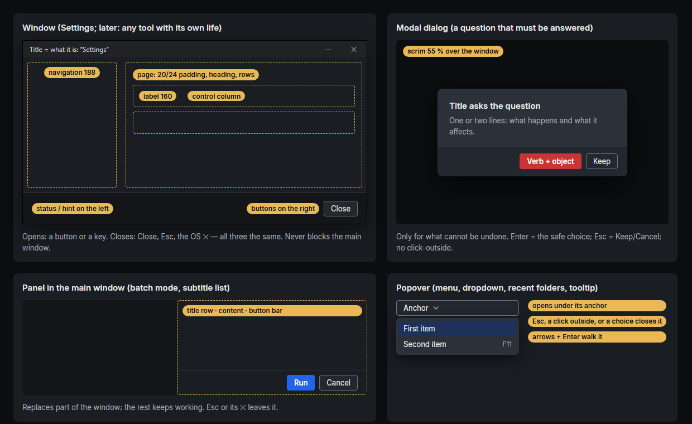

### 9.1 Four kinds of surface

| Surface | What it is | Blocks | Opens | Closes |
|---|---|---|---|---|
| **Window** | An OS window of its own: the main window; Settings. | Nothing. Both windows work at the same time. | A button or a shortcut; a second open focuses the open one. | Close in its button bar, Esc, the OS ✕. All three the same. |
| **Panel** | Part of the main window that changes: batch mode, the subtitle / marker list over the video, the expanded comment. | Only the area it replaces. | Its button or key. | Its ✕ or toggle, Esc (when focus is not in a field). |
| **Modal dialog** | A question drawn over the window with a scrim. | Its window, until answered. | Only by an action that needs an answer (§9.3). | One of its buttons, or Esc (= the safe answer). Not a click outside. |
| **Popover** | Menus, dropdown lists, recent folders (#63), tooltips. | Nothing; it closes when you do something else. | Its anchor, a right-click, a key. | Esc, a click outside, choosing an item. |

The cheat sheet of #62 is a modal dialog without a question: it blocks the window while shown,
has only *Close*, and also closes on its own key (`Ctrl`+`/`) and Esc.

### 9.2 Window anatomy

```
┌ OS title bar: "Settings" (what it is, AF: object name) ───────────── ─  ✕ ┐
│ navigation (188, bg.window) │ page (bg.panel, padding 20/24)               │
│  ▌Selected                  │  Heading                                      │
│   Other                     │  Label ········ control                       │
│                             │                 secondary help                │
├─────────────────────────────┴──────────────────────────────────────────────┤
│ status or hint (secondary)                          [ Secondary ] [ Close ] │  button bar 56
└─────────────────────────────────────────────────────────────────────────────┘
```

- **Title:** the OS title bar says what the window is: "Settings"; the main window the open file.
  #64 decides whether the main window draws its own bar; secondary windows keep the OS one (AF
  ch. 9: they "must be movable").
- **Button bar:** at the bottom of every window and every titled panel, `bg.window` (or the
  panel's color), 1 px `border.subtle` on top, padding 0×16, buttons right-aligned with 8 px
  gaps. On the left, a status or hint in `secondary` ("Changes apply right away.", "Esc closes").
- **Button order:** the right-aligned group ends with **Close/Cancel, always the last button on
  the right**; the primary action stands immediately to its left; other actions further left.
  `[ Run again ] [ Describe 12 files ] [ Cancel ]`. This is the Windows order (confirm left of
  Cancel), which BIR insists on keeping ("like swapping gas and brake"), and it keeps Close/Cancel
  in one place in every window, as #57 asks. A window with nothing to commit has Close only. One
  exception: a batch action page (§13.6.4) has no Cancel, because the panel's `x` and Esc already
  leave it and there is nothing to cancel before Run.
- **Enter** runs the primary button only in a dialog or a panel whose primary is safe and can be
  undone or cancelled (*Describe 12 files* can be cancelled; its cost is shown first), and only when
  focus is not in a field. Never for *Update and restart* or a destructive button. Settings has no
  window-level Enter: Enter submits the focused field (a key field → *Save key*) or presses the
  button the focus ring is on (§11), nothing else. **Esc** runs
  Close/Cancel. A destructive confirmation makes the safe button the default (§10.2).
- *"Primary action on the right, Cancel/Close always in the same place"* (#57) is read as: the
  buttons sit on the right; Close/Cancel is the fixed last one; the primary is next to it.
- **Size:** fits 1280×680 logical; opens centered on the main window's monitor; remembers
  nothing it does not need to (Settings opens at its size every time). Resizable if its content
  can use the space, with a minimum size.

### 9.3 When a modal dialog is allowed

Only when the app cannot go on without an answer and the action cannot be undone (DI "Modal Panel";
MiM ch. 5; AF ch. 21). frename has one such case today, and it is better inline: *Remove a saved API key* asks in its row
(§14.3), because a key is shown only once, when it is made.

No dialog reports success, no dialog asks "Save changes?" (frename saves), no dialog opens another
dialog (AF ch. 21 "Cascading dialogs"). OS dialogs (folder picker, file picker) are fine: they are
the platform's.

### 9.4 Windows and the keyboard

- A key pressed in a window acts in that window only. Main-window shortcuts do not act while
  Settings has focus (today F1/F3/F12 leak: #62 fixes it with the shortcut registry; Settings'
  own keys come with #57).
- Esc closes the frontmost thing of the focused window: first an open popover, then a text field's
  focus (iced unfocuses the field itself), then an inline confirmation (= *Keep*), then the dialog or
  panel, then (Settings only) the window.
- iced 0.14 limit: an open `pick_list` does not take Esc, so Esc with a dropdown open acts on the
  next thing in that order (in Settings: closes the window). Accepted until iced handles it or
  frename draws its own dropdown.

## 10. Patterns

### 10.1 Settings and forms

- **One option per row:** label left (160), control right, help under the control. A row reads as
  a sentence: *Comments — In a text file next to the video* (BIR «Формы»: label and value read as a
  phrase).
- **Settings apply at once and are saved at once**; there is no Save, Apply or Cancel (AF ch. 14
  "Save documents and settings automatically"; AF ch. 21 property dialogs are modeless). The
  button bar says "Changes apply right away."
- **A setting only decides what happens from now on.** Changing where things are saved never moves
  existing data by itself; it shows an info notice under the choice with a button that opens the
  matching batch action (as today: settings choose where, batch actions change files).
- **Choose, don't type:** a bounded control (radio, dropdown, checkbox) wherever the values are
  known (AF ch. 21 "Use bounded controls for bounded input").
- Labels are nouns (*Comments*, *Model*), never "Enter …" (BIR; PUI). No asterisks, no optional
  fields.
- Tab order follows the visual order (BIR «Формы»).

### 10.2 Destructive actions

In order of preference (AF "Do, don't ask"; BIR «Привычка»; PUI "friction by severity"):
1. **Undo** (tags, renames, comments: Ctrl+Z). No confirmation.
2. **Delayed or recoverable** (files to the trash, never deleted).
3. **Inline confirmation** for what cannot be undone: the *danger-ghost* button turns into an
   error notice in place with the question as its first line, the consequence as its second, and
   `[ Remove key ] [ Keep ]` — the danger button left, the safe one last. **Enter and Esc both mean
   Keep** (MiM ch. 15: "Cancel is the default choice"). The question names the thing: "Remove the
   saved Anthropic key?", not "Are you sure?".
4. A modal dialog, only if the action starts from a place that has no room for an inline notice.

### 10.3 Errors

- **Prevent first:** bounded controls, filtering invalid characters, fixing the format silently
  (BIR: "make it impossible or fix it silently"; AF "Make errors impossible").
- **Where:** next to the cause, in space reserved for it (a field's message line; a notice under
  the row; the failed row in a list). Never a tooltip, never a dialog for a single field
  (DI p. 525; BIR «Формы»).
- **When:** on leaving the field or on commit, never while the user is still typing a valid
  value (DI p. 526; BIR).
- **Wording:** what happened · why (if known) · what to do, in the user's words, no blame, no
  "please", no "error:" prefix, no codes in the first line (PUI "Write clear error messages";
  AF ch. 21). "The Anthropic account has no credit left. Add credit, then run again." Technical
  details go to the log, with an *Open the log* link.
- **Once:** a message appears in one place. The batch result's title and its failed row do not
  both say "no credit left" (#58's complaint).
- **Action button** when there is a fix, named by the fix (§8.21): *Add credit* (opens the
  billing page), *Top up on Soniox* (the Soniox console), *Set the key…* / *Check the key…* (the
  right Settings page, scrolled to the key row, the field focused).

### 10.4 Empty states

Every list, grid and window has a designed empty state (§8.20). It says what is missing in human
words ("No markers yet", not "No items to display", BIR «Язык роботов») and offers the next step.

### 10.5 Long lists

- Rows of fixed height; the selected row scrolls into view on keyboard moves; the list keeps its
  scroll position across updates (DI; BIR: lists don't reorder under the user).
- Filtering narrows in place and says how many are hidden ("Filter (3)").
- Tables (batch failures): a header row in `caption` `text.secondary`, cells padded 6×8, a
  `border.subtle` rule between rows, the file name in `mono`, the reason in `body`. Each row can be
  copied (#58).

### 10.6 Loading and progress

- Under 0.5 s: nothing. Up to ~2 s: spinner where the result will appear. Longer: progress bar,
  "n of total", time left, Cancel (§8.15).
- Skeleton of the result rather than a blank area where the layout is known (BIR: skeletons over
  splash screens).
- Background work never blocks other windows; a batch job keeps the file list locked (as today) and
  says so.
- Never report success before it happened (BIR «Мгновенно, но без обмана»).

### 10.7 Feedback

Every click or key shows a change within 0.1 s (MiM ch. 14): a pressed state, a selection, a
spinner. Results that the user asked for are shown where they happen, not announced.

## 11. Keyboard

The full shortcut list and its registry are #62's. The design system fixes the rules the
registry and every surface follow:

- **Typing letters always goes to the tag search** when no field has focus; plain letters are
  never shortcuts (#62's proposed rule 1, kept here as a design rule).
- **Esc** closes or cancels the frontmost thing (§9.4). **Enter** commits: the primary button of a
  window or dialog, the selected item of a list or menu.
- **Arrows** move in lists, grids and menus; **Tab / Shift+Tab** move between fields in visual
  order where iced allows it (§11 focus). Settings changes pages with `Ctrl`+`Tab` instead of
  arrows, which fields do not take (§14.1).
- **Standard keys keep their standard meaning** (Ctrl+C/V/Z/Y, Ctrl+O) (AF ch. 18; DI p. 18).
- **Every shortcut is shown** in its control's tooltip and in the cheat sheet; a menu item shows
  its key on the right.
- **Dangerous commands get no single-key shortcut** (AF ch. 11 "Hide the ejector seat levers").
- **Reserved for #62's registry:** `Ctrl`+`,` opens Settings (the platform-standard key);
  `Ctrl`+`/` opens the cheat sheet. Settings uses `Ctrl`+`Tab` / `Ctrl`+`Shift`+`Tab` for its pages
  (the Windows convention for pages of a dialog) from #57 on.
- **Focus** is visible: a 2 px `accent.text` border (§6 Focus). iced 0.14 can focus only text fields
  and editors; buttons, checkboxes and radios cannot take keyboard focus, and its focus operations
  run over every open window at once, so iced's own Tab cannot be wired per window. In the main
  window every daily command has a shortcut (#62).
- **Settings keeps its own focus** (#167). Its state holds the control the focus is on; nothing
  is focused when the window opens, after a click, or after a page change.
  - **Tab / Shift+Tab** move the ring to the next / previous control of the page that takes a click
    now, in visual order, then *Close*, wrapping around. Hidden and disabled controls are skipped
    (*Save key* until a key is typed; *Update and restart* while a batch runs). The page scrolls to
    show the focused control. Each radio option is a stop of its own.
  - **A text field** takes real iced focus when the ring reaches it (only Settings' own fields are
    focused or left, never the main window's), so typing goes in; typing into a field clicked with
    the mouse moves the focus there, so Tab goes on from it.
  - **Space** does what a click does: a checkbox toggles, a radio option is picked, a dropdown moves
    to its next option (wrapping), a button is pressed. **Enter** presses a focused button only.
    Both pass to a focused field instead (it types or submits).
  - **When a press takes the control away**, the focus goes where the next step is. A key row's
    own buttons (*Remove…*, *Keep*, *Replace…*, *Cancel*) change the row at once, before the focus
    moves, so the new field is there to focus:

    | Pressed | The focus goes to |
    |---|---|
    | *Remove…* | *Keep* (the safe answer, §10.2) |
    | *Keep*, or Esc in the question | *Remove…* |
    | *Replace…* | the new key field |
    | *Cancel*, or Esc while replacing | *Replace…* |
    | *Save key*, or Enter in the key field | stays there while the key is saved; *Replace…* once saved; on a failure it stays on *Save key* (or the field) |
    | *Remove key* | *Remove…* (the question closes); the field for a new key once removed; on a failure it stays on *Remove…* |
    | *Check for updates* (disabled while it checks) | *Check for updates when frename starts* |
    | an offer (the button under a changed choice that opens its batch action) | the control after it on the page |

    *Save key* and *Remove key* are settled when the credential store answers, and only while the
    focus is still in that row. Esc moves the focus only while it is in that key row; without
    keyboard focus it stays off.
  - **A control disabled while focused** (*Update and restart* when a batch starts) keeps the ring
    until Tab moves it; Space and Enter on it do nothing, as a click would not. Tab skips it.
  - **A control that goes away otherwise** (a page change, an option hidden by another choice):
    the ring is not drawn, and the next Tab starts from the first control, Shift+Tab from the last.
  - **A click** takes the ring away; a click into a text field puts the focus on that field, so
    Tab goes on from it.
  - The button bar's *Close* never scrolls the page: it is outside it.

## 12. Text in the interface

- Sentence case everywhere: titles, buttons, menu items (PUI).
- Commands are verbs (*Remove key*); navigation is nouns (*Subtitles*); settings describe a
  lasting behaviour (*Check for updates when frename starts*) (BIR «Кнопка», «Синтаксис»).
- No filler: "please", "successfully", "here", "click", "information", "data" (BIR stop-words;
  PUI). "12 files changed", not "Operation completed successfully".
- Numbers as digits; proper plurals via Fluent (`{ $count ->`), never "file(s)".
- The same thing has the same name everywhere: a button *Describe 12 files* leads to a result
  titled *Describe with AI* and a Settings page *Describe with AI*.
- No trailing full stop on labels, buttons, titles; full stops on sentences in help and notices.
- Every string goes through `fl!` with an English and a Russian text (`docs/design/localization.md`).
  Russian is about 20 % longer: every row wraps rather than clips, and fixed widths (160 label,
  188 navigation) are checked with the Russian UI.

## 13. The main window

This section specifies every region of the main window, every element in it and every state it
can be in. #59 builds it; #58 builds §13.6; #44, #62, #63 and #64 fill the places marked for
them. Where the spec changes what the app *does* (not only how it looks), the line says
**behaviour** and names the issue that may make that change; everything else is look and layout
only.

The pictures in this section are mockups with the real tokens, fonts and icons; the "Today" column
of each table says what the app draws now, so the difference is plain.

### 13.1 Regions and layout

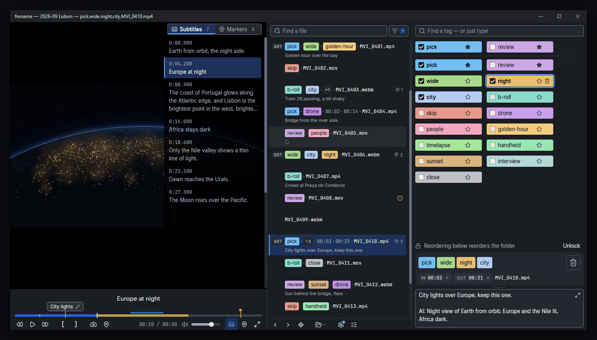

Today, for comparison (screenshots of the app):

| Main window | Marker list | Batch mode |
|---|---|---|
| 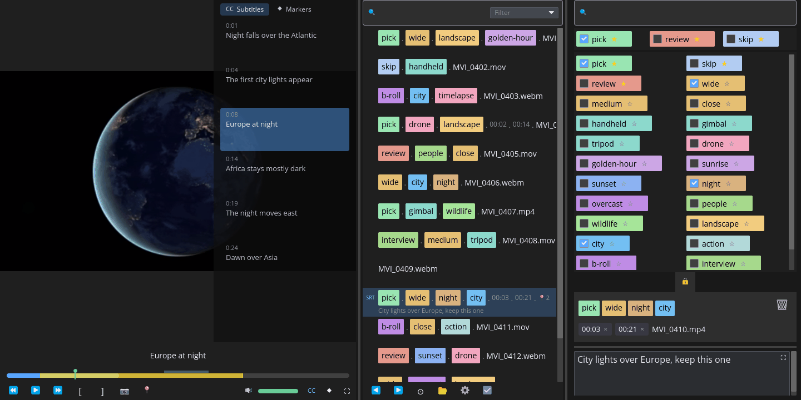 | 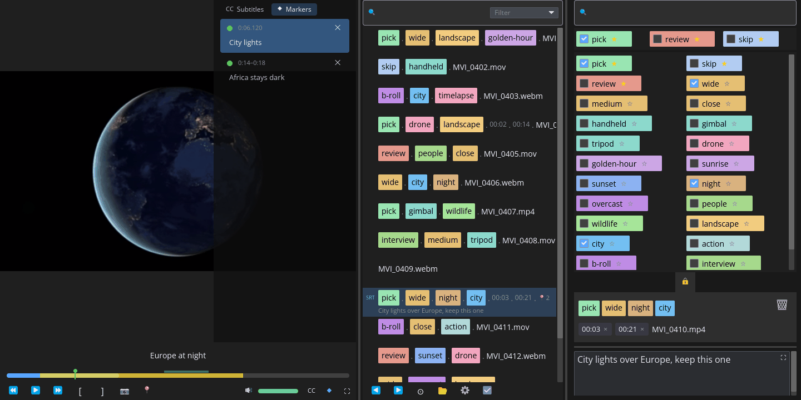 | 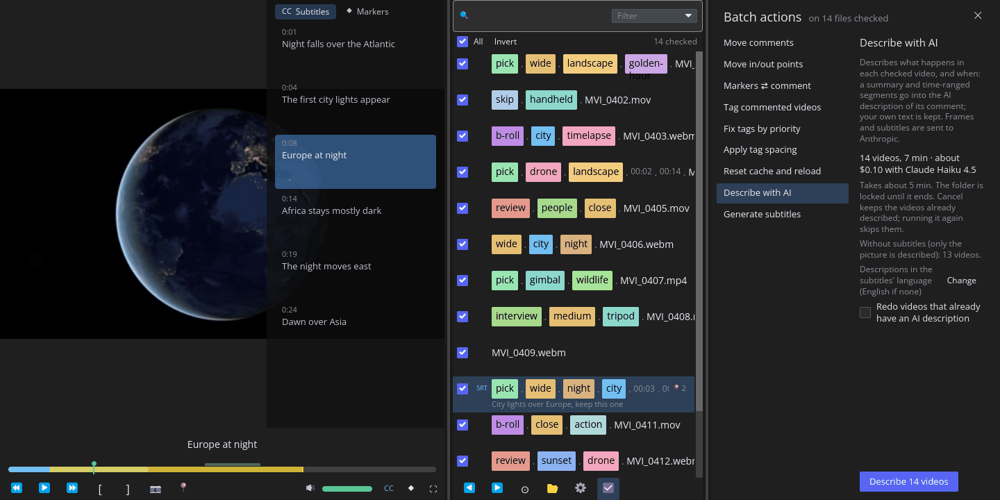 |

```
┌ title bar: #64 version A (own, 40) or B (OS + app bar 36), §13.12 ──────────────────────┐
│ VIDEO PANE (min 320)      ║ FILE LIST (200–720)   ║ TAGS AREA (min 320)                  │
│ picture                   ║ search · filter       ║ tag search                           │
│   side list (overlay)     ║ rows                  ║ starred strip                        │
│ subtitle strip (48)       ║                       ║ tag grid                             │
│ timeline (24–34)          ║                       ║ order strip (32)                     │
│ controls bar (32)         ║ toolbar (32)          ║ file name card · comment             │
└───────────────────────────╨───────────────────────╨──────────────────────────────────────┘
```

- **Three columns** separated by splitters: a 1 px `border.subtle` line whose 12 px hit area
  overlaps the neighbours by 6 px on each side, so a splitter takes 1 px of width, not 12; hover
  and drag show `border.control` and the resize cursor. Widths are the user's, remembered; the
  defaults and minimums are in §13.9 (video 320, file list 200, tags 320). Today the video pane has
  a fixed width with a minimum of 150 while dragging, the file list a minimum of 120, and the tags
  area 200: too narrow for the controls bar and a row of chips.
- The **video pane** is the column that grows and shrinks with the window (center stage, DI
  p. 232). Today the video pane keeps its width and the tags area takes the change
  (**behaviour**, #59).
- **Surfaces:** every column is `bg.panel`; bars inside a column (search, toolbars, timeline,
  controls) are `bg.panel` too and are separated by space, not lines, except the toolbar under the
  file list, which has a 1 px `border.subtle` line on top because the rows above it scroll.
- **Batch mode** (§13.6) replaces the tags area with the batch panel and adds a check column to
  the file list. The video pane stays.
- **No folder open** (§13.7): the three columns are replaced by the empty screen.

### 13.2 Rules for the whole window

**Selection and the open file**
- In the file list the *selected* row and the *open* file are the same thing: a click selects and
  opens. The row is marked by `state.selected` **and** a 2 px `accent.text` bar on its left edge
  (§3.2: never color alone).
- In the tag grid the *cursor* (the tag the keys act on) is a different thing from *checked*
  (the tag is on the file). Cursor: `state.selected` cell and a 2 px `accent.text` ring around the
  chip. Checked: a filled checkbox **and** a SemiBold label (§13.5).
- In lists over the video (subtitles, markers) the *lit* row is the one at the playhead:
  `state.selected` and the bar. An *open* marker row (being renamed) is lit and shows its editor.
- Hover never looks like selection: hover is `state.hover` only, with no bar or ring.

**Scrolling and scrollbars**
- Every scroll area reserves a **gutter** of `SCROLLBAR_WIDTH + SCROLLBAR_GAP` (6 + 8 px) on the
  right, always, not only while the content overflows. Rows, cells and the selected highlight end
  at the gutter; the scrollbar never lies over content and the layout does not jump when the list
  starts or stops overflowing. The rail itself is drawn only while there is something to scroll.
  Today the tag grid's scrollbar lies over the chips and the file list's gutter appears and
  disappears.
- Scrollbar: rail `bg.raised`, scroller `border.control` (32 px minimum length), `accent.text` while
  hovered or dragged, radius 3 (§8.19).
- **Keep the item in view:** after a *keyboard* move (PageUp/PageDown, arrows, ◀ ▶, ⊙, a search or
  filter change, a new tag) the list scrolls the least it can so the selected item and **one more
  row** after it (or before it, moving up) are visible. A *click* never scrolls: the thing under the
  pointer must not move away from it (BIR «Всему своё место»).
- **Follow the playhead:** the subtitle and marker lists keep the lit row second from the top while
  the video plays, but only when the lit row changes; a list the user scrolled by hand is left alone
  until the next change.
- Scroll positions survive switching batch mode on and off, filtering and reloading a file.

**Empty, loading and error states** of every region are listed in §13.7; each one says what is
missing in words and offers the next step (§8.20). No region is ever blank or shows a lone glyph.

**Locks.** While a batch job runs (§13.6.5) the open file is closed (its media unloads) and comes
back when the job ends. Locked controls keep their place and are drawn disabled; a one-line status
at the top of the file list says why ("Locked while Describe with AI runs").

| Locked while a job runs | Still works |
|---|---|
| file rows (select, open, check, rename), All, Invert, PageUp/PageDown | scrolling the list, the file search and the filter menu (they only hide rows) |
| the action list and every control of the action page | Cancel, and the job's own progress |
| Open a folder, the batch toggle, Settings' *Update and restart* | the rest of Settings |
| the video pane (no file is open: its empty state) and F5 | – |
| the batch panel's `x` (disabled, tooltip "Cancel the action first"; Esc cancels, §13.2) | – |

The **lock line** is a 28 px row at the top of the file list, above the search field, `bg.raised`,
padding 0×8: `lock` 14 and the sentence in `secondary`. It pushes the list down (the rows keep
their scroll position) and goes when the job ends. The batch page's button bar says the same on
its left: "The folder is locked until it ends".

Working on the folder while a job runs (at least previewing files) is #29, not this spec.

**Notices** (short feedback such as "Frame saved") appear as inline status (§8.12) in their own
slot of the video pane's controls bar (§13.3.5), never as popups: confirmations for 2 s, errors
until the next action. All their texts are translated (today five are English-only).

**Esc** does one thing per press: the first of these that applies.

| # | When | Esc |
|---|---|---|
| 1 | a menu, dropdown list or popover is open | closes it |
| 2 | a field has focus | a search field with text is cleared; any other field loses focus (its text is kept) |
| 3 | a marker row is open | closes it (the name typed so far is kept) |
| 4 | a file is being renamed | cancels the rename |
| 5 | fullscreen | leaves it |
| 6 | the file search or the tag search has text | clears both (today's Esc, also in batch mode) |
| 7 | a batch result is shown | Close |
| 8 | a batch job runs | Cancel (the job stops after the current file; nothing asks) |
| 9 | batch mode | leaves it |

Today Esc does steps 3–6 in this order and never
touches batch mode; steps 7–9 are **behaviour** for #58.

### 13.3 Video pane

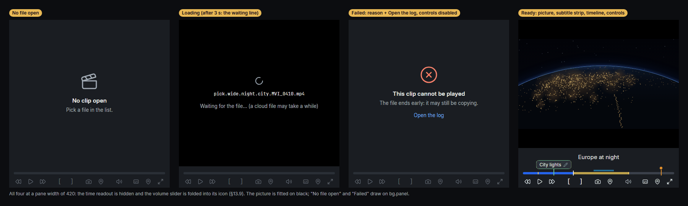

#### 13.3.1 States

| State | Drawn | Today |
|---|---|---|
| No file open | `bg.panel`, centered: `clapperboard` 48 in `text.secondary`, "No clip open" (`title`), the secondary button "Open the first clip `PgDn`" (or, with the list scrolled, the first listed); the timeline and controls bar stay, disabled, so nothing jumps when a clip opens | 🎬 alone |
| Loading | picture area black; centered `loader-circle` 24 turning, the file name in `mono` under it; after 3 s also "Waiting for the file… (a cloud file may take a while)" | ⏳ alone |
| Failed | `bg.panel`, centered: `circle-x` 48 in `error`, "This clip cannot be played" (`title`), the reason in one line (`secondary`), link *Open the log*; the controls bar stays but its buttons are disabled | red ✕ 80, no reason |
| No picture | a file with sound only: the "Failed" look with the reason "This file has no video picture" | 📄 |
| Ready | picture, subtitle strip (when the clip has subtitles), timeline, controls bar | – |
| Fullscreen | §13.3.8 | – |

#### 13.3.2 Picture area
- The picture is fitted inside the area (letterbox) on **black** (`video.bg` `#000000`), not on the
  panel gray: black bars read as part of the video, gray ones as a layout gap.
- Click = play/pause; double-click = fullscreen. Nothing is drawn on pause (no big play symbol): the
  controls bar shows the state.
- **Layers** from bottom to top: picture → side list (§13.3.6) → marker label (§13.3.4) →
  tooltips. The fullscreen caption sits between the picture and the side list.
- **Z-levels in code** (`ui::z`). Base: panels, the timeline canvas, splitters, the picture.
  Stack layers (`stack!`): side list, caption, notices, hover actions; menus (More, filter, file
  menu) with an `opaque` outside; the fullscreen video, always `opaque` so nothing under it gets
  the hover. Overlays, which share one renderer layer unless they ask for their own (the renderer
  draws every box of a layer before its text, so one overlay's text shows through another's box):
  `Z::Anchored` (the marker label) < `Z::Tooltip` < `Z::DragPreview` (what follows a drag). An
  overlay that has to be above another wraps its widget in `ui::z::layered(…, Z::…)`; a new overlay
  picks its level.

#### 13.3.3 Subtitle strip (windowed)
- Present only when the clip has subtitles; fixed height 48 so the picture never jumps between
  cues; `bg.panel`; padding 4×12.
- The cue under the playhead in `body` 15/20 (a `video.subtitle` style: 15 px, `text.primary`),
  centered, at most 2 lines, cut with "…" (today clipped mid-letter).
- Between cues it stays empty at full height.

#### 13.3.4 Timeline (progress bar)

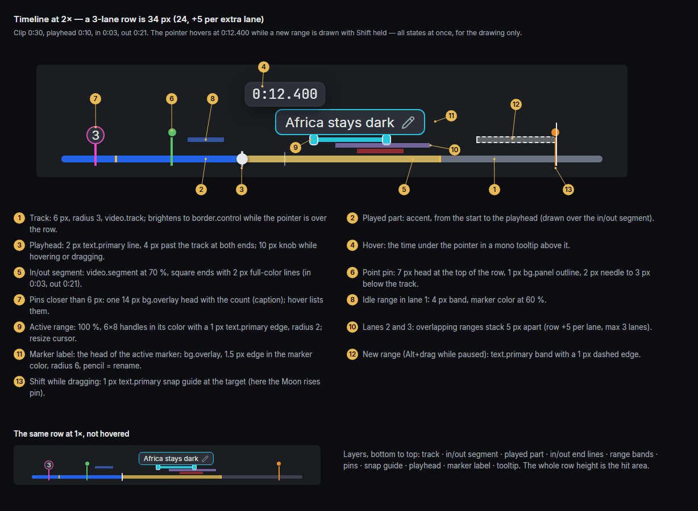

```
            ┌ label: ● City lights ✎ ┐                     ← marker label (active marker only)
   ▬▬▬▬▬▬▬▬▬▬▬▬▬▬       ▬▬▬▬▬▬▬▬▬                            ← range bands, lanes 1–3 (4 px, 1 px apart)
 ●  │       ●                                               ← pin heads (7 px) with needles
 ███████████████|████▓▓▓▓▓▓▓▓▓▓▓▓▓▓▓▓▓▓░░░░░░░░░░░░░░░░░░   ← track: played · playhead · in/out · rest
            ↑ playhead line (2 px)          ↑ in/out segment
```

Row: `bg.panel`, padding 0×12, height 24 with no or one lane of ranges, +5 per extra lane (max
3 lanes, then shared); the whole row height is the hit area. From the top: pin heads, then the
range lanes (5 px apart), then the track. Layers from the bottom: track, in/out segment, played
part, in/out end lines, range bands, pins, snap guide, playhead, marker label, tooltip — the played
part over the segment, because the yellow over the blue would hide where the playhead has been.

| Part | Look | Today |
|---|---|---|
| Track | 6 px, radius 3, `video.track` `#3A404A` (3 : 1 on panel) | 8 px `#404040` |
| Played part | `accent`, from the start to the playhead | same |
| **Playhead** | a 2 px `text.primary` line 4 px taller than the track at both ends; while hovering or dragging, a 10 px `text.primary` knob on it | none: the fill's end is the only sign |
| Hover | the hovered time in a tooltip above the pointer (`mono`); the track brightens to `border.control` | nothing |
| In/out segment | a band in `video.segment` `#F2C94C` in its own lane above the bar, like a range (no handles; a click plays it), and 2 px lines across the track at in and out; only in: one line; only out: one line. Not a fill on the track: the played part hid it | 75 % over the track |
| Point marker | 2 px needle in the marker color from the head to 3 px below the track; 7 px round head at the top of the row; head has a 1 px `bg.panel` outline so heads that overlap stay readable | no outline |
| Point marker, active | no head: the marker label is its head | same |
| Range | 4 px band in its lane, marker color, 60 % when idle, 100 % when active | same |
| Active range | two 6×8 handles in the marker color with a 1 px `text.primary` edge, radius 2; resize cursor over them | no edge |
| New range (Alt+drag) | a band in `text.primary` at 35 % with a 1 px dashed `text.primary` edge while drawing | plain white |
| Many markers | pins closer than 6 px are drawn as one 14 px `bg.overlay` head with the count in `caption`, ringed in the first marker's color; hovering it lists them in a tooltip (**behaviour**, #59) | drawn on top of each other |
| Shift (snap) | a 1 px `text.primary` guide at the snap target while Shift is held during a drag | nothing |

**Marker label** (the head of the active marker):
- A chip-like button: a pill (full radius) filled with `bg.raised` tinted by 25 % of the marker's
  color, 1.5 px edge in the marker's color, no shadow, padding 2×8, text `tooltip` 12/16 in
  `text.primary`, then a 12 px `pencil` in `text.secondary`; an unnamed marker shows "Add a name"
  in `text.secondary`. Not the tooltip's box (`bg.overlay`, `border.subtle`, radius 6, shadow), so
  when a tooltip opens next to it the two never read as two tooltips.
- Centered over a pin or the middle of a range; kept 4 px inside the pane; the name is cut with "…"
  to fit the pane (windowed; §13.9) and never in fullscreen.
- Hover: `state.hover`; click: opens the marker's row for renaming. A read-only marker's label has
  no pencil and is not a button.

**Gestures on the timeline** (unchanged unless marked):

| Gesture | What it does |
|---|---|
| click, drag | seek; dragging keeps seeking and the picture follows |
| click a band | play that range from its start and pause at its end (any seek or pause cancels this) |
| Alt+click an editable band | make it a point at its start |
| Alt+drag while paused | draw a new range (white band); under 100 ms it becomes a point; while playing, Alt+press seeks |
| drag a handle | move that end of the active editable range; crossing the other end swaps them; ends closer than 100 ms make it a point; one undo step |
| Shift while seeking or drawing | snap to the nearest marker start within 8 px (a 1 px guide shows it) |
| Shift while dragging a handle | snap to the start or end of any other marker, or to in/out, within 8 px |
| click a cluster head | opens the marker list scrolled to those markers (**behaviour**, #59) |

Handles are shown only on the active editable range. Pin heads have no hit area of their own: a
click on a pin seeks there.

**Which marker is active** (has the label and the handles): the one whose span contains the
playhead, counting from 500 ms before its start to 2 s after it (or its end, if later); among
several, one already started wins over one coming up, then the latest start.

**Marker keys** (they work even while a field has focus; they are ignored with Ctrl or Alt held;
F2's auto-repeat is ignored; what an open marker row blocks is listed under the table):

| Key | What it does |
|---|---|
| `F2` | no marker within 0.5 s: add a Green point at the playhead. A marker within 0.5 s: open its row to rename it |
| `F2` `F2` (within 1.5 s) | add a point and open its row: mark and name in one go |
| hold `F2` > 400 ms | draw a range: its end follows the playhead; released while paused (no movement), it stays a point |
| `F2` with a row open | close the row (text kept) and add a marker if none is within 0.5 s |
| `F2` on a read-only marker | notice "That marker is read-only" and the marker list opens |
| `F2` on a file that cannot hold markers | the marker list opens to say so |
| `Shift`+`F2` | delete the nearest editable marker within 0.5 s; notice "Marker deleted" or "No marker here" |
| `Shift`+`F1` / `Shift`+`F3` | jump to the previous / next marker start; "previous" skips a marker passed less than 750 ms ago |
| the `map-pin` button | a click is `F2`; holding it draws a range like holding `F2` |

While a marker row is open, `[` `]`, `Shift`+`Space`, `Ctrl`+`Z`/`Y`, `Ctrl`+`C`/`V` and
`Shift`+`F2` are ignored so typing a name cannot change the clip; `F1` `F3` `F12` keep working.
Renaming a marker is written live; the name typed in a row is one undo step (#139).

#### 13.3.5 Controls bar

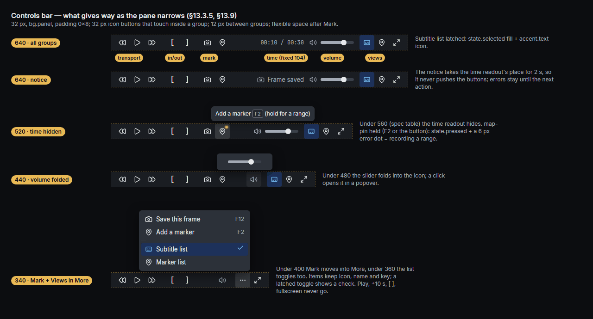

32 px, `bg.panel`, padding 0×8. Icon buttons 32×32 (§8.1) with the Lucide icons of §7, in
**groups** separated by 12 px; buttons within a group 0 px apart (the 32 px squares touch). From
left to right, with the widths §13.9 folds by:

| Group (width) | Buttons (icon, tooltip with keys) |
|---|---|
| Transport (160; 96 with the frame steps in More) | `rewind` "Back 10 s `F1`" · `step-back` "One frame back `Alt`+`←`" · `play`/`pause` "Play `Space`" / "Pause `Space`" · `step-forward` "One frame forward `Alt`+`→`" · `fast-forward` "Forward 10 s `F3`" |
| In/out (64) | text `[` "Set the in point `[`" · text `]` "Set the out point `]`" (text, as #44 says) |
| Mark (64) | `camera` "Save this frame `F12`" · `map-pin` "Add a marker `F2` (hold for a range)"; disabled with the reason "This file cannot hold markers" |
| Free space (flexible) | empty; notices (§13.2) show here when it is at least 120 wide, cut with "…" and the full text in the tooltip |
| Time (152, #59) | `00:10 / 00:30` in `mono` `text.secondary`; paused, the playhead shows milliseconds, `00:10.250 / 00:30` (the exact time of a stepped frame, #162); a fixed width (21 characters, the longest it shows: `1:02:05.250 / 1:30:00`) so it never moves |
| Volume (96) | `volume-2` icon 16 in `text.secondary` (not a button), 8 px, a 72 px slider (§8.8); folded: a 32 px icon button `volume-2` that opens the slider in a popover |
| Views (96) | `captions` "Subtitle list" (only with subtitles) · `map-pin` "Marker list" with "`Shift`+`F1` / `Shift`+`F3` jump between markers" on its second line · **More** `ellipsis` (only when something is folded) · `maximize-2`/`minimize-2` "Full screen `F5`" |

- **Rotate** (64) `rotate-ccw` / `rotate-cw` (added after this spec) sit after Mark when the pane
  has room and are the first to move into **More**; they are used rarely and have their keys
  (`Ctrl`+`Alt`+`←` / `→`).
- **Latched** (list shown, fullscreen): `state.selected` fill and the icon in `accent.text`
  (§8.1), not only a blue glyph.
- **Held** (`map-pin` while F2 or the button is held to draw a range): `state.pressed` fill and a
  pulsing 6 px `error` dot at its corner: recording.
- **Play/pause** shows the action the button will do (the media exception of §8.1), and must
  always match the player: today Space and a click on the picture can leave it showing the wrong
  symbol (**behaviour** bug, #59).
- **Notice** (§13.2): an inline status in the free space, `text.secondary`, with an icon of its
  kind: `camera` "Frame saved", `trash` "Marker deleted", `circle-alert` in `error` "Markers not
  saved: the file is read-only or in use". It never pushes a button. When the free space is under
  120 (the pane is under about 916 with every group shown), the notice shows instead as a pill over
  the bottom-left of the picture (`bg.overlay`, radius 6, padding 4×8), with the same lifetime.
- **Narrow pane:** what gives way and when is in §13.9. The **More** button (`ellipsis`) sits just
  before fullscreen; its menu opens upward, lists each moved control with its icon, name and key,
  and marks a latched one with a `check`.

#### 13.3.6 Side list over the picture

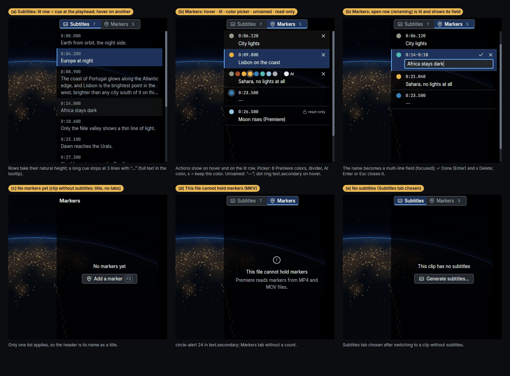

- A panel over the right of the picture, full picture height: on a pane of 600 or more, 2/5 of the
  pane's width, at most 360 (today at most 340); on a narrower pane it covers the whole picture and
  gets its own `x` "Close the list";
  `overlay.list` (black 72 %), so the picture stays visible. It covers the picture only, never the
  strip or the bars.
- **Header** 36 px: two tabs as a segmented control (§8.4) — `captions` "Subtitles", `map-pin`
  "Markers" — shown when both lists apply, or when the chosen list is empty and the other is not (so
  the way back is there); otherwise the list's name as a `title`. A tab shows its count in
  `caption` ("Markers 3"), none when the list is empty.
- Hover on the overlay is white 10 % (`state.hover` 6 % disappears on black 72 %).
- **Rows** are list rows (§8.9) on the overlay: `text.primary` / `text.secondary` keep their
  contrast on it (it is at least as dark as `bg.panel`). The gutter rule of §13.2 applies.

**Subtitle rows**
- Time in `mono` `text.secondary` on the first line, the cue text in `body` under it, up to 3 lines
  then "…"; the full text in a tooltip.
- Lit (the cue at or last before the playhead): `state.selected` + bar, text `text.primary`;
  others `text.secondary`. Hover `state.hover`. Click: the video jumps to the cue.
- Rows have their natural height (not a fixed 78 px), so short cues do not leave holes; the
  follow rule of §13.2 measures real heights (**behaviour**, #59).

**Marker rows**

```
 ● 0:06.120                                    ✕     ← dot · time · delete
   City lights                                       ← name (body; "—" in text.secondary when empty)
 ─────────────────────────────────────────────
 ● 0:14–0:18                                   ✓ ✕   ← open row: ✓ Done (Enter)
   [Africa stays dark_______________]                ← name field (text field style)
 ─────────────────────────────────────────────
 ● ● ● ● ● ● ● ●  |  ○ AI                      ✕     ← color picker replaces the first line
```

- A click on the row (outside the dot and the time) opens it for renaming (the open row below); a click on
  the time jumps there.
- First line: the **color dot** (14 px, a button; ring `text.secondary` on hover, `text.primary`
  when its picker is open), the **time** (`mono`, a ghost button that jumps there), a flexible
  space, then row actions: `check` "Done `Enter`" (open row only) and `x` "Delete the marker" as
  24 px icon buttons, shown on hover, on the lit row and on the open row (§8.9 "hover tools").
- Second line: the name, `body`, wrapping.
- **Open row** (renaming): the name becomes a multi-line text field (§8.6) with the placeholder
  "Name"; Enter or Esc closes it.
- **Color picker** (after a click on the dot): the first line becomes the 8 Premiere colors (Green,
  Red, Orange, Yellow, Blue, Cyan, Lavender, Magenta) as 14 px dots, a 1 px divider, the AI color —
  White — as a dot with the word "AI" (tooltip: "AI marker: replaced when the AI describes this clip
  again"), and `x` "Keep the color". Each dot has its color's name
  as a tooltip ("Green", "Red", …: today none).
- **Read-only marker** (written by another program): the dot is not a button, the time is, and
  instead of the actions a `lock` 12 icon with "read-only" in `caption` `text.secondary`.
- **Empty list:** "No markers yet" (`body`), and the button `map-pin` "Add a marker `F2`"
  (secondary).
- **File cannot hold markers:** `circle-alert` in `text.secondary` and "This file cannot hold
  markers" (`body`), "Premiere reads markers from MP4 and MOV files." (`secondary`).
- **No subtitles** (Subtitles tab chosen, the clip has none): "This clip has no subtitles"
  (`body`) and the secondary button `captions` "Generate subtitles…". It enters batch mode with
  this clip checked (the other checks are kept but the count says so) and Generate subtitles
  selected, so the page shows the cost; nothing runs until Run. While a job runs it is disabled
  with the reason "Another action is running". No key yet: the button is the same; the batch page
  then offers *Set the key…*.

#### 13.3.7 In and out points
- Set with `[` / `]` (in rounds down to a whole second, out up); blocked in batch mode. Shown on the timeline (§13.3.4),
  in the file name card (§13.5.6) and in the file list row (§13.4.2).
- Cleared with the `x` of their badge in the file name card, or undone.
- Or taken from the AI: Describe with AI may suggest them (the clip's lead-in and lead-out cut
  off, stored as the last line of the AI block, `Suggested In/Out: 00:00:03.200 –
  00:00:11.800`). The file name card offers the suggestion (§13.5.6); a click sets both points as
  `[` and `]` would (in rounded down, out up) in one undo step. Nothing is set without the click.

#### 13.3.8 Fullscreen

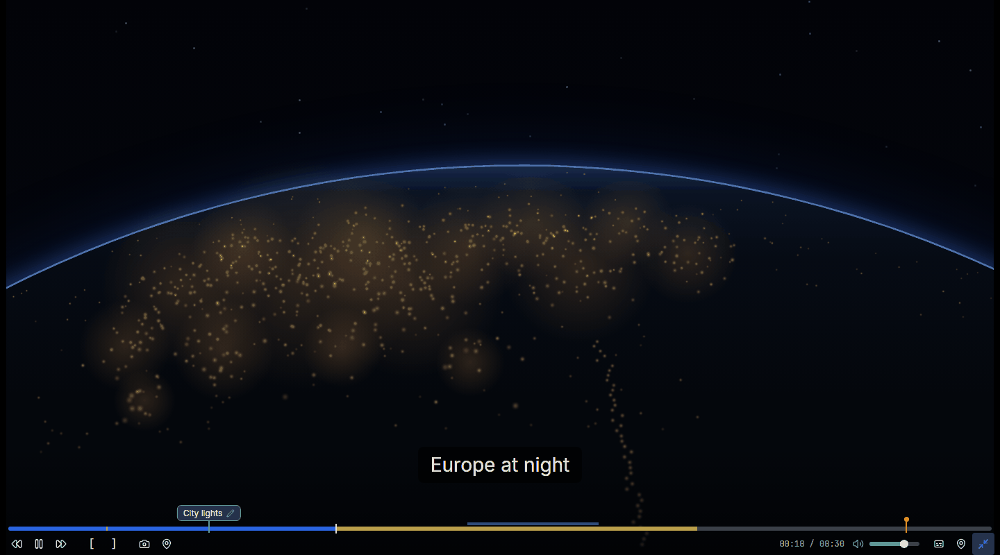

- The video pane alone over the whole window, picture on black.
- The timeline and the controls bar stay at the bottom on a gradient from black 0 % to black 60 %,
  so they read over the picture; the side list and the marker label stay as in the window.
- Subtitles become the caption: `video.caption` 28/36 over a black 62 % pill (radius 8, padding
  8×18, max 1100 wide), centered at the bottom, 48 above the controls; with the side list open,
  centered in the part of the picture the list leaves free.
- The controls stay visible (today). Hiding them after 3 s without mouse movement is a
  **behaviour** change for #59; if it is made, any mouse movement or key brings them back and they
  never hide while a list is open or the pointer is over them.
- Leave with Esc, F5, `minimize-2` or a double-click.

### 13.4 File list

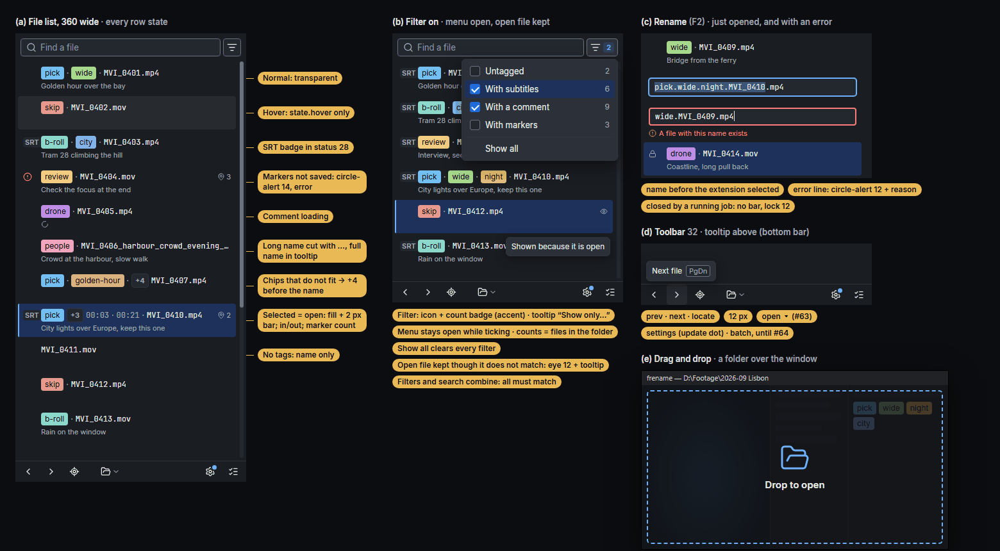

#### 13.4.1 Search and filter
- A 40 px bar, padding 6×8: a search field (§8.6, 28 high) across the column with the placeholder
  "Find a file" and `search` inside on the left; `x` "Clear `Esc`" when not empty. It searches the
  whole file name, tags included. The tag search above the grid is the same bar.
- 6 px after it the **Filter** button: a 28×28 secondary icon button `list-filter`; when filters are on, the
  count sits inside the button after the icon (`badge.accent`, "2"); pressed look while its menu is
  open; tooltip "Show only…". Today it is a dropdown whose label changes.
- The filter **menu** (§8.14) lists: Untagged, With subtitles, With a comment, With markers. Each
  item: a checkbox, the name, and the number of files in the folder on the right (`caption`
  `text.secondary`). The menu stays open while items are ticked; the last item is "Show all"
  (clears the filters). Today each tick closes the menu.
- Active filters and search combine (all must match). The open file always stays listed, even if it
  no longer matches, so the row under the user never vanishes; it is marked with `eye` 12 at the
  right end of its first line (in the marker count's place) and the tooltip "Shown because it is
  open".

#### 13.4.2 Rows

```
 ┃ [✓] SRT  pick · wide · night · 00:03 · 00:21 · MVI_0410.mp4          ⌖2
 ┃          City lights over Europe, keep this one
   └check (batch only, 28)  └status (32)  └tags · in/out · name (mono)   └marker count
```

Row: 52 px (two lines), padding 4×8, full width up to the gutter.

| Part | Look | Today |
|---|---|---|
| Check (batch mode) | 28 px column, 16 px checkbox (§8.2); after a job the column shows the file's status icon (§13.6.6) | default iced style |
| Status column | 32 px (padding 0×4): `SRT` badge (`badge`, `caption` SemiBold, `bg.raised` + `text.secondary`) when a `.srt` is next to the video | `SRT` 9 px blue text |
| Not saved | `circle-alert` 14 in `error` at the right end of the first line, after the marker count, with the tooltip "Markers not saved: the file is read-only or in use"; the `SRT` badge stays | red ✕ |
| Tags | mini chips: 20 px high, radius 4, padding 0×6, 12/16 Inter (`chip.mini`) in black on the tag color, 4 px apart. They are separated by a `text.secondary` "·" only where the file name has a dot, so the row still reads as the name | 28 px chips with " . " |
| In/out | `mono` `text.secondary` `00:03 · 00:21` when the points are in the name | same, 12 px Inter |
| Name | `mono` 12 `text.primary`, the rest of the file name with its extension | 14 px Inter |
| Marker count | `map-pin` 12 + number, `caption` `text.secondary`, right-aligned | 📍N |
| Comment line | the first line of the comment, `caption` `text.secondary`; while it loads, `loader-circle` 12 turning; nothing when there is none (the row keeps its height) | ◐◓◑◒ |

**Fitting:** the name is cut with "…" at the end and the full name is the row's tooltip; chips are
never cut in the middle: those that do not fit become a `+3` badge before the name. Chips give way
before the name: the name keeps at least 80 px, and when not even the first chip fits beside it
only the `+N` badge stays. Today names and
chips are clipped mid-letter.

**States**

| State | Look |
|---|---|
| Normal | transparent |
| Hover | `state.hover` (today no hover at all) |
| Selected = open | `state.selected`, a 2 px `accent.text` bar on the left edge |
| Selected, file closed by a running job | `state.selected` without the bar, `lock` 12 in the status column |
| Renaming | started by a double-click on the row (off in batch mode); the row becomes a text field (§8.6) with the whole file name, the part before the extension selected; an error goes on the second line in `error` with `circle-alert` 12 (Name is empty · Not allowed: \ / : * ? " < > \| · Cannot end with a dot or space · A file with this name exists; today it shares the field's line); Enter renames, Esc cancels. A rename re-reads the tags and in/out points from the new name; it is one undo step (#139) |
| Checked (batch) | the checkbox; no other change |
| Locked (batch job running) | rows unchanged, pointer cursor off, checkboxes disabled (§13.2 "Locks") |

The list is sorted by date modified, oldest first (unchanged); there is no sort control.

#### 13.4.3 Toolbar
32 px under the list, `bg.panel` with a 1 px `border.subtle` line on top; icon buttons:
`chevron-left` "Previous file `PgUp`", `chevron-right` "Next file `PgDn`", `locate-fixed` "Show the
open file in the list" — then 12 px — `folder-open` "Open a folder" (`Ctrl`+`O` is proposed for #62; today it has no key) with the
recent-folders ▾ of #63 — and at the right end, until #64 moves them to the app bar, `settings` "Settings" with the
update dot and the batch toggle `list-checks` "Batch actions" (latched in batch mode). At the
minimum width the gaps become 4 px and the least used buttons go into **More** (§13.9).
Disabled buttons are truly disabled (today ◀ ▶ ⊙ look disabled but still take clicks).

#### 13.4.4 Drag and drop
While a folder or file is dragged over the window, the whole window shows a drop target: the
window dimmed with `bg.window` at 80 %, a 2 px dashed `accent.text` edge inset 8 px and, in the middle, `folder-open` 48 with "Drop to open"
(`title`). A drop of something that is neither a folder nor a video shows an error notice. Today
there is no feedback while dragging (**behaviour**, #59).

### 13.5 Tags area

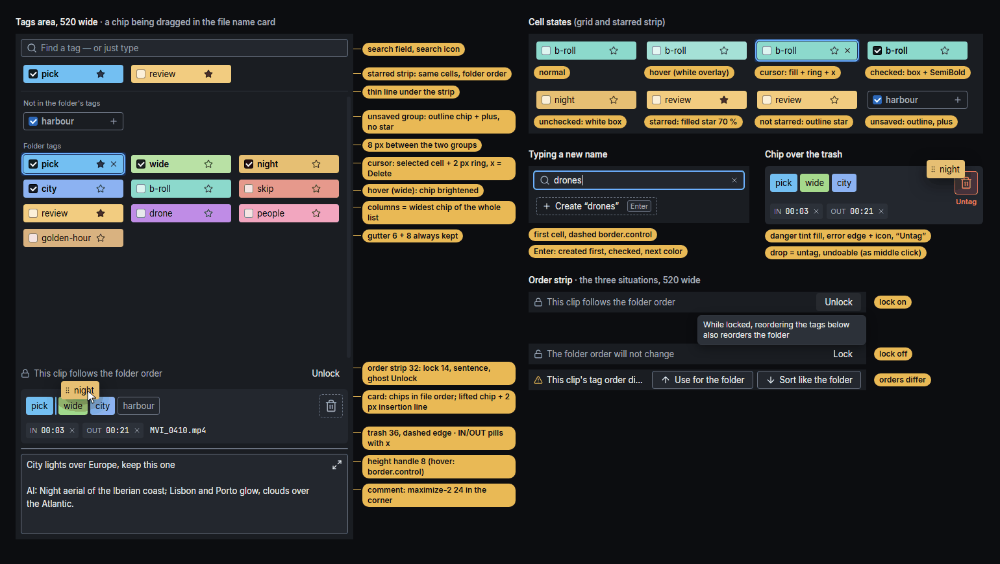

From top to bottom: tag search, starred strip, tag grid, order strip, file name card, height
handle, comment. Columns are separated by the gaps of §5.

#### 13.5.1 Tag search
- A search field with the placeholder "Find a tag — or just type" and `search` inside; `x` "Clear
  `Esc`" when not empty.
- Typing anywhere in the window types here (unchanged); the field shows it by taking focus.
- **Create:** when the text is not the name of a tag, the grid shows a first cell "Create
  “<text>”" with `plus` and the key cap `Enter`, in a dashed `border.control` outline (today a
  small ○ inside the field). Enter or a click creates the tag: first in the order, checked, with
  the next palette color.

#### 13.5.2 Tag grid

```
 ┌───────────────────────┐ ┌───────────────────────┐ ┌───────────────────────┐
 │☑ pick            ★  × │ │☐ review          ★    │ │☐ skip            ☆    │   ← cells (28 chip)
 └───────────────────────┘ └───────────────────────┘ └───────────────────────┘
   ↑ cursor: ring + cell fill   ↑ unchecked: regular label   ↑ not starred
```

- **Cell:** the tag chip, 28 px, radius 4, padding 0×8, the tag color, label `body` 13 in black;
  inside it: a checkbox, the label, then the star and the action at the right end.
- **Checkbox on a chip:** unchecked = white 70 % box with a 1 px black 45 % edge; checked = black
  85 % box with a white tick; this reads on all 16 light colors (the app's blue checkbox does not).
- **Checked** = the box **and** the label in SemiBold, so the state does not rest on the small box
  alone. The chip color never changes with checking.
- **Star:** `star` 14 in black 70 %, filled when starred, outline when not, on saved tags only;
  tooltip "Star: keep it at the top" / "Unstar".
- **Action slot:** on the cursor cell, `trash` with the tooltip "Delete “wide” from the folder's
  tags `Delete`"; on an unsaved tag, always `plus` "Add to the folder's tags `Enter`". Icons 14,
  black 70 %. Deleting a tag removes it from the folder's tags and from the open clip; other clips
  keep it in their names and show it as unsaved when opened.
- **States:**

| State | Look | Today |
|---|---|---|
| Normal | the chip on `bg.panel` | same |
| Hover | the chip brightened by a white 22 % overlay (`chip.hover`; the 6 % of `state.hover` does not show on light chips) and the pointer | only the checkbox changes |
| Cursor | the cell `state.selected`, a 2 px `accent.text` ring 1 px outside the chip | accent 45 % + 2 px accent ring |
| Checked | filled box, SemiBold label | box only |
| Unsaved (in this file's name, not in the folder's tags) | an outline chip (`border.control` edge, `text.secondary` label, no fill) with the normal checkbox, `plus` action, no star | gray chip, ○ |
| Deleted | the cell disappears; the order strip shows `trash` "Deleted “wide”" and a ghost button "Undo `Ctrl` `Z`" for 5 s | disappears silently |

- **Order = priority.** The grid lists the folder's tags in their order, left to right, top to
  bottom; the same order is the order of the tags in file names. Unsaved tags come first, under a
  `caption` "Not in the folder's tags"; then the folder's tags under "Folder tags" — the two
  groups separated by 8 px, so the split is visible without a line. With no unsaved tags there is
  one group and neither caption is shown. The grid itself is not
  reordered by dragging; the order changes in the file name card (§13.5.6).
- **Columns:** every column is as wide as the widest chip of the **whole** tag list, not of the
  filtered one, so the grid does not reflow while typing a search (today it does); the limits are in
  §13.9.
- **Mouse:** a click on a chip moves the cursor there **and** checks or unchecks it.
- **Search order:** within each group, exact matches first, then names that start with the text,
  then names that contain it. Typing in the Russian keyboard layout also matches the Latin name
  typed on the same keys (and back).

| Key | What it does (tags area; all blocked in batch mode) |
|---|---|
| arrows | move the cursor (wrapping); `Alt`+`←`/`→` step the video one frame (#162), so #62's key for moving the cursor tag in the folder order is still to be chosen |
| `Shift`+`Space` | check or uncheck the cursor tag (or the first match of the search) |
| `Enter` | add an unsaved tag to the folder's tags; on a text that is no tag, create it |
| `Delete` | delete the cursor tag from the folder (undoable) |
| `Backspace` | anywhere in the window: removes the last letter of the tag search and focuses it (like typing) |
| `Ctrl`+`C` | copy the open clip's tags |
| `Ctrl`+`V` | in the search field, paste text; elsewhere, paste copied tags onto the open clip (undoable) |
| `Ctrl`+`Z` / `Ctrl`+`Y` or `Ctrl`+`Shift`+`Z` | undo / redo |

Known bug (#97): `Enter` on a tag that is already saved pushes a save step whose undo
removes the tag from the folder.

#### 13.5.3 Starred strip
- Starred tags, again, in one strip above the grid, so the few tags used on almost every clip are
  always in the same place (BIR «Всему своё место»): cells as in the grid, in the folder's order
  (today alphabetical, while the grid is in folder order: two orders for the same tags).
- It follows the search like the grid; it takes no space when empty. It wraps, at most 3 rows;
  what does not fit ends in a `caption` button "+N more" that scrolls the grid to the first hidden
  one. It never scrolls itself.
- It is for the **mouse**: the keyboard cursor never enters it. When the cursor tag is also
  starred, both copies show the cursor ring.
- A thin `border.subtle` line separates it from the grid. The starred tags also stay in the grid.

#### 13.5.4 Empty states of the tags area
| Situation | Shown |
|---|---|
| No file open | the grid area: `tag` 48 in `text.secondary`, "Open a clip to tag it" (`title`), centered (today a 📄 in the corner); the tag search is disabled and the starred strip, order strip, file name card and comment are hidden (today the order strip still shows) |
| The folder has no tags | "No tags yet" (`title`), "Type a name and press Enter to create the first one." (`secondary`); the order strip is hidden (nothing to order) |
| Search matches nothing | only the "Create “<text>”" cell |
| All tags filtered away but the file has tags | the same, the file name card still shows its tags |

#### 13.5.5 Order strip (today the sync panel)
Between the grid and the file name card, 32 px (today 36), `bg.panel`, words instead of lock
glyphs:

| Situation | Shown |
|---|---|
| The file's tags are in the folder's order, lock on | `lock` 14 "Reordering below reorders the folder" (`secondary`) and a ghost toggle "Unlock" |
| Same, lock off | `lock-open` "Reordering below changes this clip only" and "Lock" |
| The orders differ | `triangle-alert` in `warning` "Order differs from the folder" and two secondary buttons: `arrow-up` "Use for the folder" and `arrow-down` "Sort like the folder" |

Both buttons, and the lock, are undoable (#139); a press that changes nothing pushes no step.

#### 13.5.6 File name card
- A `bg.raised` card, radius 6, padding 8.
- **First line:** the file's checked tags as chips (28 px) **in the file's order**: that is the
  order in the new name. They can be dragged:
  - on hover a chip shows `grip-vertical` 12 at its left edge and the move cursor;
  - while dragging, the chip leaves its place and floats just above a 2 px `accent.text` line that
    shows where it will land, with the popup shadow; the other chips close up and do not move again
    until the drop (today they reflow by an estimate of 64 px per chip);
  - a middle click removes the tag from the clip (undoable).
- **Trash** at the right end: a 36 px square, `trash` 20 in `text.secondary`, dashed
  `border.control` edge; while a chip is dragged over it: `DANGER_TINT` fill, `error` edge and icon,
  and "Untag" in `caption` SemiBold `error` under it (on the card's second line). A drop there untags the clip (undoable, like the middle click).
- **Second line:** the IN and OUT timecodes (§8.16: `mono` in a `bg.overlay` pill with "IN"/"OUT" in
  `caption` `text.secondary` inside, and `x` to clear), then the In/Out the AI suggests when the
  clip's AI description has one and it differs from the IN and OUT (§8.16 suggested timecode,
  "AI", tooltip "Set In and Out to what the AI suggests"), then the file name part without tags in
  `mono`.
- **No tags on the clip:** "No tags on this clip" in `secondary` where the chips go.

#### 13.5.7 Comment
- A multi-line field (§8.6) with the placeholder "Comment", `maximize-2` "Give the comment the whole
  panel" / `minimize-2` "Back to the tags" as a 24 px icon button inside its top-right corner; the
  field's own scrollbar keeps the gutter.
- The **height handle** above it: an 8 px hit area with a 2 px `border.subtle` line, `border.control`
  and the resize cursor on hover; the height stays while the folder is open (today too) and is
  not saved.
- Typing a comment checks the "Commented" tag when Settings turns that on; the text is saved when
  the field is left.
- The AI description is part of the text (settings rule: it starts at the `AI:` line).

### 13.6 Batch mode

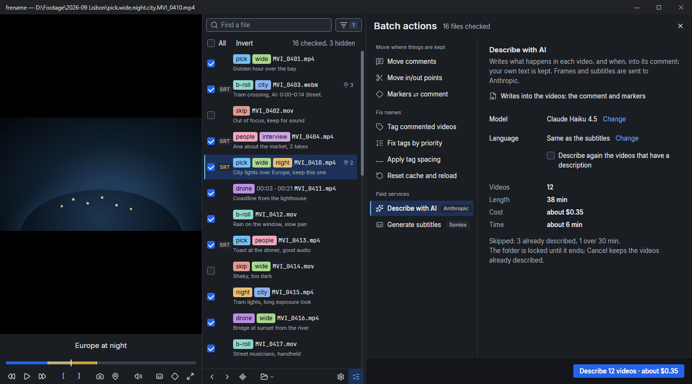

#### 13.6.1 Frame
- The tags area is replaced by the **batch panel**; the file list gains its check column and a
  header; the video pane stays and still previews the selected file.
- **Width on entering:** the panel wants 600 (the full action list, §13.9). If the tags area is
  narrower, the video pane gives it the difference, down to the video pane's minimum; leaving batch
  mode gives it back. The user can still drag the splitters; the panel then folds as §13.9 says.
- Batch panel: `bg.panel`; header 48 px: `heading` "Batch actions" and, after it, `secondary`
  "12 files checked"; at the right, `x` "Back to the open file `Esc`" (24 px icon button).
- Body: the **action list** on the left (232 px, on `bg.panel` with a `border.subtle` line after
  it) and the
  **action page** on the right (padding 16×24, scrolls), then the page's **button bar** at the
  bottom of the panel (§9.2).

#### 13.6.2 File list in batch mode
- Header under the search field, 32 px: checkbox "All" (lined up with the row checkboxes), a ghost
  button "Invert", a flexible space, and "12 checked" in `secondary`; when some checked files are
  hidden by the search or a filter, "12 checked · 3 hidden" with the tooltip "3 checked files are
  hidden by the search or a filter; the action runs on them too". Below 260 Invert moves into a
  **More** button.
- **All** and **Invert** act on the listed files only; unchecking All clears every check, hidden
  ones too. Hidden checked files are included in the job: the Run label's count and the plan say
  so ("12 files, 3 of them hidden").
- **Entering batch mode** from the toolbar checks the open file (if none is checked); from a Settings
  link it checks every listed file and selects the linked action. Leaving keeps the checks and the
  last result.
- Rows get the 28 px check column (§13.4.2). A click on the row still opens the file for preview;
  the checkbox checks it. Markers stay editable in batch mode; `[` `]`, rename and every tag key are
  blocked (they would change the open file behind the batch).

#### 13.6.3 Action list
Every action has an icon (Lucide, 16), its name, and — for the two paid ones — a `caption` badge
with the service. All nine are in one list in three groups, each group under a `caption` heading
in `text.secondary`:

| Group | Icon | Action | Badge |
|---|---|---|---|
| Move between places | `message-square-text` | Move comments | |
| | `scissors` | Move in/out points | |
| | `map-pin` | Markers ⇄ comment | |
| Fix names | `tag` | Tag commented videos | |
| | `list-ordered` | Fix tags by priority | |
| | `text-cursor-input` | Apply tag spacing | |
| | `rotate-ccw` | Reset cache and reload | |
| Paid services | `sparkles` | Describe with AI | Anthropic |
| | `captions` | Generate subtitles | Soniox |

As built there are ten actions in three groups: *Move between places* (Move comments, Move
in/out points, Markers ⇄ comment), *Fix
names and videos* (Rotate videos with `rotate-cw`, Tag commented, Fix tags by priority, Apply tag
spacing, Reset cache and reload), *Paid services* (Describe with AI, Generate subtitles).

- Rows as the Settings navigation (§14): 32 px, the selected one `state.selected` with the bar and
  SemiBold; hover `state.hover`. Icons `text.secondary`, the selected row's `text.primary`; badges
  right-aligned.
- **Paid badge = who will bill for it.** The action's name says what it does and never names a
  company ("Describe with AI", "Generate subtitles"). The badge names the service that will be
  used, as chosen in Settings: "Anthropic" today; "OpenAI" when that is chosen once #17 or a later
  issue adds it. The choice is a setting, not an option on the page (settings choose, actions
  use). The page's first option row repeats it with the model: "Service: Anthropic · Claude Haiku
  4.5 *Change*". With no service set up yet, the badge is `badge.warning` "No key", and the page
  shows the notice with *Set the key…*. The badge never lists several services: the one that will
  bill is the only fact the list needs. When the row is too narrow for both, the name is cut with
  "…" before the badge goes, and the badge goes before the icon (§13.9).
- **Why icons for all:** an icon is for recognition (BIR «Пиктограммы»): after a week the editor
  finds "Describe with AI" by its sparkles without reading. One action with an icon and eight
  without (the mockup of §2) was inconsistent; the rule is all or none, and the list is long enough
  to earn them.
- `Ctrl`+`Tab` / `Ctrl`+`Shift`+`Tab` move to the next / previous action (as between Settings pages).
- While a job runs, the list is disabled (`text.disabled`, no hover) and the running action keeps
  its selection.

#### 13.6.4 Action pages
Every page has the same parts, in this order:
1. **Title** (`title`: the panel header above already has the `heading`) and one or two lines of
   description (`secondary`) of what it does.
2. **What it changes** — one line with an icon, so the editor sees the risk before running
   (§1 "do, don't ask" still holds: the page says it, nothing asks):
   `pencil-line` "Renames files" · `file-video-camera` "Writes into the videos" · `file-text` "Writes
   text files next to the videos" · `database` "Changes only frename's own records". The line follows
   the settings: Describe with AI says "Writes into the comments" and names text files or the videos
   as comments are kept.
3. **Options** as setting rows (§10.1), label left, controls right.
4. **Plan** (paid actions): key-value rows — Videos, Length, Cost, Time — the numbers in
   `body.strong`.
5. **A notice** when something stops it from running, with the button that fixes it.
6. **Button bar:** on the left the reason Run is off, if it is (unless a notice above already says
   it), with the button that removes the reason when there is one (§8.21); on the right the **primary** Run button with a verb and the count (§8.1); with nothing
   checked the count is left out ("Move comments"). No Cancel: leaving is the `x` or Esc. The count on
   Run is the files that will be worked on, which may be fewer than the checked ones (the plan says
   why: "Skipped: 3 already described").

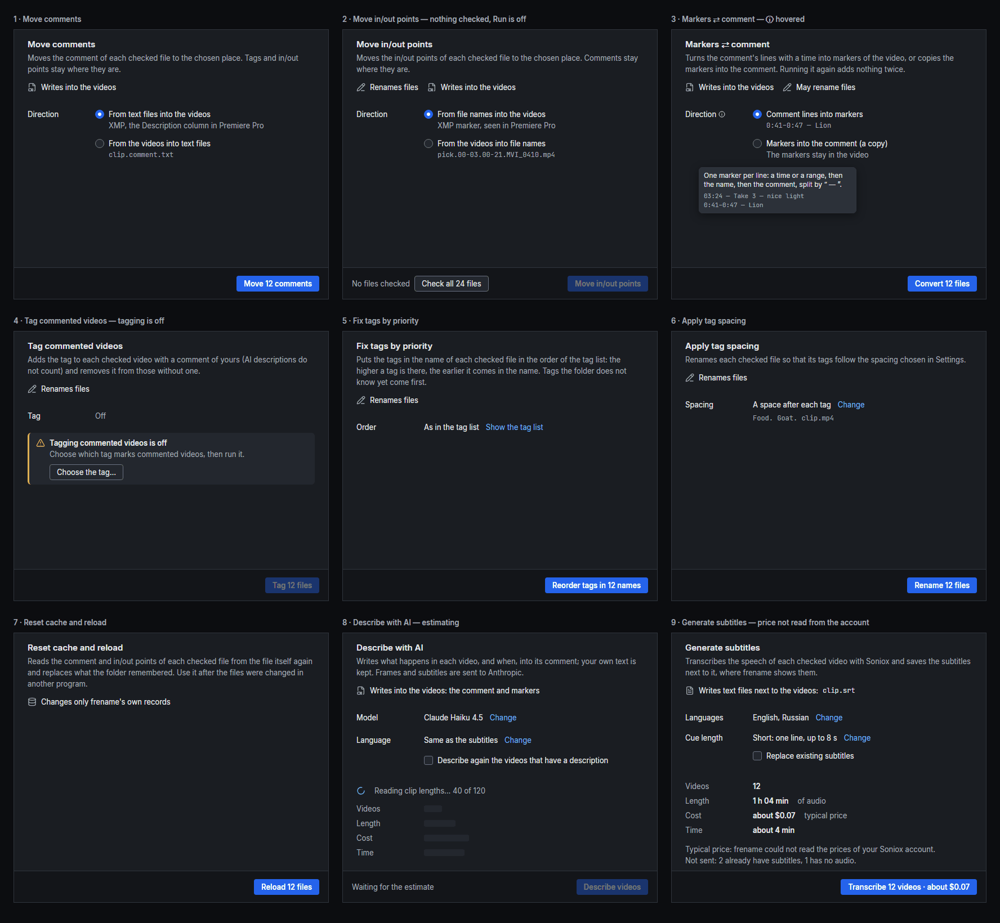

| Action | Changes | Options | Run label | Run is off when (the reason shown) |
|---|---|---|---|---|
| Move comments | writes into the videos / text files | radio: "From text files into the videos" (description "XMP, the Description column in Premiere Pro") · "From the videos into text files" (`clip.comment.txt`) | Move 12 comments | nothing checked: "No files checked" and the secondary button *Check all 24 files* (the listed ones) next to it; a job runs: "Another action is running" |
| Move in/out points | renames files; writes into the videos | radio: "From file names into the videos" · "From the videos into file names" | Move in/out of 12 files | nothing checked |
| Markers ⇄ comment | writes into the videos; may rename | radio: "Comment lines into markers" (example `0:41–0:47 — Lion`) · "Markers into the comment (a copy)"; ⓘ with the line format | Convert 12 files | nothing checked |
| Tag commented videos | renames files; also removes the tag from files without a comment | row "Tag" with the tag name and the link *Change*; when the tag is off, a warning notice "Tagging commented videos is off" with the button *Choose the tag…* (Settings → Saving, at the tag row) | Tag 12 files | the tag is off (the notice says why; today a red "Tag: off") |
| Fix tags by priority | renames files | none; a line "Order: as in the tag list" with the link *Show the tag list* (leaves batch mode) | Reorder tags in 12 names | nothing checked |
| Apply tag spacing | renames files | row "Spacing" with the current choice and the link *Change* | Rename 12 files | nothing checked |
| Reset cache and reload | changes only frename's records | none | Reload 12 files | nothing checked |
| Describe with AI | writes into comments (and markers) | rows: Model (the model and *Change*), Language (*Change*), checkbox "Describe again the videos that have a description"; plan rows and "Without subtitles: 4" (they are described from the picture only); skipped line in `secondary` ("Skipped: 3 already described, 1 over 30 min") | Describe 12 videos · about $0.35 | estimating: a spinner line "Reading clip lengths… 40 of 120" over the plan rows drawn as empty skeletons, Run "Describe videos", reason "Waiting for the estimate"; no key (error notice "No Anthropic API key yet" + *Set the key…*); key rejected (+ *Check the key…*); nothing to send |
| Generate subtitles | writes `.srt` files | rows: Languages (from Settings, as a line, *Change*), Cue length, checkbox "Replace existing subtitles"; plan rows: videos, length, cost with its source ("from your account" / "typical price"; "cost unknown" when neither is known), time; `secondary` lines: what is skipped and why, "The audio is sent to Soniox", "Uploads are deleted from Soniox afterwards (the log lists any that could not be)", and that the clips get the "subtitled" tag when Settings says so | Transcribe 12 videos · about $0.07 (or "Build 3 subtitles, free") | key missing or rejected (notice + *Set the key…* / *Check the key…*); nothing to transcribe |

Today seven actions share one generic "Run on N files". What explains a disabled Run today: the red
key footers of AI and subtitles, "Tag: off", and the labels "No videos to describe." / "Nothing to
transcribe"; nothing says "nothing checked", "a job runs" or "reading clip lengths", and while
Describe with AI reads clip lengths every action's Run is off without a word.

#### 13.6.5 Progress

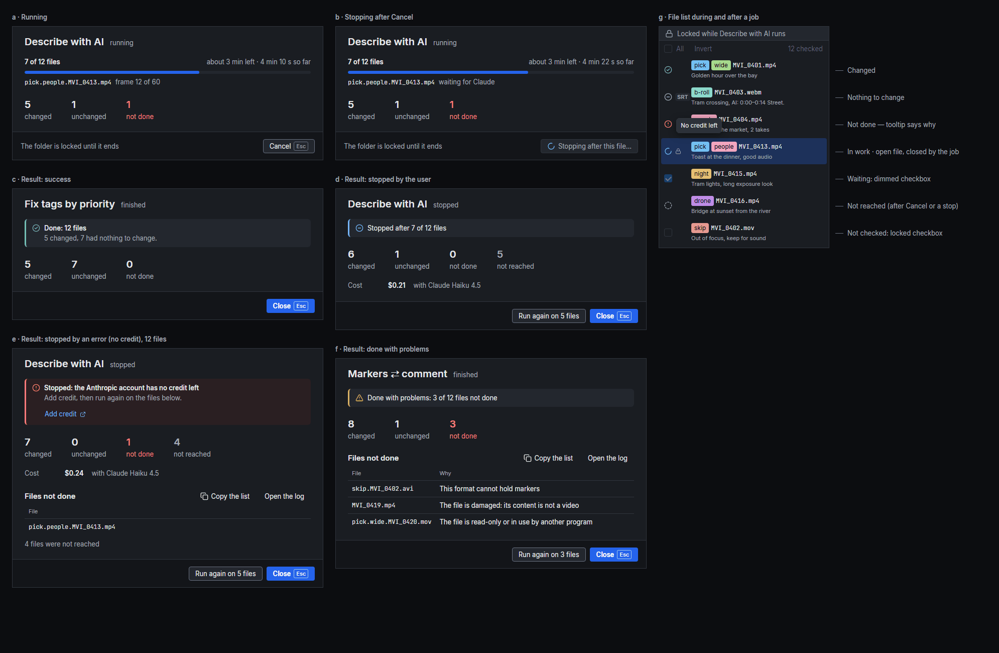

The action page is replaced by the job (the list and the header stay):
- `heading` with the action's name and, after it, `secondary` "running".
- **Progress block:** "7 of 12 files" (`body.strong`), at the right "about 3 min left" (after two
  files; before: "estimating time…") and the time spent in `secondary`; the bar (§8.15) under it;
  under the bar the current file in `mono` and its step in `secondary` ("frame 12 of 60", "waiting
  for Claude", "saving", "transcribing").
- **Live figures:** changed · unchanged · not done, as in the result (§13.6.7), updating as files
  finish; after a stop, "not reached" is its own figure, never added to "not done".
- **Button bar:** `secondary` Cancel `Esc` at the right. After a press: "Stopping after this file…"
  with a spinner, disabled.
- **Closing the app** during a job cancels it and closes after the current file.
- In the file list (§13.6.6) each file shows its state, and a status line on top of the list:
  `lock` "Locked while Describe with AI runs".

#### 13.6.6 Per-file status in the file list
The check column shows the file's state during and after a job (replacing the tinted checkboxes,
where "changed" and "nothing to change" looked the same):

| State | Icon (16) | Tooltip |
|---|---|---|
| Waiting | the checked checkbox, dimmed | – |
| In work | `loader-circle` turning, `accent.text` | "Working on it" |
| Changed | `circle-check` `success` | "Changed" |
| Nothing to change | `circle-minus` `text.secondary` | "Nothing to change" |
| Not done | `circle-alert` `error` | the reason ("No credit left") |
| Not reached (stopped) | `circle-dashed` `text.secondary` | "Not reached" |

A click on the icon turns it back into the checkbox and keeps the file checked (**behaviour**,
#58: today it unchecks it); Close clears them all. Undo history is cleared when a job ends (the
files changed under it).

#### 13.6.7 Result

The job's page stays until Close:
1. **One status notice** (§8.12), the only place the outcome is said:
   - success: `circle-check` "Done: 12 files" (+ "5 changed, 7 had nothing to change");
   - stopped by the user: `circle-minus` info notice "Stopped after 7 of 12 files" (the files not
     reached are not listed: they did not fail; "Run again" covers them);
   - stopped by an error: error notice "Stopped: the Anthropic account has no credit left" with the
     fix (*Add credit* for Anthropic billing, *Top up on Soniox* for an empty Soniox balance or
     budget, *Check the key…* for a rejected key) — the reason is not repeated below;
   - finished with some failures: warning notice "Done with problems: 3 of 12 files not done".
2. **Figures:** three figures in a row — changed, unchanged, not done — and a fourth, "not reached"
   (`text.secondary`), when the job stopped early; each a `heading` number over
   a `secondary` word; "not done" in `error` only when above 0.
3. **Spend** (paid actions): a key-value row "Cost: $0.31 with Claude Haiku 4.5" ("at least" when a
   timeout may have been billed).
4. **Files not done:** a table (§10.5) with the header "File" / "Why", the file name in `mono`, the
   reason in `body`, 8 rows then it scrolls; when every file has the stop reason, only the names
   (the reason is in the notice). Above it at the right: ghost button *Copy the list* (copies
   "name — reason" lines) and the link *Open the log*.
5. **Button bar:** secondary "Run again on 5 files" (the not done and not reached; it checks exactly
   those files and starts at once), then **primary Close** `Esc` at the right (§8.1: the result screen's primary is Close). A key cap on a filled
   button is drawn with a white 60 % edge and white text.
6. The job and result pages use `heading` for the action's name with a `secondary` word after it:
   "running", "finished", "stopped".

Today: the stop reason is said twice, "Finished 12 files" shows even when all failed, the counts are
one gray line of symbols, the failed list is red text that cannot be copied, and Esc does nothing.

### 13.7 Empty states and "nothing here yet"

| File list | Tags area |
|---|---|
| 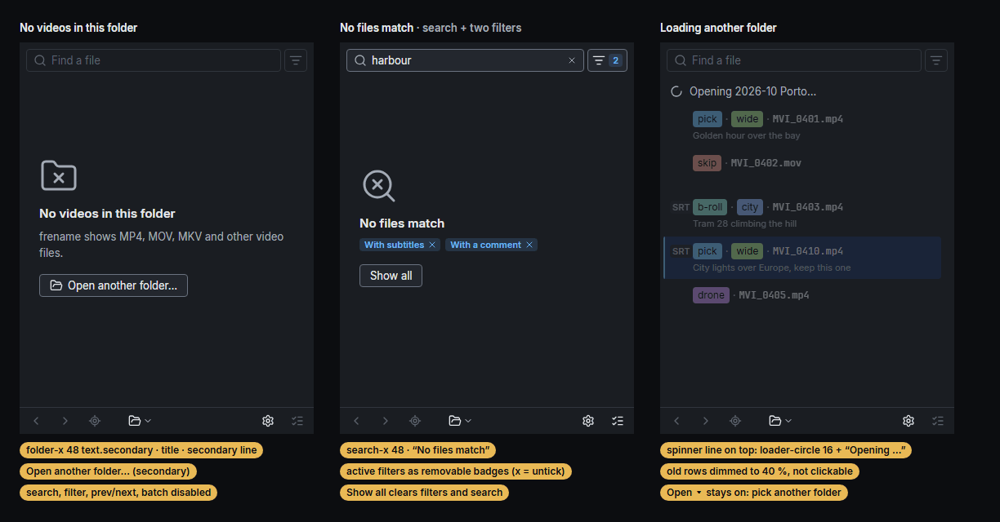 | 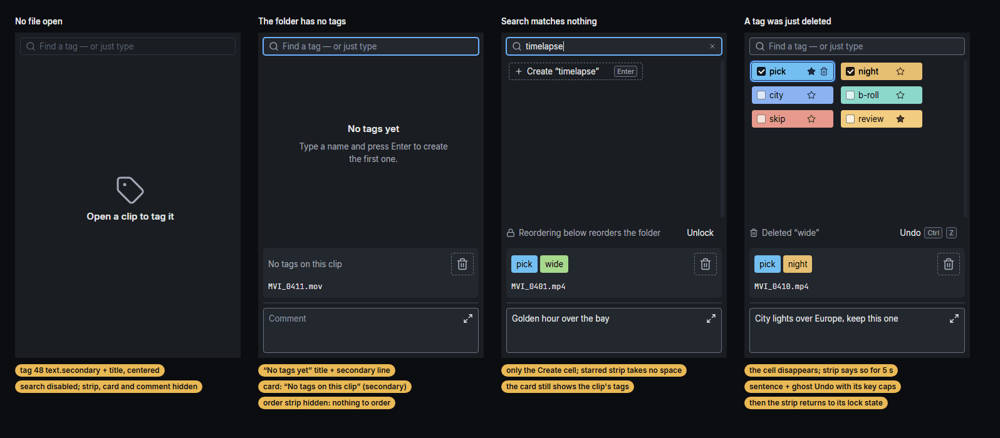 |


Every place that can be empty, with what it shows (words in `title` + `secondary`, the icon 48 in
`text.secondary` for areas, 24 for small panels; §8.20):

| Place | Situation | Shown |
|---|---|---|
| Window | no folder open | the empty screen: "Open a folder of clips", *Open a folder…* (primary), *Open a file…* (proposed for #63; today a path on the command line opens a file), recent folders (#63); the last session's folder reopens by itself at start |
| Window | first folder loading | `loader-circle` 24 and "Opening 2026-09 Lisbon…" |
| File list | folder has no videos | `folder-x` "No videos in this folder" · "frename shows MP4, MOV, MKV and other video files." · *Open another folder…* |
| File list | loading another folder | the old rows dimmed with a spinner line on top "Opening …" |
| File list | the new folder cannot be read | the old folder stays; an error notice at the top of the list "Cannot open “Lisbon”: access denied" with *Try again* (**behaviour**, #59: today nothing is shown) |
| File list | search or filters hide every file | `search-x` "No files match" · the active filters as removable badges · *Show all* |
| Video pane | no file open | `clapperboard` "No clip open" · *Open the first clip `PgDn`* |
| Video pane | cannot play | §13.3.1 |
| Subtitle list | no subtitles | "This clip has no subtitles" · *Generate subtitles…* |
| Marker list | no markers | "No markers yet" · *Add a marker F2* |
| Marker list | format without markers | "This file cannot hold markers" |
| Tag grid | no file open | `tag` "Open a clip to tag it" |
| Tag grid | folder has no tags | "No tags yet" · "Type a name and press Enter to create the first one." (the one hint that stays text: typing goes into the tag search right above it, which takes focus) |
| Tag grid | no match | the "Create “…”" cell |
| Starred strip | nothing starred | takes no space |
| File name card | no tags on the clip | "No tags on this clip" |
| Comment | empty | the placeholder "Comment" |
| Batch panel | nothing checked | the action page as usual, Run off with "No files checked" and *Check all 24 files* |
| Batch result | nothing failed | no "Files not done" block |

### 13.8 Colors of the content

Colors that belong to the content, not to the chrome, and are tokens too (§3.3):

| Token | Value | Use |
|---|---|---|
| `video.bg` | `#000000` | behind the picture, fullscreen |
| `video.track` | `#3A404A` | timeline and volume track |
| `video.segment` | `#F2C94C` at 70 % | in/out segment |
| `video.subtitle` | `text.primary`, 15/20 | windowed subtitle strip |
| `overlay.list` | black 72 % | side list over the picture |
| `overlay.caption` | black 62 % | fullscreen caption pill |
| `marker.*` | the 9 Premiere colors of `theme::marker_color` | pins, bands, dots, label edges |
| `tag.palette.*` | the 16 colors of `tag_colors.rs` | chips |
| `tag.text` | black | chip labels and icons (70 % for icons) |
| `tag.star` | black 70 % (on the chip) | star; the gold star of today reads poorly on yellow chips |
| `chip.hover` | white 22 % over the chip | hover on a tag chip |
| `chip.mini` | 12/16 Inter, black | mini chips in the file list |
| `overlay.hover` | white 10 % | hover on the side list's rows |
| `chip.check` | white 70 % / black 85 % | checkbox on a chip |

### 13.9 Sizes: minimum, maximum and what gives way

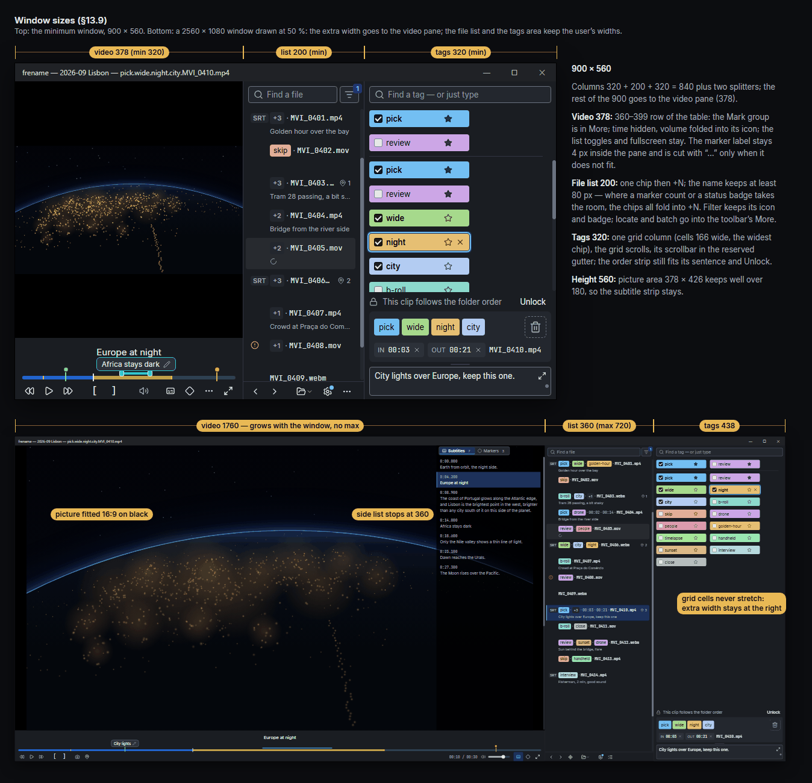

**Rules for every region**
1. **Nothing overlaps and nothing wraps into a second row of controls.** A bar that does not fit
   gives up whole elements in a fixed order; controls never shrink below their size (icon buttons
   32, fields 28 high, text 11 px) and a bar never becomes two bars (the rows under it would jump).
2. **What gives way first is what is used least,** and it goes into a **More** menu
   (`ellipsis` icon button, tooltip "More"), where it keeps its name, icon and key. Frequent
   controls (play, the file's own actions) never go.
3. **Words become icons only as a last step,** and then keep their words in the tooltip.
4. **Text is cut with "…", never mid-letter,** and the full text is in the tooltip.
5. **Content has a maximum width**, readable lines of at most ~80 characters (§4.2): past it, the
   extra space is empty, not stretched. Lists and grids fill the width; pages of text and forms do
   not.
6. Everything below is in logical pixels. The reference screen is 1080p at 150 %: a work area of
   1280×680 under the taskbar (§1 principle 8); the minimum window fits it with room to spare.

**Window**

| | Width | Height | Notes |
|---|---|---|---|
| Minimum | 900 | 560 | 320 + 200 + 320 of columns + 2 splitters of 1 px = 842; the other 58 go to the video pane (378) |
| Default | 1440 × 800, but at most 90 % of the work area (1152 × 612 on the reference screen) | | columns: at 1440 or more 600 / 360 / the rest; narrower, 440 / 300 / the rest (410 at 1152, the default on the reference screen) |
| Maximum | none | none | extra width goes to the video pane first |
| Today | 1200 × 600 | | video 460, file list 200, no minimum window size (**behaviour**, #59) |

A saved size or column width below the minimum (from an older version or a smaller screen) is
raised to the minimum when the window opens.

When the window gets narrower than the sum of the user's column widths, the **video pane** shrinks
first (it also grows first), down to its minimum; then the tags area; the file list keeps its width
longest (it is the one place to find the clip). A splitter never pushes a column below its
minimum.

**Video pane** (min 320, no max)

The controls bar folds by the widths of §13.3.5 (`video_controls/fold.rs`, whose test pins these
numbers): padding 16 + Transport 160 + In/out 64 + Mark 64 + Rotate 64 + Time 152 + Volume 96 +
Views 96 + seven gaps of 12 (the free space counts as one more item of the row) = **796** with
everything shown and a clip with subtitles. Each step below takes away what the previous width no
longer fits:

| Pane width | Controls bar | Needs |
|---|---|---|
| ≥ 796 | all groups (§13.3.5) | 796 |
| 752–795 | ↺ ↻ move into **More** (More appears just before fullscreen) | 796 − 64 − 12 + 32 = 752 |
| 688–751 | also the frame steps (`step-back`, `step-forward`) move into **More**, before the readout hides: stepping, the readout shows the frame's time | 752 − 64 = 688 |
| 524–687 | also the time readout hides (the timeline's hover tooltip still shows times) | 688 − 152 − 12 = 524 |
| 460–523 | also the volume slider folds into its icon button | 524 − 64 = 460 |
| 384–459 | also the Mark group (`camera`, `map-pin`) moves into **More** | 460 − 64 − 12 = 384 |
| 320–383 | also the subtitle and marker list buttons move into **More**; transport, in/out, the volume icon, More and fullscreen stay | 384 − 64 = 320 |

Without subtitles (no subtitle list button) each threshold is 32 lower. Notices use the free space
when it is at least 120, otherwise the pill over the picture (§13.3.5).

- **Side list:** 2/5 of the pane, at most 360, when the pane is 600 or wider; narrower, it covers
  the whole picture with its own `x`.
- **Marker label:** cut to fit the pane, at least 12 characters.
- **Height:** the picture keeps at least 180; below that, the subtitle strip goes first (subtitles
  move to the side list).

The mockups show the pane at 640, 520, 440 and 340; the controls bar picture adds 740 and 390.

Never hidden: play/pause, back/forward 10 s, `[` `]`, fullscreen, the timeline.

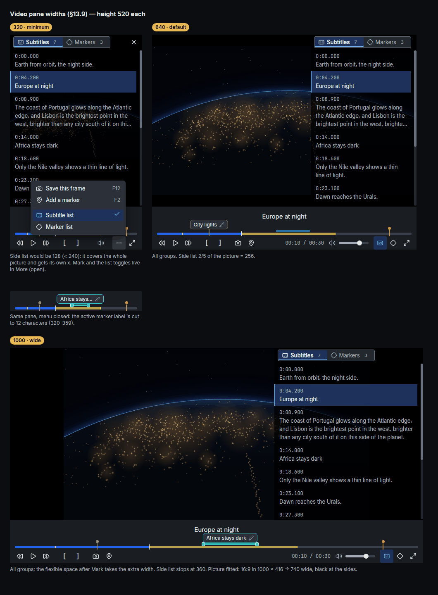

**File list** (min 200, max 720)

| Column width | Rows | Search bar and toolbar |
|---|---|---|
| ≥ 320 | all parts (§13.4.2) | full |
| 260–319 | chips that do not fit become `+N`; in/out timecodes hide (they are in the name's tooltip) | full |
| 200–259 | the first chip only if the name still gets 80 px, otherwise only `+N`; the marker count stays | the Filter button keeps its icon and badge; the toolbar's gaps become 4 px and `locate-fixed` and the batch toggle go into **More** |
| > 720 | the column stops growing; the splitter stops | – |

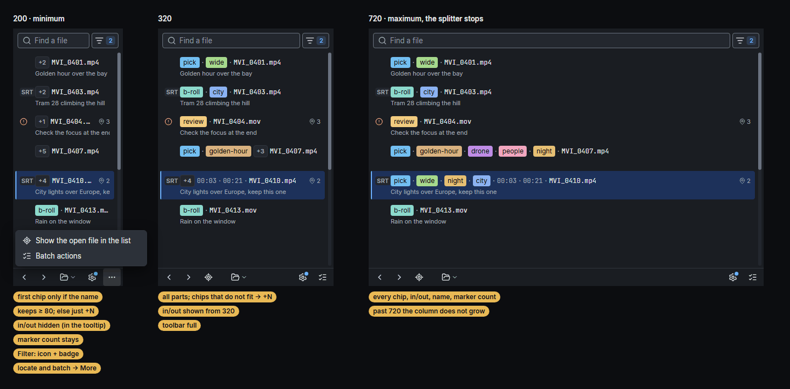

**Tags area** (min 320, no max)
- **Grid:** column width = the widest chip of the tag list, but at most 240 (longer names are cut
  with "…" inside the chip, full name in the tooltip). Columns = as many as fit,
  and never fewer than **2**: when two would not fit, the width becomes min(widest, 240, (area − 24
  padding − 14 gutter − 8 gap) / 2), so at 320 two columns of 137. On a wide area many. Cells never stretch: extra width stays
  at the right end of each row.
- **Starred strip:** wraps like the grid; at most 3 rows, then "+N more" (§13.5.3).
- **Order strip** (32 px): below 420 the two buttons become icon buttons (`arrow-up`, `arrow-down`)
  with their words in the tooltip; the sentence is cut with "…".
- **File name card:** chips wrap to more lines (it grows; the grid gives up the height); the trash
  stays at the end of the first line.
- **Comment:** min height 48, max 60 % of the area; the handle stops there.
- **Height:** when the area gets shorter, space is given up in this order: the comment shrinks to
  its minimum; the starred strip shows 1 row ("+N more"); the file name card keeps one line of chips
  ("+N" at its end); the grid never goes below 2 rows (72) and scrolls.

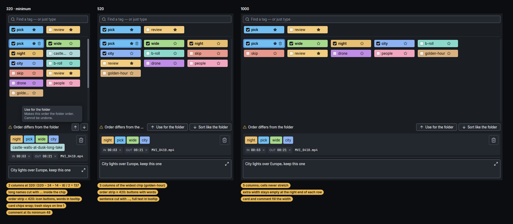

**Batch panel** (takes the tags area's width, min 320)

| Panel width | Layout |
|---|---|
| ≥ 600 | action list 232 with names + page |
| 440–599 | the action list folds to its icons (48 wide, groups split by 1 px lines, each icon's name and badge in a tooltip to its right); the page gets the rest |
| 320–439 | the action list becomes a dropdown (§8.7) at the top of the page ("Describe with AI ▾"); its menu keeps the group headings, icons and badges and marks the current action with a `check` |
| Page under 440 | setting rows put the label above the control; the reason Run is off moves to its own line above the button bar; the cost leaves the Run label and stays in the plan |
| Page content | max 640 wide (`PAGE_MAX_WIDTH`); the plan and result tables stay inside it |

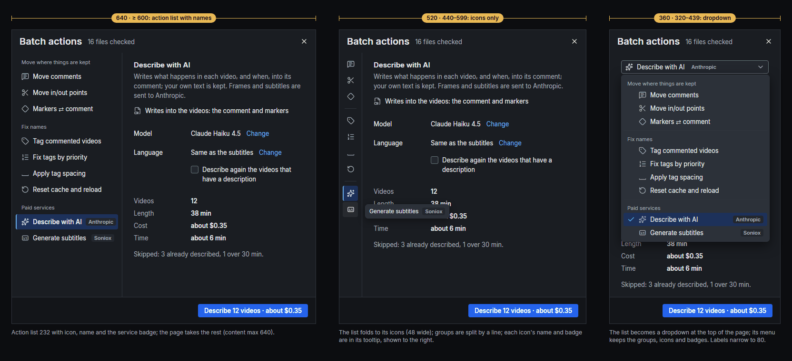

**Settings window** (min 720×520, §14.1): the navigation stays 188; the page content is at most
640 wide and stays left-aligned, so on a wide window the rows do not stretch.

**Dialogs and menus:** dialogs 420–560 wide, menus 200–360 (items cut with "…"), tooltips at most
280.

### 13.10 Tasks

How the core tasks run on the system: keys, where the result shows, and what happens when it
fails. The keys are today's (#62 owns the list).

| Task | Keys / mouse | Where it happens | Feedback | Error or empty state |
|---|---|---|---|---|
| Open a folder | 📂, drop a folder, recent folders (#63), a path on the command line; the last session reopens at start | OS picker; the file list | the list fills; the app bar shows the folder (#64) | empty folder: empty state in the list; cannot read it: error notice, the old folder stays; missing recent folder: dimmed row with a remove offer |
| Walk the clips | PageUp / PageDown, click | file list, video pane | row selected and scrolled into view; video loads | load failed: `circle-x` 48 and the reason in the video pane |
| Tag a clip | type part of a name, arrows, Shift+Space | tag search, tag grid | checkbox ticks; the chip appears in the file name panel and the list row | no match: the search offers to create the tag (Enter) |
| Rename | double-click a row, Enter / Esc | inline field in the row | the row shows the new name | error line under the field (why + what to do); the field keeps the text |
| Comment | click the comment box, type | comment editor | saved on leave; comment line in the list row; "Commented" tag checked if Settings says so | – |
| Mark in / out | `[` `]` | video controls, file name panel | IN/OUT timecodes appear; segment on the bar | – |
| Markers | F2 (F2 F2 to name, hold for a range), Shift+F1/F3, Shift+F2 (§13.3.4) | timeline, marker list | pin appears with its label | not saved: `circle-alert` at the row's right end and an error notice |
| Run a batch action | batch mode, pick an action, primary button | batch panel | progress with n of total, time left, Cancel | stopped or failed: one notice with the reason and a fix button; files not done listed once |
| Change a setting | ⚙, Ctrl+Tab between pages | Settings window | applies at once | key save failed: error line under the key row |
| Update | the dot on ⚙ | Settings → Updates | status line; *Update and restart* | check failed: error line with the reason |
| Undo | Ctrl+Z / Ctrl+Y | where the change was | the change reverts in place | nothing to undo: nothing happens |

### 13.11 How the later issues fit

Mockups of #63's recent folders and #62's cheat sheet on the same rules (#64's app bar is §13.12, #58's
batch screens §13.6):

| Empty screen with recent folders (#63) | Cheat sheet (#62) |
|---|---|
| 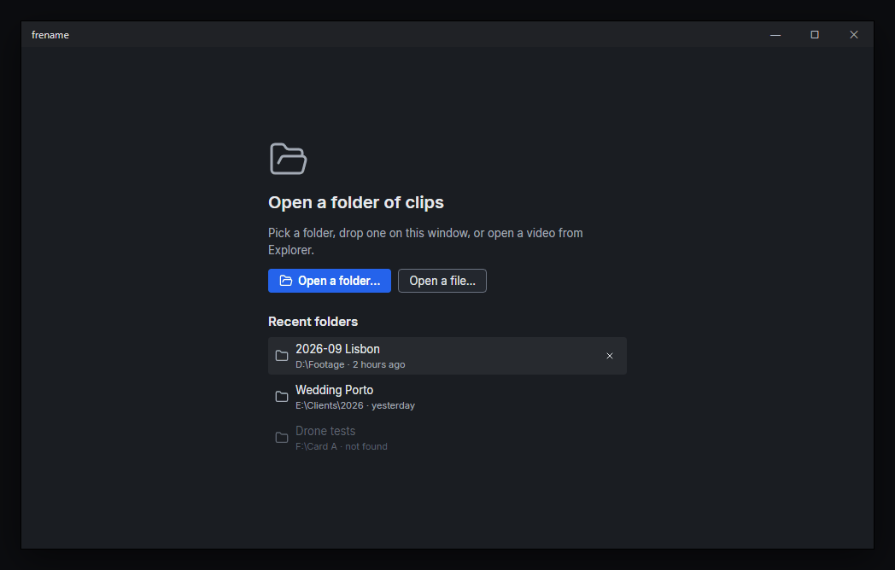 | 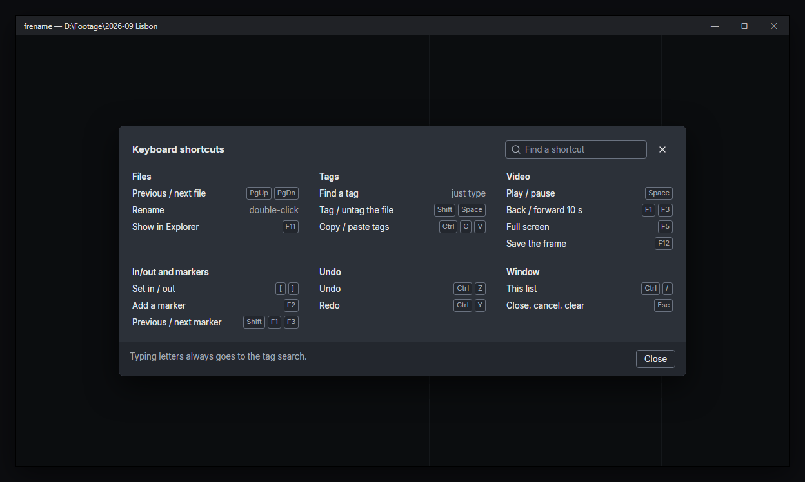 |

These are directions, not specs: each issue writes its own details and may change them within
these rules.

### 13.12 App bar (#64): two versions

⚙ and the mode switch leave the file list's toolbar for a bar of their own (§18 item 3). There are
two versions: **A** is the one to build; **B** is what is built if A cannot keep every native
window behaviour on Windows (#64's rule). Both hold the same controls in the same order, so
everything below the bar, and every other section of this document, is the same for both.

**The controls, in both versions**

| Place | Control | Notes |
|---|---|---|
| left, fixed | mode switch: segmented control (§8.4) `file-video-camera` "Single file" · `list-checks` "Batch" | a fixed place: it never moves when the folder name changes. In batch mode the Batch segment is latched and carries the number of checked files as a `badge.accent` ("Batch 12"). Tooltip: "Batch actions on the checked files". Keys: #62 |
| after it (A only) | folder name (`body.strong`) and its parent path (`caption` `text.secondary`) | plain text, part of the drag area; tooltip: the full path. In B the OS title bar says it |
| right | `keyboard` "Keyboard shortcuts `Ctrl`+`/`" (#62) · `settings` "Settings" with the update dot (§14.1) | 32×32 icon buttons; the dot keeps its meaning ("an update is ready") |

Not in the bar: Open a folder and the recent folders (#63) stay in the file list's toolbar with the
other file controls; the file name stays in the tags area's card.

#### Version A — frename draws its own title bar (#64 option 1)

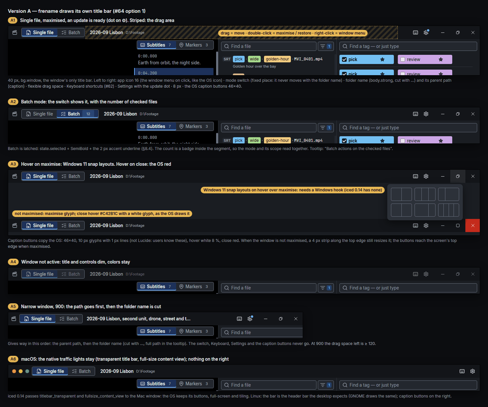

- **The window's only title bar**, 40 px (`appbar.height`), `bg.window`, no line under it (the
  panes start below it on `bg.panel`, which is enough of an edge). Chrome costs 40 px: 8 more than
  today's OS title bar, and the file toolbar loses two buttons.
- **Left to right:** 12 px · app icon 16 (`clapperboard` in `text.secondary`; a click opens the
  window menu, as the OS icon does) · 12 px · mode switch · 16 px · folder name and path ·
  flexible drag space (at least 120) · Keyboard shortcuts · Settings · 8 px · caption buttons.
- **Caption buttons** copy the OS so they are recognised, not redesigned: 46×40 each, 10 px
  glyphs with 1 px lines (minimise, maximise / restore, close — drawn, not Lucide), hover white
  8 %, pressed white 12 %; close hovers `#C42B1C` with a white glyph (the Windows value, not
  `danger`). Tooltips are the OS's words ("Minimize", "Maximize", "Restore Down", "Close").
- **The drag area** is every pixel of the bar that is not a control, the folder name included:
  press and drag moves the window (`window::drag`, which also gives Aero Snap to the screen edges),
  double-click maximises or restores (`window::toggle_maximize`), right-click opens the window
  menu (`window::show_system_menu`).
- **Resizing:** the window keeps its resize edges; along the top, a 4 px strip above the bar
  resizes it when the window is not maximised (`window::drag_resize`). Maximised, the bar touches
  the screen's top edge, where its buttons are easiest to hit (BIR on Fitts's law).
- **Inactive window:** the bar's text and icons at 55 %; colors and places stay.
- **Narrow window** (900): the parent path goes first, then the folder name is cut with "…" (full
  path in the tooltip) so the drag space never drops below 120. The switch, Keyboard, Settings and
  the caption buttons never go.
- **Fullscreen video:** the bar hides with the rest of the chrome (§13.3.8).
- **macOS:** the OS keeps its own traffic lights on the left (iced's `titlebar_transparent` +
  `fullsize_content_view`, so tiling and full screen stay native); the bar starts 72 px in and has
  no caption buttons. **Linux:** the bar is the header bar the desktop expects; caption buttons on
  the right.
- **Windows 11 snap layouts** (the flyout when hovering maximise) is the one behaviour iced 0.14
  does not give: winit offers no way to tell Windows that the maximise button is there (the
  `WM_NCHITTEST` answer `HTMAXBUTTON`). Version A therefore needs a small Windows-only hook on the
  window procedure that answers it for the maximise button's rectangle. `Win`+`Z` opens snap
  layouts either way.

**What must be proven before A is chosen** (#64's prototype, checked by the owner on Windows 10
and 11): snap layouts on hover; Aero Snap by dragging to the edges and corners; resize from every
edge and corner; double-click; the window menu (and `Alt`+`Space`); moving between monitors with
different scaling; minimise / restore animations; the taskbar title and thumbnail. One failure
and B is built.

#### Version B — a thin app bar under the OS title bar (#64 option 2)

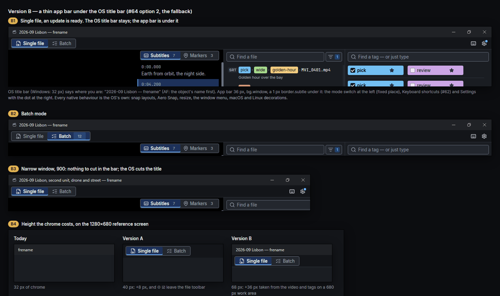

- **The OS title bar stays** and says where the user is: "2026-09 Lisbon — frename" (the object's
  name first, AF ch. 14; today it shows the open file's whole path). Every native behaviour is the
  OS's own.
- **The app bar** under it: 36 px (`appbar.height.under_title`: the 28 px switch and 4 px above and
  below), `bg.window`, a 1 px `border.subtle` line under it, padding 0×8. The mode switch at the
  left, Keyboard shortcuts and Settings at the right; nothing else, so nothing in it is ever cut.
- **Cost:** 32 + 36 = 68 px of chrome, 36 more than today, taken from the video and the tags on a
  680 px work area. This is why A is preferred.

Version B changes nothing else: the same controls, keys and tooltips. Moving from B to A later
only replaces the OS title bar with A's bar.

## 14. The Settings window

### 14.1 Window

- **Size** 800×600 logical (fits 1280×680), centered, **resizable** with a minimum of 720×520 so a
  long Russian label or a large system font never clips; the page scrolls when it does not fit.
- **Wider than needed:** the page content stops at 640 (`PAGE_MAX_WIDTH`) and stays left-aligned;
  the navigation stays 188.

| Minimum, 720×520 | Wide, 1400×600 |
|---|---|
| 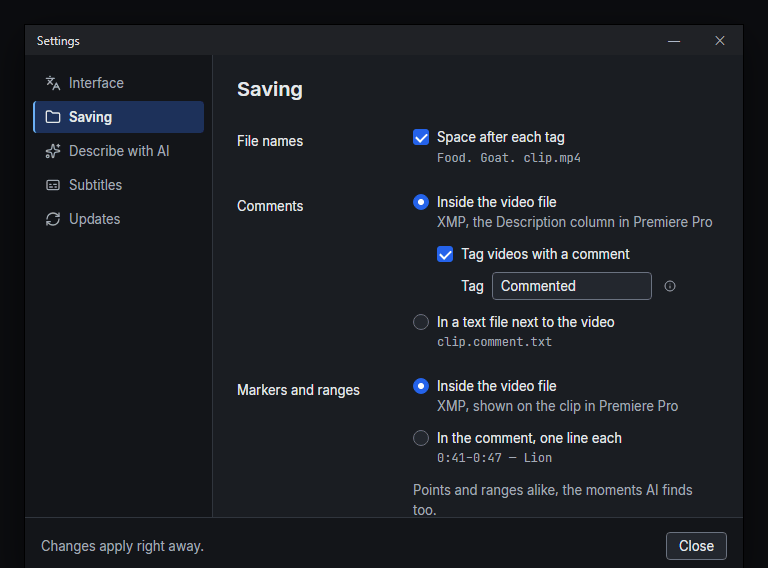 | 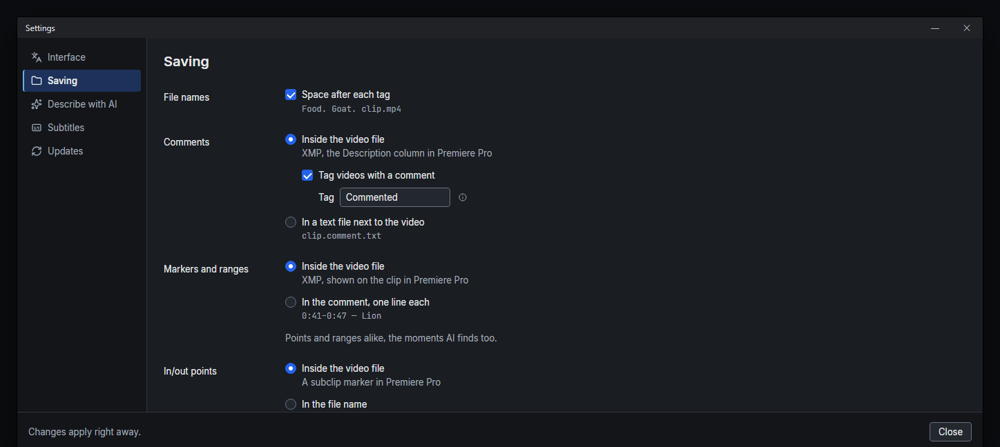 |
- **One instance**; opening it again focuses it and switches to the requested page.
- **Closes** with *Close*, Esc, or the OS ✕. Esc first leaves a focused field (iced does that
  itself) and first cancels an open remove confirmation (= *Keep*), per §9.4.
- **Keys:** `Ctrl`+`Tab` / `Ctrl`+`Shift`+`Tab` move to the next / previous page (plain arrows would
  switch pages while typing: iced fields do not take Up/Down). `Tab` / `Shift`+`Tab` move between the
  controls of a page, `Space` presses the focused one, `Enter` a focused button (§11). No
  window-level Enter (§9.2).
  Main-window keys do not act here except the video F-keys, whose leak #62 fixes. With a dropdown
  open, Esc closes the window rather than the list (iced 0.14 limit, §9.4).
- **Opened on a page:** ⚙ opens the last page shown in this session (*Interface* the first time), or
  *Updates* when an update is ready (the dot on ⚙ leads to it, and the *Updates* item shows the
  same dot). *Describe with AI* and *Generate subtitles* in batch mode open their pages (they used to
  open "scrolled to the end"); the *Change* links and *Choose the tag…* buttons of *Tag commented* and *Apply tag spacing* open
  *Saving*.

### 14.2 Pages

| Category (icon) | Rows |
|---|---|
| **Interface** (`languages`) | Language · Tag colors (*Monochrome*) · Video (*Play videos automatically when opened*) |
| **Saving** (`folder`) | File names (*Space after each tag*) · Comments · Markers and ranges · In/out points |
| **Describe with AI** (`sparkles`; Russian list label «Описание от AI», heading «Описать с помощью AI») | Anthropic API key · Model · Description language |
| **Subtitles** (`captions`) | Soniox API key · Cue length · Languages (cue length first: the language list is long and hid it) |
| **Updates** (`refresh-cw`) | Version (version, status, *Check for updates*, *Update and restart*, *Check for updates when frename starts*) · Settings from an older frename (installed only) |

Why these groups: *Saving* holds the four settings that decide what frename writes into files
and names, which is what an editor thinks about together; *Interface* holds what changes only how
frename looks and behaves; the two paid services each get the page their batch action links to.
No "General" (BIR). The version is on *Updates* ("About" would hold only it).

| Interface | Saving | Describe with AI |
|---|---|---|
| 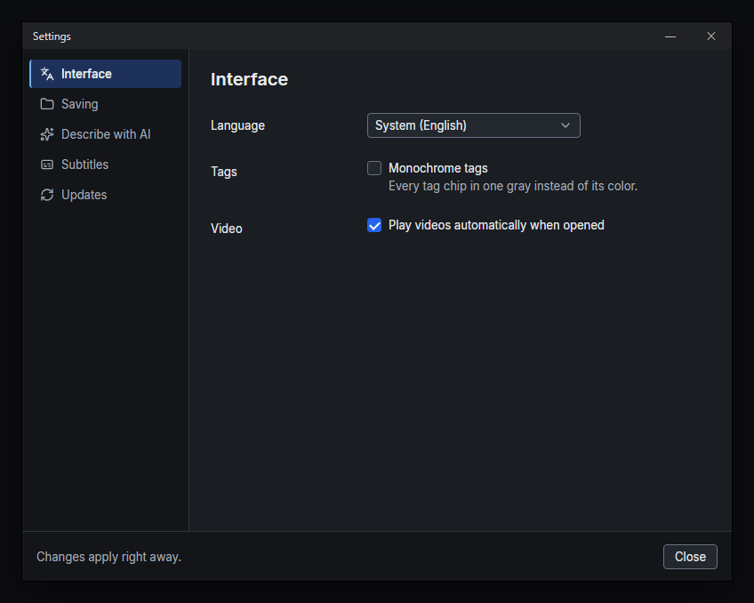 | 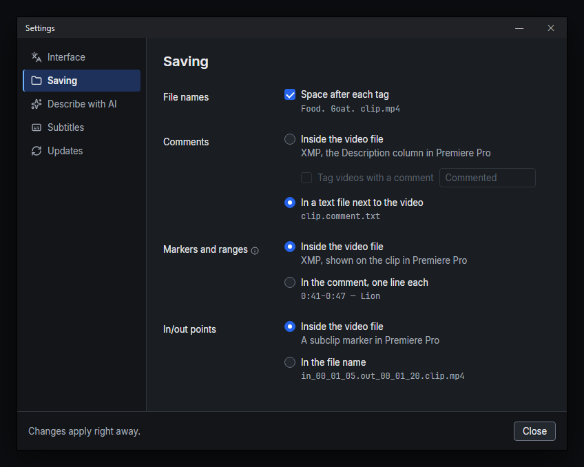 | 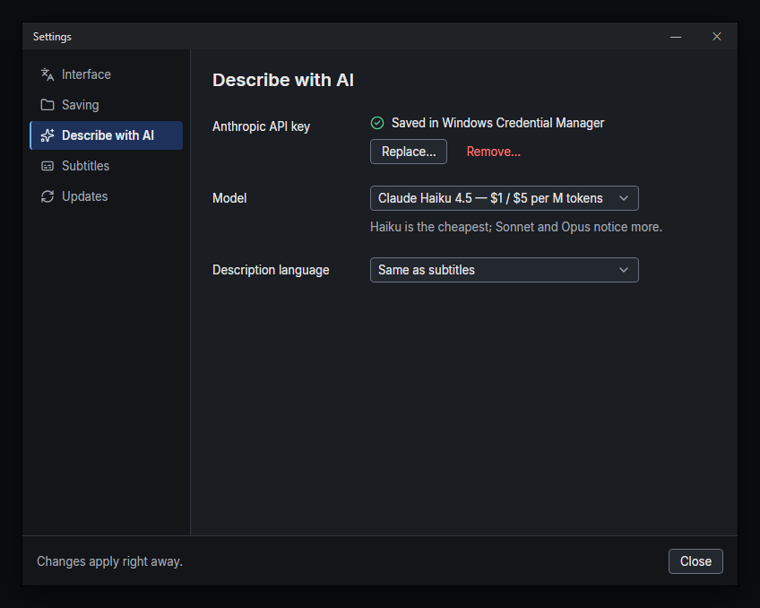 |

| Removing the key | Subtitles (no key yet) | Updates (an update is ready) |
|---|---|---|
| 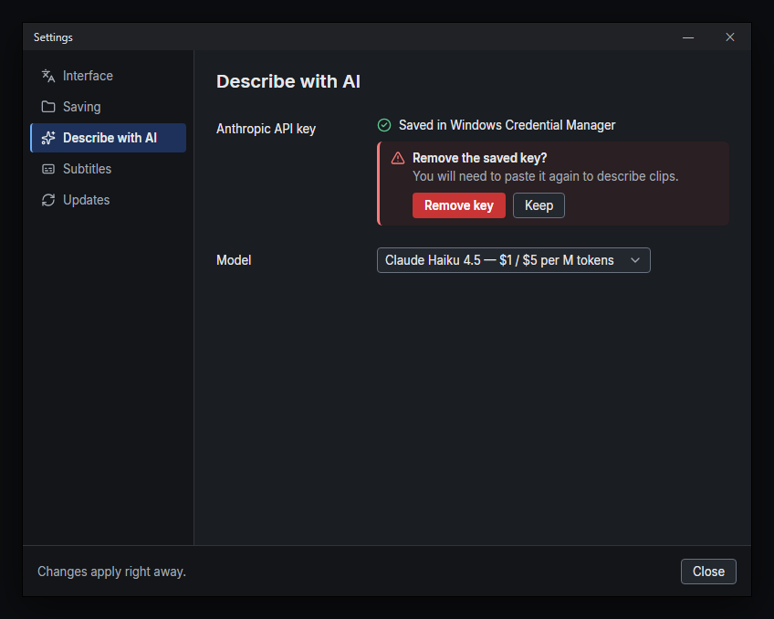 | 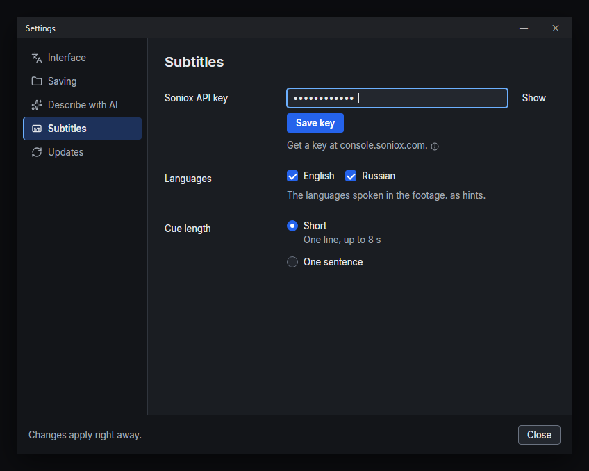 | 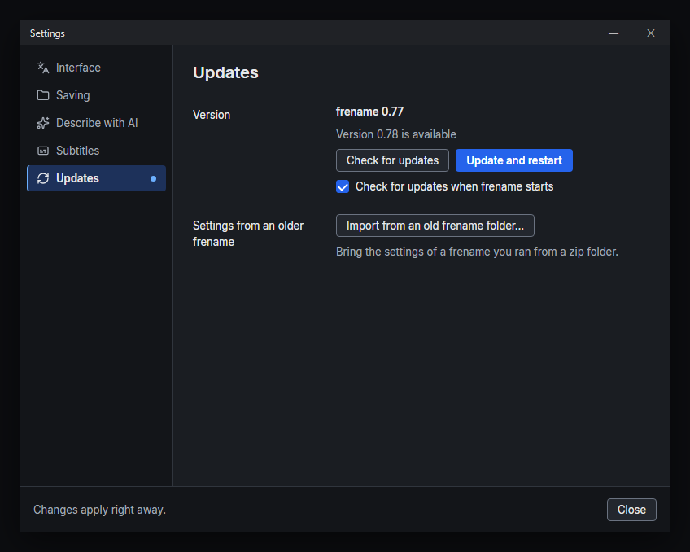 |

### 14.3 Rows in detail

- **Language:** dropdown, 240 wide: *System (English)*, then each language in its own name (a
  dropdown although the list is short: it grows, §8.7).
- **Tag colors:** checkbox *Monochrome*, help "Every tag chip in one gray."
- **Video:** checkbox *Play videos automatically when opened*.
- **File names:** checkbox *Space after each tag*, example in `mono` `Food. Goat. clip.mp4`. After a
  change: info notice "Files keep their names until renamed or saved." with *Add the space to
  existing file names…* / *Remove the space from existing file names…* (secondary).
- **Comments:** radios *Inside the video file* — "XMP, the Description column in Premiere Pro";
  *In a text file next to the video* — `clip.comment.txt`. While comments go inside the video (as
  today, the part is hidden otherwise), under the first option, indented 24: checkbox *Tag videos with
  a comment*, and under it, indented again, the label *Tag* with a 160-px field and an ⓘ that holds
  today's explanation with the example name. After a change of storage: info notice + *Move comments
  into the videos…* / *Move comments into text files…* (and the same short labels for markers, in/out
  points and the tag space).
- **Markers and ranges:** radios *Inside the video file* — "XMP, shown on the clip in Premiere
  Pro"; *In the comment, one line each* — `0:41–0:47 — Lion`; one help line under them: "Points and
  ranges alike, the moments AI finds too." Move notice after a change.
- **In/out points:** radios *Inside the video file* — "A subclip marker in Premiere Pro"; *In the
  file name* — `in_00_01_05.out_00_01_20.clip.mp4`. Move notice after a change.
- **API key rows** (Anthropic, Soniox), one component:
  - *Saved:* inline status `circle-check` "Saved in Windows Credential Manager on this computer"
    (the store's name per OS); buttons *Replace…* (secondary) and *Remove…* (danger-ghost).
  - *Missing, or replacing:* secret field (fills the column) + *Show* / *Hide* (secondary: a ghost
    button there read as plain text in review); under it
    *Save key* (primary, disabled while the field is empty) and, when replacing, *Cancel*
    (secondary); one help line: where to get a key, and for Soniox that the audio is sent to it (it
    matters before saving); where Save key keeps the key goes behind the row's ⓘ, which says only
    what the service is used for once a key is saved.
  - *Confirm remove:* in place of the buttons, an error notice "Remove the saved Anthropic key?" /
    "You will need to paste it again." with *Remove key* (danger) and *Keep* (secondary, the last
    button). Esc = Keep. The other rows stay where they are.
  - *Keyring unavailable:* warning notice with today's text and hint.
  - A failed save or removal: error line under the row.
- **Model** (AI): dropdown 300 wide with the prices; help "Haiku is the cheapest; Sonnet and Opus
  notice more." **Description language:** dropdown 300. The page's ⓘ (on the key row): "Used by
  Describe with AI in batch mode."
- **Languages** (Subtitles): checkboxes of a fixed width that wrap into as many columns as fit (three
  at the default size, two at the minimum); a status line under them while loading, locked or
  failed; help "The languages spoken in the footage, as hints." **Cue length:** radios *Short* —
  "One line, up to 8 s"; *One sentence*. ⓘ on the key row: "Used by Generate subtitles in batch
  mode. The cue length applies to new subtitles."
- **Version** (Updates): `body.strong` "frename <version>"; one status line (up to date, checking,
  downloading n %, version n is available; failed: in `error`). In a build that cannot update
  itself (a zip or development build) the status says "Updates work in the installed version" and
  *Check for updates* is disabled: the reason is that line. *Check for updates* (secondary);
  *Update and restart* (primary, only when an update is ready; disabled while a batch runs, with the
  tooltip "Wait for the batch to finish"); checkbox *Check for updates when frename starts*.
- **Settings from an older frename** (installed only): *Import from an old frename folder…*
  (secondary), help "Bring the settings of a frename you ran from a zip folder.", and the import's
  status line.
- **Button bar:** "Changes apply right away. Tab moves between options, Ctrl+Tab between pages."
  on the left, so the keys are visible (§11: every shortcut is shown); *Close* (secondary) on the
  right.

### As built

Screenshots of the app (`frename --demo docs/screenshots/main.toml --settings <page>`; a demo shows
the Anthropic key as saved and the Soniox key as missing):

| Interface | Saving | Describe with AI |
|---|---|---|
| 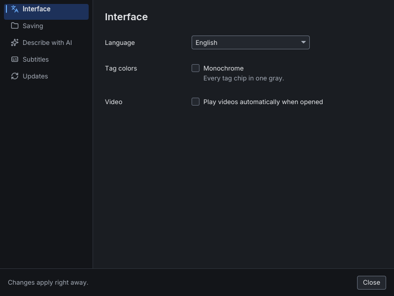 | 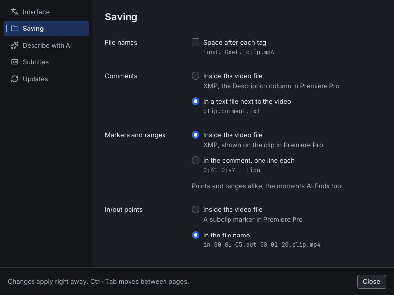 | 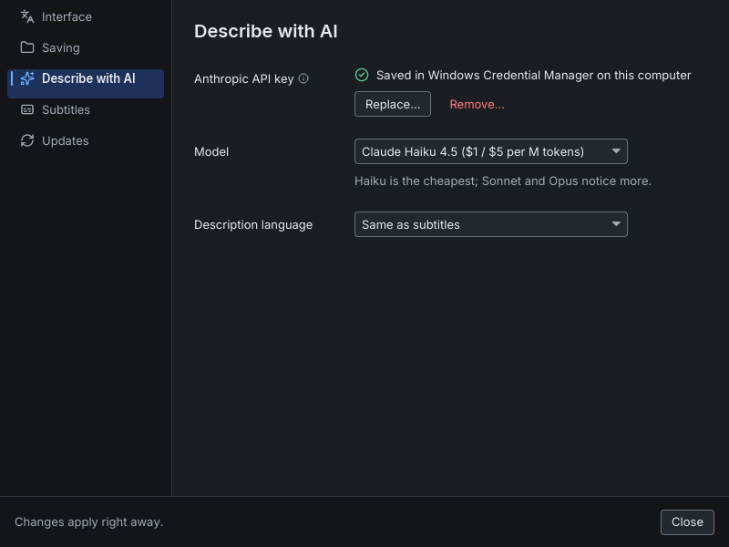 |

| Subtitles | Updates (a development build) | Russian: Saving, Describe with AI |
|---|---|---|
| 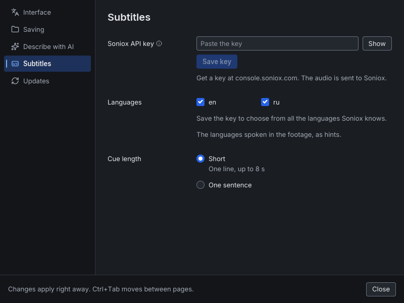 | 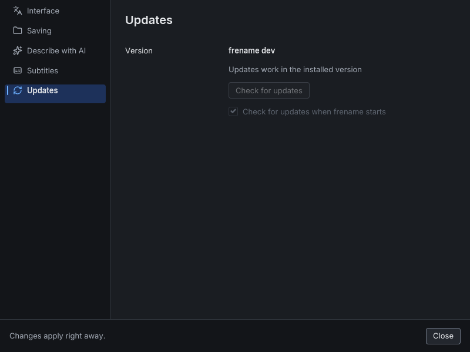 | 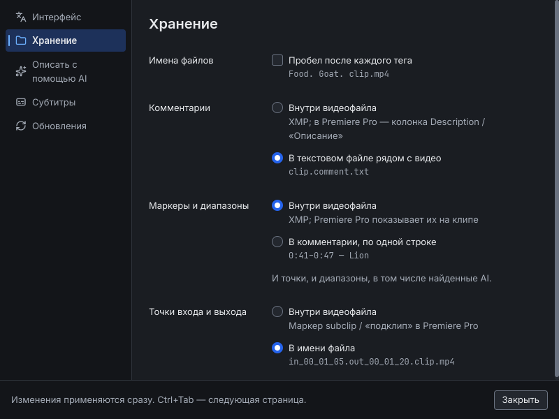 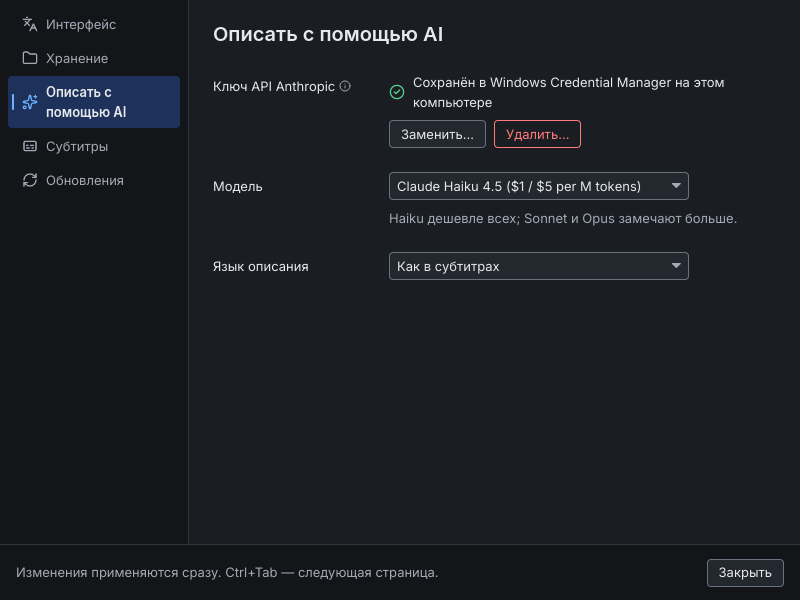 |

| Comments inside the video, after a change | Removing the key | Replacing the key |
|---|---|---|
| 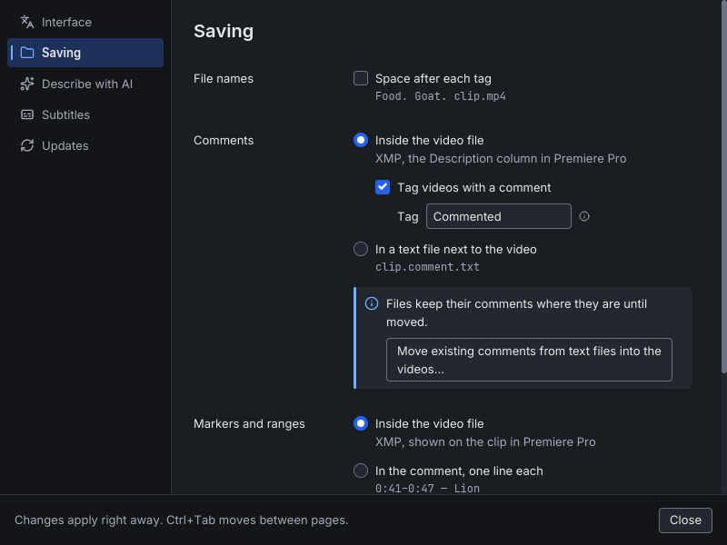 | 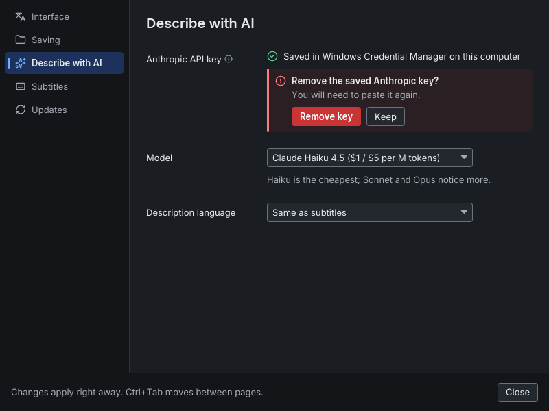 | 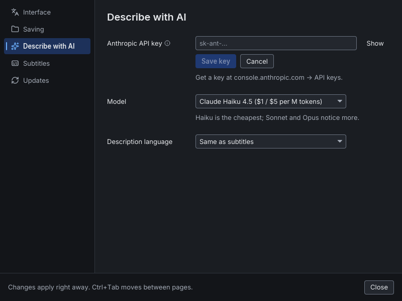 |

| Keyring unavailable | Update ready (installed build) | Update ready, Russian |
|---|---|---|
| 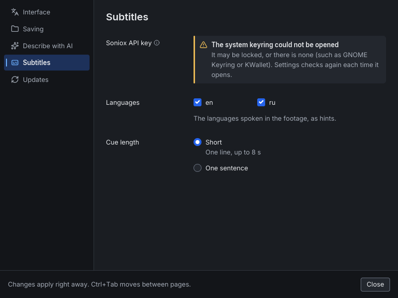 | 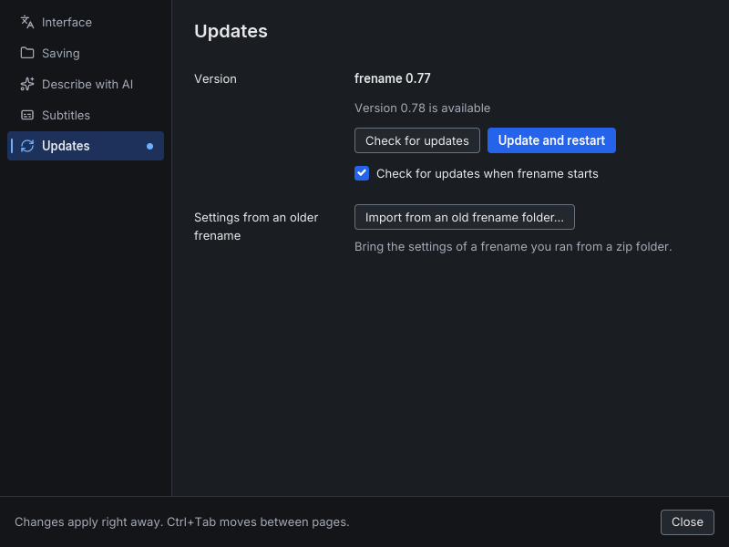 | 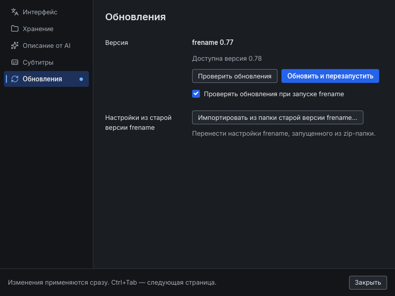 |

The state screenshots were taken with a local, uncommitted patch that puts the demo into those
states (for "update ready" it also makes the development build act as an installed 0.77).

Differences from the mockups: *Remove…* gained a 1 px `error` edge after review, so it reads as a
button (§8.1); the dropdown keeps iced's own arrow instead of a `chevron-down`
(iced 0.14 draws the pick list's handle itself); a navigation item whose label wraps (Russian)
grows taller instead of clipping.

### 14.4 Behaviour that does not change

Every setting keeps its meaning, its default and its storage; the key rows keep their credential
store logic; the move offers open the same batch actions; *Update and restart* waits for a batch
job as today. What changes: the layout, the grouping into pages, shorter labels with descriptions,
and what the new window needs: the Close button, Esc, `Ctrl`+`Tab`, opening on a page.

## 15. Implementation

### 15.1 Module

`src/ui/` is the design system in code:

```
src/ui/
  mod.rs        re-exports; theme.rs: the theme of every window, a palette from the tokens
  tokens/       consts only, by kind: color.rs (chrome), content.rs (video, tags, markers),
                space.rs, size.rs (controls, lines, icons, radii), region.rs (windows, columns,
                bars, §13.9), typography.rs (sizes, lines, fonts); durations in mod.rs
  palette.rs    TagPalette (a tag's chip color) and marker_color (a marker's Premiere color)
  icons.rs      the bundled Lucide icons (one `icons!` list), icon(), spinner()
  text.rs       heading(), title(), body(), strong(), secondary(), error(), mono(), caption(),
                caption_strong(), chip_mini(), subtitle(), video_caption(), tooltip(), label()
  button.rs     primary(), secondary(), ghost(), danger(), danger_ghost(), link(), with_icon()
  icon_button.rs  IconButton: toolbar 32 / small 24 / control 28, latched, held, overlay, dot,
                on_hold, tip
  tooltip.rs    Tip (name, keys as key caps, detail), tip(), tip_text()
  badge.rs      badge(BadgeKind), key_cap(), timecode()
  form.rs       checkbox(), checkbox_with_hint(), radio_option() with description() or example(),
                text_field(), invalid_text_field(), search_field(), dropdown()
  list.rs       hoverable(), selection_bar(), row_item(): the one hover and selected look
  scroll.rs     vertical(), vertical_with_id(): scroll areas that keep the gutter
  segmented.rs  segmented() of Segment
  menu.rs       the popup menu of commands (the video pane's More)
  empty.rs      pane(), pane_in(), small(): empty states
  layout.rs     window_with_navigation(), sidebar(), page(), setting_row(), setting_row_with_info(),
                aligned(), controls(), indented(), buttons(), nav_item(), nav_item_with(),
                update_dot(), button_bar(), horizontal_line(), vertical_line(), notice(),
                inline_status(), info()
  style/        the style functions behind them: button.rs (ButtonKind), form.rs, surface.rs,
                scroll.rs
```

- **`ui` vs `widgets`:** `ui` holds tokens, styles and stateless constructors of standard controls;
  `src/widgets/` keeps frename's own stateful or custom-drawn widgets (splitter, chips, progress
  bar), which take their colors and sizes from `ui::tokens`.
- **Tokens are consts** (`Color::from_rgb8` is const; `Padding` fields are public). Radii are
  `f32`; `Border` values are built inside style functions.
- **Theme per window.** The daemon's theme hook takes the window id: Settings gets `ui::theme()`
  (a `Theme::custom_with_fn` palette from the tokens, so unstyled parts such as the dropdown list
  follow it); the main window keeps `Theme::Dark` until #59, so #57 changes nothing there.
- **Fonts** (`assets/fonts/`, with their licences) are loaded once on the daemon with `.font(bytes)`.
  They are not the default font: `ui` components set `FONT` / `FONT_STRONG` / `FONT_MONO` and their
  sizes explicitly, so the main window keeps its system font and 16-px default until #59 moves it.
- `src/theme.rs` moved to `src/ui/legacy.rs` in #57 and was deleted when #58 and #59 moved the
  last views; the tag palette (`src/tag_colors.rs`) is `ui::palette` now. Every window uses
  `ui::theme()`, with Inter as the default font at 13 px.

### 15.2 The check that keeps the system followed

A unit test (`src/ui/lint.rs`) reads every `.rs` file under `src/` outside `src/ui/`, ignoring
`#[cfg(test)]` code, and fails on:
- a color literal: `Color::from_rgb`, `Color::from_rgba`, `Color::from_rgb8`, `Color::from_rgba8`,
  `color!(`, `Color::WHITE`, `Color::BLACK`;
- a number passed as a size: any method whose name ends in `size`, `spacing`, `padding`, `width`,
  `height`, `gap` or `line_height` (so `.vertical_spacing(`, `.max_height(`, `.text_line_height(`
  too), `.center_x(` / `.center_y(`, `rounded(`, `Length::Fixed(`, `Padding::new(`, `Vector::new(`,
  `padding::…(`; a number inside `Padding {`, `Border {` or `Shadow {`, or after `radius:`;
- a size moved into a constant of the file (`const GAP: f32 = 6.0`): a size of its own is still
  not a token. Only constants named as sizes count (`…WIDTH`, `…HEIGHT`, `…SIZE`, `…SPACING`,
  `…PADDING`, `…GAP`, `…RADIUS`, `…MARGIN`, `…INDENT`, `…SIDE`, `…PX`), so an alpha or a count is
  not pushed into the tokens.

`0` alone is allowed (it means "none"), and so is `FillPortion(n)` (a ratio, not a size).
Colors also include `Color::new(`, `Color {`, `Color::parse(` and `Color::from_linear…`;
`Size::new(`, `radius(`, `Pixels(` and `border::…(` count as sizes too, `.scale_alpha(` counts as a
color (a tint off the tokens), `static` counts like `const`, and `resize` / `stack_size` do not
count. A file on the system also may not use the old theme (`theme::`, `ui::legacy`). The test cannot see a size kept in a local `let` (`let gap =
6.0;`): reviewers of #58 and #59 check that by eye.

Files not yet on the system are in an **allow-list inside the test**, each with the issue that moves
it (#58 batch, #59 the rest). The test also fails when an allow-listed file has nothing left to
allow, so the list only shrinks. After #59 it is empty.

### 15.3 Demo mode

`--settings [page]` makes the demo capture the Settings window (opened on `page`: `interface`,
`saving`, `ai`, `subtitles`, `updates`) instead of the main window. In a demo the API keys read as
"Anthropic saved, Soniox missing", never from the renderer's keyring, so a screenshot shows both
states and asks no server. `docs/screenshots/render.sh` and the README images do not change: the
main window does not change in #57 and the README has no Settings screenshot.

### 15.4 Delivery

- **#57 (this):** this document; `src/ui/` with tokens, fonts, icons, the Settings theme and the
  components Settings needs; `theme.rs` moved into `ui::legacy`; `src/features/settings/` and
  `src/features/updates/view.rs` rebuilt with them; the lint test with its allow-list; Close, Esc,
  `Ctrl`+`Tab` and opening on a page; demo `--settings [page]`; new and changed strings in English
  and Russian; the Settings section of the README; `version.md`; the `ui-dev` skill and the styling
  section of the Elm skill pointed at this document and `src/ui`.
- **After the owner's first look (2026-09-28):** the filter is the `list-filter` button with the
  count badge and its menu (checkbox per filter with its count, *Show all*, stays open while
  ticking); tags that do not fit become `+N` and names are cut with "…" (mono has a fixed
  advance, chips are estimated); the in/out span is a band in its own lane above the bar (a fill on
  the track hid under the played part) and a line at the top of the marker list; the timeline
  keeps a lane for the marker label so it never covers the subtitle strip; subtitle rows have
  their natural height; the tag grid shows the two groups of §13.5.2 with their captions; batch
  option rows put the label above the controls (the page is always under 440); the segmented
  control is one outlined box. The action "Move in/out points out of file names" is removed.
- **#58 and #59 (built together):** the batch views, the video pane, the file list, the tags
  area and the window frame on the system, with the icons of §7 in their places; the allow-list
  is empty and `ui::legacy` is gone. Left for later issues: the changes marked **behaviour**,
  `+N` chips and "…" on long names (iced 0.14 cannot measure or cut text), the drop target of
  §13.4.4, and *Copy the list* on a batch result.
- **#44:** the icons not placed yet. **#53:** monochrome tags.

## 16. Out of scope

- Icons (#44), batch windows (#58), the rest of the app (#59), the app bar (#64), recent folders
  (#63), shortcuts and the cheat sheet (#62), monochrome tags (#53). This document only fixes the
  rules they follow.
- A light theme. The tokens are named by role, so one could be added, but nothing asks for it.
- User-adjustable font size or density.
- Keyboard focus for buttons and checkboxes outside Settings (iced 0.14 limit, §11).
- Animation beyond iced's own hover changes, except three: the turning spinner, the pulsing
  recording dot on a held `map-pin`, and the fade of a notice that times out.

## 17. Test plan

- **Unit:** the lint test (§15.2) with its allow-list; demo arguments parse `--settings [page]`;
  the Settings page parses from its name and pages step with wrap-around; the token contrast pairs of
  §3.1 are recomputed by a test from the constants (text ≥ 4.5, control edges ≥ 3.0), so a later
  color change cannot break them silently.
- **Screenshots:** `frename --demo docs/screenshots/main.toml --settings <page> --out …` for
  every page, English and Russian, at 800×600; before/after in the PR.
- **By hand:** Esc closes; Esc in a focused field only leaves the field; Esc during a remove
  confirmation keeps the key; Ctrl+Tab / Ctrl+Shift+Tab change pages; ⚙ with an update ready opens
  *Updates*;
  opening Settings from Describe with AI / Generate subtitles lands on their pages; every setting
  still changes what it did; key Save / Replace / Remove / Keep; move offers open the batch action;
  resize down to 720×520 in Russian: nothing clips.

## 18. Decisions (answered by the owner, 2026-09-28)

1. **Inter or the system font?** Inter, bundled. The issue asks for one font on every OS; Segoe UI
   cannot be shipped on Linux.
2. **Should Settings stay a separate window once #64 adds an app bar?** Yes (§2). Settings is
   visited rarely and works next to the main window.
3. **Should ⚙ and the mode switch move to an app bar (#64)?** Yes, and it follows the books better
   than today's place:
   - *Related things together, unrelated apart.* Today ⚙ and ☑ sit in the file-list toolbar
     between ◀ ▶ ⊙ 📂, which act on files; they act on the whole app. Proximity is what tells the
     user what belongs together (AF ch. 17 "Items in proximity to one another generally are
     related"; DI ch. 4, Gestalt proximity).
   - *App-level tools have one fixed place.* Settings is "utility navigation": on every main screen,
     in the upper-right corner, smaller and quieter than the content (DI ch. 3 "Utility
     Navigation", "Clear Entry Points"). The app bar gives it that place; the file list's toolbar
     keeps only file controls.
   - *The mode must always be visible* (MiM ch. 15: "Mode slips: clearly indicate the current
     system mode"). A lone ☑ icon among file buttons does not say which mode is on; a segmented
     control "Single file | Batch" at the top does (§8.4).
   - *But the switch is not the cure for the mode.* BIR («Модальность — признак плохого
     интерфейса»; «Хороший сценарий побеждает модальность») warns that a louder mode indicator is a
     compromise; better that the same gesture does the same thing in both modes. So batch mode keeps
     clicks on rows opening the file for preview, the video pane works the same, and #60 lets
     Ctrl/Shift+click enter batch mode as part of the task instead of by a separate switch.
   - *Custom title bar or a bar under it* (#64's two options): a custom title bar saves the 40 px
     of a second bar, which a sovereign app should spend on content (AF ch. 9), and puts ⚙ at the
     screen's top edge when maximised, where it is easiest to hit (BIR on Fitts's law: targets
     pressed to the edge). It must keep what makes a window movable and sizeable (AF ch. 9;
     #64's list: drag, double-click, resize edges, snap layouts). iced 0.14 draws undecorated
     windows through winit, which does not offer Windows 11 snap layouts on a custom maximise
     button; a small Windows-only hook can add it. So: **version A** (own title bar, with that
     hook) is the one to build if #64's prototype keeps every native behaviour; otherwise
     **version B** (a thin bar under the OS title bar). Both are drawn and specified in §13.12,
     with the same controls in the same order.
4. **Toggle switches for settings that apply at once (Windows 11 style)?** No, one checkbox look
   (§8.5).
5. **Remember the last Settings page across restarts?** No, only within a session; it is a small
   convenience and one more stored value.
6. **Tooltip delay 500 ms** instead of the books' ~1 s? Yes for this app (§8.13); one token.
7. **Chip height:** 28 in the grid and card (the checkbox, label, star and action need it), 20 in
   file list rows (§13.4.2).
8. **Keyboard focus for Settings' checkboxes and buttons?** Not in #57 (§11); filed as #92: a
   focus ring owned by Settings' state. Built in #167.

## 19. Sources

- Alan Cooper, Robert Reimann, David Cronin, Christopher Noessel. *About Face: The Essentials of
  Interaction Design*, 4th ed., Wiley, 2014 — ch. 9 (posture), 11, 14–18, 21.
- Jenifer Tidwell, Charles Brewer, Aynne Valencia. *Designing Interfaces*, 3rd ed., O'Reilly, 2020 —
  ch. 4–5, Settings Editor, Two-Panel Selector, Titled Sections, Button Groups, Prominent "Done"
  Button, Input Hints, Error Messages, Cancelability, Multilevel Undo.
- Jeff Johnson. *Designing with the Mind in Mind*, 3rd ed., Morgan Kaufmann, 2020 — ch. 2, 4–7, 9,
  13–15.
- Adham Dannaway. *Practical UI*, 2024 — Colour (contrast, dark palettes, states), Typography,
  Layout, Buttons, Forms, Copywriting.
- Adam Wathan, Steve Schoger. *Refactoring UI*, 2022 — hierarchy, spacing system, color, depth,
  empty states.
- Илья Бирман. *Пользовательский интерфейс*. Бюро Горбунова, 2017 — «Привычка», «Модальность»,
  «Взгляд новичка», «Обратная связь», «Прицеливание», «Близость», «Формы», «Сетка», «Язык».
- WCAG 2.2: contrast (1.4.3, 1.4.11), target size (2.5.8).
- Inter 4.1 (rsms/inter, OFL 1.1); JetBrains Mono 2.304 (JetBrains/JetBrainsMono, OFL 1.1);
  Lucide (lucide-icons/lucide, ISC).
- Mockup method: the `frontend-design` skill (anthropics/skills) for the design pass and its
  self-critique, and the `ui-ux-pro-max` skill (nextlevelbuilder/ui-ux-pro-max-skill) checklists
  for token naming, state parity and contrast.
- iced 0.14 sources (iced_core, iced_widget, iced_winit) for what the toolkit can draw.
